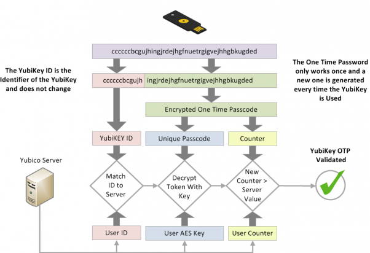

**אימות רב - גורמי** (**MFA**) הוא מנגנון אבטחה הדורש צעדים נוספים מעבר להזנת שם המשתמש (או הדוא"ל) והסיסמה שלך. השיטה הנפוצה ביותר היא קודים מוגבלים בזמן שאתה עשוי לקבל מ - SMS או אפליקציה.

בדרך כלל, אם האקר (או יריב) מסוגל להבין את הסיסמה שלך, הוא יקבל גישה לחשבון שאליו שייכת הסיסמה. חשבון עם MFA מאלץ את ההאקר להחזיק בסיסמה (משהו שאתה יודע **) ובמכשיר שבבעלותך (משהו שיש לך **), כמו הטלפון שלך.

שיטות ה - MFA משתנות באבטחה, אך מבוססות על ההנחה שככל שקשה יותר לתוקף לקבל גישה לשיטת ה - MFA שלך, כך טוב יותר. דוגמאות לשיטות MFA (מהחלש ביותר לחזק ביותר) כוללות SMS, קודי דוא"ל, הודעות דחיפה לאפליקציה, TOTP, Yubico OTP ו - FIDO.

## שיטת השוואה ל - MFA

### SMS או דוא"ל MFA

קבלת קודי OTP באמצעות SMS או דוא"ל היא אחת הדרכים החלשות לאבטחת החשבונות שלך באמצעות MFA. קבלת קוד בדוא"ל או ב- SMS לוקחת את "משהו שאתה *יש*" רעיון, כי יש מגוון של דרכים שבהן האקר יכול[להשתלט על מספר הטלפון שלך](https://en.wikipedia.org/wiki/SIM_swap_scam) או קבלת גישה אל הדוא"ל שלך מבלי שתהיה לך גישה פיזית לאף אחד מהמכשירים שלך כלל. אם אדם לא מורשה קיבל גישה לדוא"ל שלך, הוא יוכל להשתמש בגישה זו כדי לאפס את הסיסמה שלך ולקבל את קוד האימות, ולהעניק לו גישה מלאה לחשבון שלך.

### התראות דחיפה

הודעה בדחיפה MFA היא צורה של הודעה שנשלחת לאפליקציה בטלפון שלך ומבקשת ממך לאשר כניסות חדשות לחשבון. שיטה זו עדיפה בהרבה על SMS או דוא"ל, מאחר שתוקף בדרך כלל לא יוכל לקבל הודעות דחיפה אלה מבלי שיהיה לו מכשיר שכבר מחובר, מה שאומר שהוא יצטרך להתפשר על אחד מהמכשירים האחרים שלך קודם.

כולנו עושים טעויות, ויש סיכון שאולי תקבל את ניסיון ההתחברות בטעות. הרשאות כניסה של הודעות דחיפה נשלחות בדרך כלל ל - *כל* המכשירים שלך בבת אחת, מה שמרחיב את הזמינות של קוד ה - MFA אם יש לך מכשירים רבים.

האבטחה של הודעות דחיפה MFA תלויה הן באיכות האפליקציה, ברכיב השרת והן באמון של המפתח המייצר אותה. התקנת אפליקציה עשויה גם לדרוש ממך לקבל הרשאות פולשניות המעניקות גישה לנתונים אחרים במכשיר שלך. אפליקציה בודדת דורשת גם שתהיה לך אפליקציה ספציפית עבור כל שירות, אשר עשויה שלא לדרוש סיסמה לפתיחה, בשונה מיישום מחולל TOTP טוב.

### סיסמה חד פעמית מבוססת זמן (TOTP)

TOTP היא אחת הצורות הנפוצות ביותר של MFA. כאשר אתה מגדיר TOTP, אתה בדרך כלל נדרש לסרוק קוד QR [](https://en.wikipedia.org/wiki/QR_code) אשר קובע "[סוד משותף](https://en.wikipedia.org/wiki/Shared_secret)" עם השירות שבו אתה מתכוון להשתמש. הסוד המשותף מאובטח בתוך הנתונים של אפליקציית האימות, ולעתים מוגן על ידי סיסמה.

לאחר מכן, הקוד המוגבל בזמן נגזר מהסוד המשותף ומהזמן הנוכחי. מאחר שהקוד תקף לזמן קצר בלבד, ללא גישה לסוד המשותף, היריב אינו יכול ליצור קודים חדשים.

אם יש לך מפתח אבטחת חומרה עם תמיכה ב- [TOTP Yubico Authenticator](https://www.yubico.com/products/yubico-authenticator/), אנו ממליצים לאחסן את "הסודות המשותפים" שלך בחומרה. חומרה כגון YubiKey פותחה מתוך כוונה להפוך את "הסוד המשותף" קשה לחלץ ולהעתיק. YubiKey גם לא מחובר לאינטרנט, בניגוד לטלפון עם אפליקציית TOTP.

שלא כמו[WebAuthn](#fido-fast-identity-online), TOTP לא מציע הגנה מפני [פישינג](https://en.wikipedia.org/wiki/Phishing) או שימוש חוזר בהתקפות. אם היריב מקבל ממך קוד חוקי, הוא עשוי להשתמש בו כמה פעמים שירצה עד שיפוג תוקפו (בדרך כלל 60 שניות).

יריב יכול להקים אתר אינטרנט כדי לחקות שירות רשמי בניסיון לגרום לך למסור את שם המשתמש, הסיסמה וקוד ה - TOTP הנוכחי שלך. אם היריב אז משתמש אלה אישורים שנרשמו הם עשויים להיות מסוגלים להיכנס לשירות האמיתי לחטוף את החשבון.

אמנם לא מושלם, TOTP מאובטח מספיק עבור רוב האנשים, וכאשר [מפתחות אבטחה חומרה](../multi-factor-authentication.md#hardware-security-keys) אינם נתמכים [אפליקציות מאמת](../multi-factor-authentication.md#authenticator-apps) עדיין אפשרות טובה.

### מפתחות אבטחת חומרה

ה - YubiKey מאחסן נתונים על שבב מוצק עמיד לחבלה שהוא [בלתי אפשרי לגישה](https://security.stackexchange.com/a/245772) באופן לא הרסני ללא תהליך יקר ומעבדת זיהוי פלילי.

מפתחות אלה הם בדרך כלל רב - פונקציוניים ומספקים מספר שיטות לאימות. להלן הנפוצים ביותר.

#### Yubico OTP

Yubico OTP הוא פרוטוקול אימות המיושם בדרך כלל במפתחות האבטחה של החומרה. כאשר אתה מחליט להשתמש ב - OTP של יוביקו, המפתח ייצור מזהה ציבורי, מזהה פרטי ומפתח סודי אשר לאחר מכן מועלים לשרת ה - OTP של יוביקו.

בעת כניסה לאתר אינטרנט, כל שעליך לעשות הוא לגעת פיזית במפתח האבטחה. מקש האבטחה יחקה מקלדת וידפיס סיסמה חד פעמית בשדה הסיסמה.

לאחר מכן, השירות יעביר את הסיסמה החד פעמית לשרת ה - OTP של יוביקו לצורך אימות. מונה מוגדל הן במפתח והן בשרת האימות של יוביקו. ניתן להשתמש ב - OTP רק פעם אחת, וכאשר מתבצע אימות מוצלח, המונה מוגבר ומונע שימוש חוזר ב - OTP. יוביקו מספקת מסמך</a>

מפורט על התהליך.</p>

<figure markdown>
  
</figure>

מפורט על התהליך.

שרת האימות של יוביקו הוא שירות מבוסס ענן, ואתה נותן אמון ביוביקו שהם מאחסנים נתונים בצורה מאובטחת ולא מפרסמים אותך בפרופיל. התעודה המזהה הציבורית המשויכת ל - OTP של Yubico נמצאת בשימוש חוזר בכל אתר ועשויה להיות דרך נוספת לפרופיל שלך עבור צדדים שלישיים. בדומה ל - TOTP, Yubico OTP אינו מספק עמידות בפני התחזות.

אם מודל האיומים שלך דורש ממך זהויות שונות באתרים שונים, חזק **אל תשתמש **ב- Yubico OTP עם אותו מפתח אבטחת חומרה באתרים אלה מכיוון שמזהה ציבורי הוא ייחודי לכל מפתח אבטחה.


#### FIDO (זיהוי מהיר באינטרנט)

אם מודל האיומים שלך דורש ממך זהויות שונות באתרים שונים, חזק **אל תשתמש **ב- Yubico OTP עם אותו מפתח אבטחת חומרה באתרים אלה מכיוון שמזהה ציבורי הוא ייחודי לכל מפתח אבטחה.

U2F ו - FIDO2 מתייחסים ל - [Client to Authenticator Protocol](https://en.wikipedia.org/wiki/Client_to_Authenticator_Protocol), שהוא הפרוטוקול בין מפתח האבטחה למחשב, כגון מחשב נייד או טלפון. זה משלים את WebAuthn שהוא הרכיב המשמש לאימות עם האתר (" הצד המסתמך ") שאתה מנסה להתחבר אליו.

WebAuthn היא הצורה המאובטחת והפרטית ביותר של אימות גורם שני. בעוד שחוויית האימות דומה ל - Yubico OTP, המפתח אינו מדפיס סיסמה חד - פעמית ומאמת באמצעות שרת צד שלישי. במקום זאת, הוא משתמש [קריפטוגרפיה מפתח ציבורי](https://en.wikipedia.org/wiki/Public-key_cryptography) לאימות.

<figure markdown>
  
</figure>

בעת יצירת חשבון, המפתח הציבורי נשלח לשירות, ולאחר מכן כאשר אתה מתחבר, השירות ידרוש ממך "לחתום" על נתונים מסוימים באמצעות המפתח הפרטי שלך. היתרון של זה הוא שאף סיסמא לא מאוחסנת על ידי השירות, כך שאין שום דבר ליריב לגנוב.

מצגת זו דנה בהיסטוריה של אימות סיסמאות, במלכודות (כגון שימוש חוזר בסיסמאות) ובדיון על FIDO2 ו-[WebAuthn](https://webauthn.guide) סטנדרטים.

<div class="yt-embed">
  <iframe width="560" height="315" src="https://www.youtube-nocookie.com/embed/aMo4ZlWznao" title="כיצד FIDO2 ו- WebAuthn עוצרים השתלטויות על חשבונות" frameborder="0" allow="accelerometer; autoplay; clipboard-write; encrypted-media; gyroscope; picture-in-picture" allowfullscreen></iframe>
</div>

מצגת זו דנה בהיסטוריה של אימות סיסמאות, במלכודות (כגון שימוש חוזר בסיסמאות) ובדיון על FIDO2 ו-[WebAuthn](https://webauthn.guide) סטנדרטים.

בדרך כלל עבור שירותי אינטרנט הוא משמש עם WebAuthn המהווה חלק מההמלצות [W3C](https://en.wikipedia.org/wiki/World_Wide_Web_Consortium#W3C_recommendation_(REC)). הוא משתמש באימות מפתח ציבורי והוא מאובטח יותר מסודות משותפים המשמשים בשיטות OTP ו - TOTP של יוביקו, שכן הוא כולל את שם המקור (בדרך כלל, שם הדומיין) במהלך האימות. ההצהרה מסופקת כדי להגן עליך מפני התקפות התחזות, מכיוון שהיא עוזרת לך לקבוע שאתה משתמש בשירות האותנטי ולא בעותק מזויף.

שלא כמו Yubico OTP, WebAuthn אינו משתמש בשום מזהה ציבורי, כך שהמפתח **אינו** ניתן לזיהוי באתרים שונים. הוא גם לא משתמש בשום שרת ענן של צד שלישי לאימות. כל התקשורת הושלמה בין המפתח לאתר שאליו אתה מתחבר. FIDO משתמש גם ביתרון אשר מוגדל בעת השימוש על מנת למנוע שימוש חוזר בסשן ומפתחות משובטים.

אם אתר אינטרנט או שירות תומך ב - WebAuthn לאימות, מומלץ מאוד להשתמש בו על פני כל צורה אחרת של MFA.


## המלצות כלליות

אם אתר אינטרנט או שירות תומך ב - WebAuthn לאימות, מומלץ מאוד להשתמש בו על פני כל צורה אחרת של MFA.


### באיזו שיטה עלי להשתמש?

בעת הגדרת שיטת ה - MFA שלך, זכור שהיא מאובטחת כמו שיטת האימות החלשה ביותר שבה אתה משתמש. לכן, חשוב להשתמש בשיטת ה - MFA הטובה ביותר. לדוגמה, אם אתה כבר משתמש ב - TOTP, עליך להשבית דואר אלקטרוני ו - SMS MFA. אם אתה כבר משתמש ב - FIDO2/WebAuthn, אינך אמור להשתמש ב - Yubico OTP או ב - TOTP בחשבונך.


### גיבויים

תמיד צריכים להיות לך גיבויים לשיטת ה - MFA שלך. מפתחות אבטחה של חומרה יכולים ללכת לאיבוד, להיגנב או פשוט להפסיק לעבוד לאורך זמן. מומלץ להחזיק זוג מפתחות אבטחת חומרה עם גישה זהה לחשבונות שלך במקום רק אחד.

בעת שימוש ב- TOTP עם אפליקציית מאמת, הקפד לגבות את מפתחות השחזור שלך או את האפליקציה עצמה, או העתק את "הסודות המשותפים" למופע אחר של האפליקציה בטלפון אחר או לגורם מכיל מוצפן (לדוגמה,[VeraCrypt](../encryption.md#veracrypt)).


### הגדרה ראשונית

בעת רכישת מפתח אבטחה, חשוב לשנות את פרטי הכניסה המוגדרים כברירת מחדל, להגדיר הגנה באמצעות סיסמה עבור המפתח ולאפשר אישור מגע אם המפתח שלך תומך בו. למוצרים כגון ה - YubiKey יש מספר ממשקים עם אישורים נפרדים עבור כל אחד מהם, לכן עליך לעבור על כל ממשק ולהגדיר גם אמצעי הגנה.


### דוא"ל ו - SMS

אם אתה צריך להשתמש בדוא"ל עבור MFA, ודא כי חשבון הדוא"ל עצמו מאובטח עם שיטת MFA נכונה.

אם אתה צריך להשתמש בדוא"ל עבור MFA, ודא כי חשבון הדוא"ל עצמו מאובטח עם שיטת MFA נכונה.

[כלי MFA שאנחנו ממליצים עליהם](../multi-factor-authentication.md ""){.md-button}


## מקומות נוספים להגדרת MFA

מעבר לאבטחת פרטי הכניסה שלך לאתר, ניתן להשתמש באימות רב - גורמי כדי לאבטח גם את הכניסות המקומיות, מפתחות SSH או אפילו מסדי נתונים של סיסמאות.


### ווינדוס

ליוביקו יש מוקדש[ספק אישורים](https://docs.microsoft.com/en-us/windows/win32/secauthn/credential-providers-in-windows)המוסיף אימות Challenge-Response עבור זרימת הכניסה של שם המשתמש + הסיסמה עבור חשבונות Windows מקומיים. אם יש לך YubiKey עם תמיכה באימות אתגר - רספונס, עיין ב [Yubico Login עבור Windows Configuration Guide](https://support.yubico.com/hc/en-us/articles/360013708460-Yubico-Login-for-Windows-Configuration-Guide), שיאפשר לך להגדיר MFA במחשב Windows שלך.


### macOS

ל - macOS יש [תמיכה מקומית](https://support.apple.com/guide/deployment/intro-to-smart-card-integration-depd0b888248/web) לאימות עם כרטיסים חכמים (PIV). אם יש לך כרטיס חכם או מפתח אבטחת חומרה התומך בממשק PIV כגון YubiKey, אנו ממליצים לך לעקוב אחר התיעוד של ספק האבטחה של כרטיס חכם/חומרה ולהגדיר אימות גורם שני עבור מחשב ה - macOS שלך.

ליוביקו יש מדריך [לשימוש ב - YubiKey ככרטיס חכם ב - macOS](https://support.yubico.com/hc/en-us/articles/360016649059) שיכול לעזור לך להגדיר את YubiKey ב - macOS.

ליוביקו יש מדריך [לשימוש ב - YubiKey ככרטיס חכם ב - macOS](https://support.yubico.com/hc/en-us/articles/360016649059) שיכול לעזור לך להגדיר את YubiKey ב - macOS.


```text
sudo defaults write /Library/Preferences/com.apple.loginwindow DisableFDEAutoLogin -bool YES
```


ליוביקו יש מדריך [לשימוש ב - YubiKey ככרטיס חכם ב - macOS](https://support.yubico.com/hc/en-us/articles/360016649059) שיכול לעזור לך להגדיר את YubiKey ב - macOS.


### לינוקס

!!! אזהרה

    אם שם המארח של המערכת שלך משתנה (כגון עקב DHCP), לא תוכל להתחבר. חיוני להגדיר שם מארח מתאים למחשב שלך לפני ביצוע מדריך זה.
    

המודול `Pam_u2f` ב - Linux יכול לספק אימות דו - שלבי להתחברות להפצות לינוקס הפופולריות ביותר. אם יש לך מפתח אבטחה לחומרה שתומך ב - U2F, באפשרותך להגדיר אימות MFA להתחברות שלך. ליוביקו יש מדריך [Ubuntu Linux Login Guide - U2F](https://support.yubico.com/hc/en-us/articles/360016649099-Ubuntu-Linux-Login-Guide-U2F) שאמור לעבוד על כל הפצה. מנהל החבילות פקודות - כגון `apt - get`- ושמות החבילות עשויים להיות שונים. מדריך זה **לא** חל על Qubes OS.


### Qubes OS

ל - Qubes OS יש תמיכה באימות אתגר - רספונס עם YubiKeys. אם יש לך YubiKey עם תמיכה באימות תגובה לאתגר, עיין במערכת ההפעלה Qubes[YubiKey תיעוד](https://www.qubes-os.org/doc/yubikey/) אם ברצונך להגדיר MFA במערכת ההפעלה Qubes.


### SSH


#### מפתחות אבטחה לחומרה

SSH MFA יכול להיות מוגדר באמצעות שיטות אימות שונות מרובות אשר פופולריות עם מפתחות אבטחת חומרה. מומלץ לעיין בתיעוד [](https://developers.yubico.com/SSH/) של יוביקו כדי ללמוד כיצד להגדיר זאת.


#### סיסמה חד פעמית מבוססת זמן (TOTP)

ניתן גם להגדיר SSH MFA באמצעות TOTP. DigitalO Ocean סיפק מדריך [כיצד להגדיר אימות רב - גורמי עבור SSH ב - Ubuntu 20.04](https://www.digitalocean.com/community/tutorials/how-to-set-up-multi-factor-authentication-for-ssh-on-ubuntu-20-04). רוב הדברים צריכים להיות זהים ללא קשר להפצה, עם זאת מנהל החבילה מצווה - כגון `apt - get`- ושמות החבילות עשויים להיות שונים.


### KeePass (ו - KeePassXC)

ניתן לאבטח את מסדי הנתונים KeePass ו - KeePassXC באמצעות Challenge - Response או HOTP כגורם שני לאימות. יוביקו סיפקה מסמך עבור KeePass[ שימוש ב-YubiKey שלכם עם KeePass](https://support.yubico.com/hc/en-us/articles/360013779759-Using-Your-YubiKey-with-KeePass) ויש גם אחד על [KeePassXC](https://keepassxc.org/docs/#faq-yubikey-2fa) אתר.
