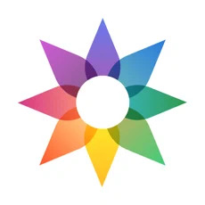

Wanneer je bestanden deelt, is het belangrijk om de bijbehorende metadata te verwijderen. Beeldbestanden bevatten gewoonlijk [Exif](https://en.wikipedia.org/wiki/Exif) gegevens. Foto's bevatten soms zelfs GPS-coördinaten in de metagegevens van het bestand.

## Desktop

### MAT2

!!! recommendation

    MAT2 logo](assets/img/data-redaction/mat2.svg){ align=right }
    
    **MAT2** is gratis software, waarmee de metadata uit beeld-, audio-, torrent- en documentbestanden kan worden verwijderd. Het biedt zowel een opdrachtregelprogramma als een grafische gebruikersinterface via een [extensie voor Nautilus](https://0xacab.org/jvoisin/mat2/-/tree/master/nautilus), de standaard bestandsbeheerder van [GNOME](https://www.gnome.org), en [Dolphin](https://0xacab.org/jvoisin/mat2/-/tree/master/dolphin), de standaard bestandsbeheerder van [KDE](https://kde.org).
    
    Voor Linux bestaat een grafisch hulpprogramma van derden [Metadata Cleaner](https://gitlab.com/rmnvgr/metadata-cleaner) op basis van MAT2, dat [beschikbaar is op Flathub](https://flathub.org/apps/details/fr.romainvigier.MetadataCleaner).
    
    [:octicons-repo-16: Repository](https://0xacab.org/jvoisin/mat2){ .md-button .md-button--primary }
    [:octicons-info-16:](https://0xacab.org/jvoisin/mat2/-/blob/master/README.md){ .card-link title=Documentatie}
    [:octicons-code-16:](https://0xacab.org/jvoisin/mat2){ .card-link title="Broncode" }
    
    ??? downloads
    
        - [:simple-windows11: Windows](https://pypi.org/project/mat2)
        - [:simple-apple: macOS](https://0xacab.org/jvoisin/mat2#requirements-setup-on-macos-os-x-using-homebrew)
        - [:simple-linux: Linux](https://pypi.org/project/mat2)
        - [:octicons-globe-16: Web](https://0xacab.org/jvoisin/mat2#web-interface)

## Mobiel

### ExifEraser (Android)

!!! recommendation

    ExifEraser logo](assets/img/data-redaction/exiferaser.svg){ align=right }
    
    **ExifEraser** is een moderne, toestemmingsvrije applicatie voor het wissen van beeldmetadata voor Android.
    
    Het ondersteunt momenteel JPEG-, PNG- en WebP-bestanden.
    
    [:octicons-repo-16: Repository](https://github.com/Tommy-Geenexus/exif-eraser){ .md-button .md-button--primary }
    [:octicons-info-16:](https://github.com/Tommy-Geenexus/exif-eraser#readme){ .card-link title=Documentatie}
    [:octicons-code-16:](https://github.com/Tommy-Geenexus/exif-eraser){ .card-link title="Broncode" }
    
    ??? downloads
    
        - [:simple-googleplay: Google Play](https://play.google.com/store/apps/details?id=com.none.tom.exiferaser)
        - [:octicons-moon-16: Accrescent](https://accrescent.app/app/com.none.tom.exiferaser)
        - [:simple-github: GitHub](https://github.com/Tommy-Geenexus/exif-eraser/releases)

De metagegevens die worden gewist, hangen af van het bestandstype van de afbeelding:

* **JPEG**: ICC Profile, Exif, Photoshop Image Resources en XMP/ExtendedXMP metadata worden gewist als ze bestaan.
* **PNG**: ICC Profile, Exif en XMP metadata worden gewist als ze bestaan.
* **WebP**: ICC Profile, Exif en XMP metadata zullen worden gewist als ze bestaan.

Na het verwerken van de afbeeldingen, geeft ExifEraser u een volledig rapport over wat er precies uit elke afbeelding is verwijderd.

De app biedt meerdere manieren om metadata uit afbeeldingen te wissen. Namelijk:

* U kunt een afbeelding vanuit een andere toepassing delen met ExifEraser.
* Via de app zelf kunt u een enkele afbeelding, meerdere afbeeldingen tegelijk of zelfs een hele map selecteren.
* Het heeft een "Camera"-optie, die de camera-app van uw besturingssysteem gebruikt om een foto te nemen, en vervolgens de metagegevens ervan verwijdert.
* Hiermee kunt u foto's uit een ander programma naar ExifEraser slepen wanneer beide programma's in split-screen modus geopend zijn.
* Tenslotte kunt u een afbeelding van uw klembord plakken.

### Metapho (iOS)

!!! recommendation

    { align=right }
    
    Metapho is een eenvoudige en nette viewer voor foto metadata zoals datum, bestandsnaam, grootte, camera model, sluitertijd, en locatie.
    
    [:octicons-home-16: Homepage](https://zininworks.com/metapho){ .md-button .md-button--primary }
    [:octicons-eye-16:](https://zininworks.com/privacy/){ .card-link title="Privacy Policy" }
    
    ??? downloads
    
        - [:simple-appstore: App Store](https://apps.apple.com/us/app/metapho/id914457352)

### PrivacyBlur

!!! recommendation

    PrivacyBlur logo](assets/img/data-redaction/privacyblur.svg){ align=right }
    
    **PrivacyBlur** is een gratis app die gevoelige delen van foto's kan vervagen voordat je ze online deelt.
    
    De metagegevens over de beeldoriëntatie worden niet gewist. Als je locatie inschakelt (in Beveiligde Camera) zal die **ook niet** worden verwijderd.

!!! warning

    { align=right }
    { align=right }
    
    **Secure PDF Viewer** is een PDF-viewer gebaseerd op [pdf.js](https://en.wikipedia.org/wiki/PDF.js) die geen rechten vereist. De PDF wordt ingevoerd in een [sandboxed](https://en.wikipedia.org/wiki/Sandbox_(software_development)) [webview](https://developer.android.com/guide/webapps/webview). Dit betekent dat het niet direct toestemming nodig heeft om toegang te krijgen tot inhoud of bestanden.

## Command-line

### ExifTool

!!! recommendation

    ExifTool logo](assets/img/data-redaction/exiftool.png){ align=right }
    
    **ExifTool** is de originele perl library en command-line applicatie voor het lezen, schrijven en bewerken van meta-informatie (Exif, IPTC, XMP, en meer) in een groot aantal bestandsformaten (JPEG, TIFF, PNG, PDF, RAW, en meer).
    
    Het is vaak een onderdeel van andere Exif verwijderingsprogramma's en staat in de repositories van de meeste Linux distributies.
    
    [:octicons-home-16: Homepage](https://exiftool.org){ .md-button .md-button--primary }
    [:octicons-info-16:](https://exiftool.org/faq.html){ .card-link title=Documentatie}
    [:octicons-code-16:](https://github.com/exiftool/exiftool){ .card-link title="Broncode" }
    [:octicons-heart-16:](https://exiftool.org/#donate){ .card-link title=Bijdragen }
    
    ??? downloads
    
        - [:simple-windows11: Windows](https://exiftool.org)
        - [:simple-apple: macOS](https://exiftool.org)
        - [:simple-linux: Linux](https://exiftool.org)

!!! example "Verwijderen van gegevens uit een map met bestanden"

    ```bash
    exiftool -all= *.file_extension
    ```

## Criteria

**Wij zijn niet verbonden aan de projecten die wij aanbevelen.** Naast [onze standaardcriteria](about/criteria.md)hebben wij een duidelijke reeks eisen ontwikkeld om objectieve aanbevelingen te kunnen doen. Wij stellen voor dat je zich vertrouwd maakt met deze lijst voordat je een project kiest, en jouw eigen onderzoek uitvoert om er zeker van te zijn dat het de juiste keuze voor je is.

!!! example "Deze sectie is nieuw"

    We werken aan het vaststellen van gedefinieerde criteria voor elk deel van onze site, en dit kan onderhevig zijn aan verandering. Als u vragen hebt over onze criteria, stel ze dan [op ons forum](https://discuss.privacyguides.net/latest) en neem niet aan dat we iets niet in overweging hebben genomen bij het opstellen van onze aanbevelingen als het hier niet vermeld staat. Er zijn veel factoren die worden overwogen en besproken wanneer wij een project aanbevelen, en het documenteren van elke factor is een werk in uitvoering.

- Apps ontwikkeld voor open-source besturingssystemen moeten open-source zijn.
- Apps moeten gratis zijn en mogen geen advertenties of andere beperkingen bevatten.
