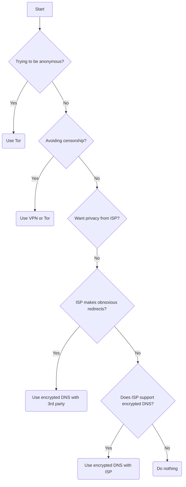

The [Domain Name System (DNS)](https://en.wikipedia.org/wiki/Domain_Name_System) is the 'phonebook of the Internet'. DNS translates domain names to [IP](https://en.wikipedia.org/wiki/Internet_Protocol) addresses so browsers and other services can load Internet resources, through a decentralized network of servers.

## What is DNS?
When you visit a website, a numerical address is returned. For example, when you visit `privacyguides.org`, the address `192.98.54.105` is returned.

DNS has existed since the [early days](https://en.wikipedia.org/wiki/Domain_Name_System#History) of the Internet. DNS requests made to and from DNS servers are **not** generally encrypted. In a residential setting, a customer is given servers by the [ISP](https://en.wikipedia.org/wiki/Internet_service_provider) via [Dynamic Host Configuration Protocol (DHCP)](https://en.wikipedia.org/wiki/Dynamic_Host_Configuration_Protocol).

Unencrypted DNS requests are able to be easily **surveilled** and **modified** in transit. In some parts of the world ISPs are ordered to do primitive [DNS filtering](https://en.wikipedia.org/wiki/DNS_blocking). When a user requests the IP of a domain that is blocked, the server may not respond or may respond with a different IP address. As the DNS protocol is not encrypted, the ISP (or any network operator) can use [deep packet inspection (DPI)](https://en.wikipedia.org/wiki/Deep_packet_inspection) to monitor requests. ISPs can also block requests based on common characteristics, regardless of which DNS server is used. Unencrypted DNS always uses [port](https://en.wikipedia.org/wiki/Port_(computer_networking)) 53 and always uses the [User Datagram Protocol (UDP)](https://en.wikipedia.org/wiki/User_Datagram_Protocol).

Below we discuss and provide a tutorial to prove what an outside observer may see using regular unencrypted DNS, and [encrypted DNS](/dns/#what-is-encrypted-dns).

### Unencrypted DNS
1. Using [`tshark`](https://www.wireshark.org/docs/man-pages/tshark.html) (part of the [Wireshark](https://en.wikipedia.org/wiki/Wireshark) project) we can monitor and record internet packet flow. This command records packets that meet the rules specified:
   ```
   tshark -w /tmp/dns.pcap udp port 53 and host 1.1.1.1 or host 8.8.8.8
   ```

2. We can then use [`dig`](https://en.wikipedia.org/wiki/Dig_(command)) (Linux, MacOS etc) or  [`nslookup`](https://en.wikipedia.org/wiki/Nslookup) on Windows to send the DNS lookup to both servers. Software such as web browsers do these lookups automatically unless they are configured to use [encrypted DNS](/dns/#what-is-encrypted-dns).

    === "Linux, MacOS"

        ```
        dig +noall +answer privacyguides.org @1.1.1.1
        dig +noall +answer privacyguides.org @8.8.8.8
        ```
    === "Windows"

        ```
        nslookup privacyguides.org 1.1.1.1
        nslookup privacyguides.org 8.8.8.8
        ```

3. Next we want to [analyse](https://www.wireshark.org/docs/wsug_html_chunked/ChapterIntroduction.html#ChIntroWhatIs) the results:

    === "Wireshark"

        ```
        wireshark -r /tmp/dns.pcap
        ```

    === "tshark"

        ```
        tshark -r /tmp/dns.pcap
        ```

If you ran the Wireguard command above the top pane shows the "[frames](https://en.wikipedia.org/wiki/Ethernet_frame)", and the bottom pane shows all the data about the selected frame. Enterprise filtering and monitoring solutions (such as those purchased by governments) can do the process automatically, without human interaction and can aggregate those frames to produce statistical data useful to the network observer.

| No. | Time     | Source    | Destination | Protocol | Length | Info                                                                   |
|-----|----------|-----------|-------------|----------|--------|------------------------------------------------------------------------|
| 1   | 0.000000 | 192.0.2.1 | 1.1.1.1     | DNS      | 104    | Standard query 0x58ba A privacyguides.org OPT                          |
| 2   | 0.293395 | 1.1.1.1   | 192.0.2.1   | DNS      | 108    | Standard query response 0x58ba A privacyguides.org A 198.98.54.105 OPT |
| 3   | 1.682109 | 192.0.2.1 | 8.8.8.8     | DNS      | 104    | Standard query 0xf1a9 A privacyguides.org OPT                          |
| 4   | 2.154698 | 8.8.8.8   | 192.0.2.1   | DNS      | 108    | Standard query response 0xf1a9 A privacyguides.org A 198.98.54.105 OPT |

An observer could modify any of these packets.

## What is "encrypted DNS"?
Encrypted DNS can refer to one of a number of protocols, the most common ones being:

### DNSCrypt
[**DNSCrypt**](https://en.wikipedia.org/wiki/DNSCrypt) was one of the first methods of encrypting DNS queries. The [protocol](https://en.wikipedia.org/wiki/DNSCrypt#Protocol) operates on [port 443](https://en.wikipedia.org/wiki/Well-known_ports) and works with both the [TCP](https://en.wikipedia.org/wiki/Transmission_Control_Protocol) or [UDP](https://en.wikipedia.org/wiki/User_Datagram_Protocol) transport protocols. DNSCrypt has never been submitted to the [Internet Engineering Task Force (IETF)](https://en.wikipedia.org/wiki/Internet_Engineering_Task_Force) nor has it gone through the [Request for Comments (RFC)](https://en.wikipedia.org/wiki/Request_for_Comments) process, so it has not been used widely outside of a few [implementations](https://dnscrypt.info/implementations). As a result, it has been largely replaced by the more popular [DNS over HTTPS (DoH)](/dns/#dns-over-https-doh).

### DNS over TLS (DoT)
[**DNS over TLS (DoT)**](https://en.wikipedia.org/wiki/DNS_over_TLS) is another method for encrypting DNS communication that is defined in [RFC 7858](https://datatracker.ietf.org/doc/html/rfc7858). Support was first implemented in [Android 9](https://en.wikipedia.org/wiki/Android_Pie), [iOS 14](https://en.wikipedia.org/wiki/IOS_14) and on Linux in [systemd-resolved](https://www.freedesktop.org/software/systemd/man/resolved.conf.html#DNSOverTLS=) in version 237. Preference in the industry has been moving away from DoT to [DNS over HTTPS](/dns/#dns-over-https-doh) in recent years as DoT is a [complex protocol](https://dnscrypt.info/faq/) and has varying compliance to the RFC across the implementations that exist. DoT also operates on a dedicated port 853 and that can be blocked easily by restrictive firewalls.

### DNS over HTTPS (DoH)
[**DNS over HTTPS**](https://en.wikipedia.org/wiki/DNS_over_HTTPS) as defined in [RFC 8484](https://datatracker.ietf.org/doc/html/rfc8484) packages queries in the [HTTP/2](https://en.wikipedia.org/wiki/HTTP/2) protocol and provides security with [HTTPS](https://en.wikipedia.org/wiki/HTTPS). Support was first added in web browsers such as [Firefox 60](https://support.mozilla.org/en-US/kb/firefox-dns-over-https) and [Chrome 83](https://blog.chromium.org/2020/05/a-safer-and-more-private-browsing-DoH.html).

Native implementations showed up in [iOS 14](https://en.wikipedia.org/wiki/IOS_14), [macOS 11](https://en.wikipedia.org/wiki/MacOS_11), [Microsoft Windows](https://docs.microsoft.com/en-us/windows-server/networking/dns/doh-client-support), and Android 13 (however it won't be enabled [by default](https://android-review.googlesource.com/c/platform/packages/modules/DnsResolver/+/1833144)). General Linux desktop support is waiting on the systemd [implementation](https://github.com/systemd/systemd/issues/8639) so installing third party software is still required as described [below](/dns/#linux).

## What can an outside party see?
In this example we will record what happens when we make a DoH request:

1. Firstly start `tshark`:
   ```
   tshark -w /tmp/dns_doh.pcap -f "tcp port https and host 1.1.1.1"
   ```

2. Secondly make a request with `curl`:
   ```
   curl -vI --doh-url https://1.1.1.1/dns-query https://privacyguides.org
   ```

3. After making the request, we can stop the packet capture with <kbd>CTRL</kbd> + <kbd>C</kbd>.

4. Analyse the results in Wireshark:
   ```
   wireshark -r /tmp/dns_doh.pcap
   ```

We can see the [connection establishment](https://en.wikipedia.org/wiki/Transmission_Control_Protocol#Connection_establishment) and [TLS handshake](https://www.cloudflare.com/learning/ssl/what-happens-in-a-tls-handshake/) that occurs with any encrypted connection. When looking at the "application data" packets that follow, none of them contain the domain we requested or the IP address returned.

## Why **shouldn't** I use encrypted DNS?
In locations where there is internet filtering (or censorship), visiting forbidden resources may have its own consequences which you should consider in your [threat model](/threat-modeling/). We do **not** suggest the use of encrypted DNS for this purpose. Use [Tor](https://torproject.org), or a [VPN](/providers/vpn/) instead. If you're using a VPN, you should use your VPN's DNS servers. When using a VPN you are already trusting them with all your network activity. We made this flow chart to describe when you *should* use "encrypted DNS":



When we do a DNS lookup, it's generally because we want to access a resource. Below we will discuss some of the methods that may disclose your browsing activities even when using encrypted DNS:

### IP Address
The simplest way to determine browsing activity might be to look at the IP addresses your devices are accessing. For example, if the observer knows that `privacyguides.org` is at `198.98.54.105`, and your device is requesting data from `198.98.54.105`, there is a good chance you're visiting Privacy Guides.

This method is only useful when the IP address belongs to a server that only hosts few websites. It's also not very useful if the site is hosted on a shared platform, (e.g. Github Pages, Cloudflare Pages, Netlify, Wordpress, Blogger etc). It also isn't very useful if the server is hosted behind a [reverse proxy](https://en.wikipedia.org/wiki/Reverse_proxy), which is very common on the modern Internet.

### Server Name Indication (SNI)
Server Name Indication, is typically used when a IP address hosts many websites. This could be a service like Cloudflare, or some other [Denial-of-service attack](https://en.wikipedia.org/wiki/Denial-of-service_attack) protection.

1. Start capturing again with `tshark`. We've added a filter with our IP address so you don't capture many packets:
   ```
   tshark -w /tmp/pg.pcap port 443 and host 198.98.54.105
   ```

2. Then we visit [https://privacyguides.org](https://privacyguides.org).

3. After visiting the website, we what to stop the packet capture with <kbd>CTRL</kbd> + <kbd>C</kbd>.

4. Next we want to analyze the results:
   ```
   wireshark -r /tmp/pg.pcap
   ```
   We will see the [connection establishment](https://en.wikipedia.org/wiki/Transmission_Control_Protocol#Connection_establishment), followed by the [TLS handshake](https://www.cloudflare.com/learning/ssl/what-happens-in-a-tls-handshake/) for the Privacy Guides website. Around frame 5. you'll see a "Client Hello".

5. Expand the triangle &#9656; next to each field:
   ```
   ▸ Transport Layer Security
     ▸ TLSv1.3 Record Layer: Handshake Protocol: Client Hello
       ▸ Handshake Protocol: Client Hello
         ▸ Extension: server_name (len=22)
           ▸ Server Name Indication extension
   ```

6. We can see the [Server Name Indication (SNI)](https://en.wikipedia.org/wiki/Server_Name_Indication) value which discloses the website we are visiting. The `tshark` command can give you the value directly for all packets containing a SNI value:
   ```
   tshark -r /tmp/pg.pcap -Tfields -Y tls.handshake.extensions_server_name -e tls.handshake.extensions_server_name
   ```

This means even if we are using "Encrypted DNS" servers, the domain will likely be disclosed through SNI. The [TLS v1.3](https://en.wikipedia.org/wiki/Transport_Layer_Security#TLS_1.3) protocol brings with it [Encrypted Client Hello](https://blog.cloudflare.com/encrypted-client-hello/) which prevents this kind of leak.

Governments, in particular [China](https://www.zdnet.com/article/china-is-now-blocking-all-encrypted-https-traffic-using-tls-1-3-and-esni/) and [Russia](https://www.zdnet.com/article/russia-wants-to-ban-the-use-of-secure-protocols-such-as-tls-1-3-doh-dot-esni/), have either already [started blocking](https://en.wikipedia.org/wiki/Server_Name_Indication#Encrypted_Client_Hello) it or expressed a desire to do so. Recently Russia has [started blocking foreign websites](https://github.com/net4people/bbs/issues/108) that use the [HTTP/3](https://en.wikipedia.org/wiki/HTTP/3) standard. This is because the [QUIC](https://en.wikipedia.org/wiki/QUIC) protocol that is a part of HTTP/3 requires that `ClientHello` be also encrypted.

### Online Certificate Status Protocol (OCSP)
Another way your browser can disclose your browsing activities is with the [Online Certificate Status Protocol](https://en.wikipedia.org/wiki/Online_Certificate_Status_Protocol). When visiting a [HTTPS](https://en.wikipedia.org/wiki/HTTPS) website, the browser might check to see if the [X.509](https://en.wikipedia.org/wiki/X.509) [certificate](https://en.wikipedia.org/wiki/Public_key_certificate) has been [revoked](https://en.wikipedia.org/wiki/Certificate_revocation_list). This is generally done through the [HTTP](https://en.wikipedia.org/wiki/Hypertext_Transfer_Protocol) protocol, meaning it is **not** encrypted.

The OCSP request contains the certificate "[serial number](https://en.wikipedia.org/wiki/Public_key_certificate#Common_fields)", which is unique. It is sent to the "OCSP responder" in order to check its status.

We can simulate what a browser would do using the [`openssl`](https://en.wikipedia.org/wiki/OpenSSL) command.

1. Get the server certificate and use [`sed`](https://en.wikipedia.org/wiki/Sed) to keep just the important part and write it out to a file:
   ```
   openssl s_client -connect privacyguides.org:443 < /dev/null 2>&1 |
       sed -n '/^-*BEGIN/,/^-*END/p' > /tmp/pg_server.cert
   ```

2. Get the intermediate certificate. [Certificate Authorities (CA)](https://en.wikipedia.org/wiki/Certificate_authority) normally don't sign a certificate directly; they use what is known as an "intermediate" certificate.
   ```
   openssl s_client -showcerts -connect privacyguides.org:443 < /dev/null 2>&1 |
       sed -n '/^-*BEGIN/,/^-*END/p' > /tmp/pg_and_intermediate.cert
   ```

3. The first certificate in `pg_and_intermediate.cert`, is actually the server certificate from step 1. We can use `sed` again to delete until the first instance of END:
   ```
   sed -n '/^-*END CERTIFICATE-*$/!d;:a n;p;ba' \
       /tmp/pg_and_intermediate.cert > /tmp/intermediate_chain.cert
   ```

4. Get the OCSP responder for the server certificate:
   ```
   openssl x509 -noout -ocsp_uri -in /tmp/pg_server.cert
   ```
   If we want to see all the details of the certificate we can use:
   ```
   openssl x509 -text -noout -in /tmp/pg_server.cert
   ```
   Our certificate shows the Lets Encrypt certificate responder.

5. Start the packet capture:
   ```
   tshark -w /tmp/pg_ocsp.pcap -f "tcp port http"
   ```

6. Make the OCSP request:
   ```
   openssl ocsp -issuer /tmp/intermediate_chain.cert \
                -cert /tmp/pg_server.cert \
                -text \
                -url http://r3.o.lencr.org
   ```

7. Open the capture:
   ```
   wireshark -r /tmp/pg_ocsp.pcap
   ```
   There will be two packets with the "OCSP" protocol; a "Request" and a "Response". For the "Request" we can see the "serial number" by expanding the triangle &#9656; next to each field:
   ```
   ▸ Online Certificate Status Protocol
     ▸ tbsRequest
       ▸ requestList: 1 item
         ▸ Request
           ▸ reqCert
             serialNumber
   ```
   For the "Response" we can also see the "serial number":
   ```
   ▸ Online Certificate Status Protocol
     ▸ responseBytes
       ▸ BasicOCSPResponse
         ▸ tbsResponseData
           ▸ responses: 1 item
             ▸ SingleResponse
               ▸ certID
                 serialNumber
   ```

7. Or use `tshark` to filter the packets for the Serial Number:
   ```
   tshark -r /tmp/pg_ocsp.pcap -Tfields -Y ocsp.serialNumber -e ocsp.serialNumber
   ```

If the network observer has the public certificate, which is publicly available, they can match the serial number with that certificate and therefore determine the site you're visiting from that. The process can be automated and can associate IP addresses with serial numbers. It is also possible to check [Certificate Transparency](https://en.wikipedia.org/wiki/Certificate_Transparency) logs for the serial number.

## Why should I use encrypted DNS?
You should only use DNS if your [threat model](/threat-modeling/) doesn't require you to hide any of your browsing activity. Encrypted DNS should only be used to get around basic [DNS blocking](https://en.wikipedia.org/wiki/DNS_blocking) when you can be sure there won't be any consequences.

Encrypted DNS can also help if your ISP obnoxiously redirects you to other websites. These are our recommendations for servers:

| DNS Provider | Privacy Policy | Type | Protocols | Logging | ECS | Filtering |
| ------------ | -------------- | ---- | --------- | ------- | --- | --------- |
| [**AdGuard**](https://adguard.com/en/adguard-dns/overview.html) | [:octicons-link-external-24:](https://adguard.com/en/privacy/dns.html) | Commercial | Cleartext <br> DoH <br> DoT <br> DNSCrypt | Some[^1] | No | Based on server choice. Filter list being used can be found here. [:octicons-link-external-24:](https://github.com/AdguardTeam/AdGuardDNS)
| [**Cloudflare**](https://developers.cloudflare.com/1.1.1.1/setting-up-1.1.1.1/) | [:octicons-link-external-24:](https://www.cloudflare.com/privacypolicy) | Commercial | Cleartext <br> DoH <br> DoT | Some[^2] | No | Based on server choice.|
| [**ControlID**](https://controld.com) | [:octicons-link-external-24:](https://controld.com/privacy) | Commercial | Cleartext <br> DoH <br> DoT | Optional[^3] | No |  Based on server choice.  |
| [**MullvadDNS**](https://mullvad.net/en/help/dns-over-https-and-dns-over-tls) | [:octicons-link-external-24:](https://mullvad.net/en/help/privacy-policy/) [^4] | Commercial | DoH <br> DoT | No | No | Based on server choice. Filter list being used can be found here. [:octicons-link-external-24:](https://github.com/mullvad/dns-adblock)
| [**NextDNS**](https://www.nextdns.io) | [:octicons-link-external-24:](https://www.nextdns.io/privacy) | Commercial | Cleartext <br> DoH <br> DoT <br> DNSCrypt | Optional[^5] | No | Based on server choice. |
| [**Quad9**](https://quad9.net) | [:octicons-link-external-24:](https://quad9.net/service/privacy) | Non-Profit | Cleartext <br> DoH <br> DoT <br> DNSCrypt | No | Optional |  Based on server choice, Malware blocking by default. |

[^1]: We store aggregated performance metrics of our DNS server, namely the number of complete requests to a particular server, the number of blocked requests, the speed of processing requests. We keep and store the database of domains requested in the last 24 hours. We need this information to identify and block new trackers and threats. We also log how many times this or that tracker has been blocked. We need this information to remove outdated rules from our filters.
[^2]: Cloudflare collects and stores only the limited DNS query data that is sent to the 1.1.1.1 resolver. The 1.1.1.1 resolver service does not log personal data, and the bulk of the limited non-personally identifiable query data is only stored for 25 hours.
[^3]: Neither free nor premium service have logging enabled by default. Premium users can enable logging/analytics at will.
[^4]: Our public DNS service offers DNS over HTTPS (DoH) and DNS over TLS (DoT), with QNAME minimization and basic ad blocking. It has been audited by the security experts at Assured. You can use this privacy-enhancing service even if you don't use Mullvad.
[^5]: NextDNS can provide insights and logging features on an opt-in basis. Users can choose retention times and log storage locations for any logs they choose to keep.

The criteria for servers for this table are:

- Must support [DNSSEC](/dns/#what-is-dnssec-and-when-is-it-used)
- Must have [anycast](https://en.wikipedia.org/wiki/Anycast#Addressing_methods) support
- [QNAME Minimization](/dns/#what-is-qname-minimization)

## What is DNSSEC and when is it used?
[Domain Name System Security Extensions (DNSSEC)](https://en.wikipedia.org/wiki/Domain_Name_System_Security_Extensions) is used to provide authenticity to the records being fetched from upstream DNS servers. It doesn't provide confidentiality, for that we use one of the [encrypted DNS](/dns#what-is-encrypted-dns) protocols discussed above.

## What is QNAME minimization?
A QNAME is a "qualified name", for example `privacyguides.org`. QNAME minimisation reduces the amount of information sent from the DNS server to the [authoritative name server](https://en.wikipedia.org/wiki/Name_server#Authoritative_name_server).

Instead of sending the whole domain `privacyguides.org`, QNAME minimization means the DNS server will ask for all the records that end in `.org`. Further technical description is defined in [RFC 7816](https://datatracker.ietf.org/doc/html/rfc7816).

## What is EDNS Client Subnet (ECS)?
The [EDNS Client Subnet](https://en.wikipedia.org/wiki/EDNS_Client_Subnet) is a method for a recursive DNS resolver to specify a [subnetwork](https://en.wikipedia.org/wiki/Subnetwork) for the [host or client](https://en.wikipedia.org/wiki/Client_(computing)) which is making the DNS query.

It's intended to "speed up" delivery of data by giving the client an answer that belongs to a server that is close to them such as a [content delivery network (CDN)](https://en.wikipedia.org/wiki/Content_delivery_network), which are often used in video streaming and serving JavaScript web apps.

This feature does come at a privacy cost, as it tells the DNS server some information about the client's location.

## Native Operating System Support

### Android
Android 9 and above support DNS over TLS. Android 13 will support DNS over HTTPS. The settings can be found in: *Settings* &rarr; *Network & Internet* &rarr; *Private DNS*.

### Apple Devices
The latest versions of iOS, iPadOS, tvOS, and macOS, support both DoT and DoH. Both protocols are supported natively via [configuration profiles](https://support.apple.com/guide/security/configuration-profile-enforcement-secf6fb9f053/web) or through the [DNS Settings API](https://developer.apple.com/documentation/networkextension/dns_settings).

After installation of either a configuration profile or an app that utilizes the DNS Settings API, the DNS configuration can be selected. If a VPN is active, resolution within the VPN tunnel will use the VPN's DNS settings and not your system-wide settings.

 * **iOS/iPadOS:** *Settings &rarr; General &rarr; VPN, DNS, & Device Management &rarr; DNS*
 * **macOS:** *System Preferences &rarr; Network*

Apple does not provide a native interface for creating encrypted DNS profiles. [Secure DNS profile creator](https://dns.notjakob.com/tool.html) is an unofficial tool for creating your own encrypted DNS profiles, however they will not be signed. Signed profiles are preferred; signing validates a profile's origin and helps to ensure the integrity of the profiles. A green "Verified" label is given to signed configuration profiles. For more information on code signing, see [About Code Signing](https://developer.apple.com/library/archive/documentation/Security/Conceptual/CodeSigningGuide/Introduction/Introduction.html).

 * **Signed profiles** are offered by [AdGuard](https://adguard.com/en/blog/encrypted-dns-ios-14.html), [ControlD](https://kb.controld.com/en/tutorials), [NextDNS](https://apple.nextdns.io), [Quad9](https://www.quad9.net/news/blog/ios-mobile-provisioning-profiles/).

### Windows
Windows users can [turn on DoH](https://docs.microsoft.com/en-us/windows-server/networking/dns/doh-client-support), by accessing Windows settings in the control panel.

Select *Settings* &rarr; *Network & Internet* &rarr; *Ethernet* or *WiFi*, &rarr; *Edit DNS Settings* &rarr; Preferred DNS encryption &rarr; *Encrypted only (DNS over HTTPS)*.

### Linux
`systemd-resolved` doesn't [yet support](https://github.com/systemd/systemd/issues/8639), which many Linux distributions use to do their DNS lookups. This means you need to install a proxy like [dnscrypt-proxy](https://github.com/DNSCrypt/dnscrypt-proxy) and [configure it](https://wiki.archlinux.org/title/Dnscrypt-proxy) to take all the DNS queries from your system resolver and forward them over HTTPS.

## Encrypted DNS Proxies
This software provides third-party encrypted DNS support by pointing the [unencrypted dns](/dns/#unencrypted-dns) resolver to a local [encrypted dns](/dns/#what-is-encrypted-dns) proxy.

### RethinkDNS
!!! recommendation

    { align=right }
    { align=right }

    **RethinkDNS** is an open-source Android client supporting [DNS-over-HTTPS](/dns/#dns-over-https-doh), [DNS-over-TLS](/dns/#dns-over-tls-dot), [DNSCrypt](/dns/#dnscrypt) and DNS Proxy along with caching DNS responses, locally logging DNS queries and can be used as a firewall too.

    [Visit rethinkdns.com](https://rethinkdns.com){ .md-button .md-button--primary } [Privacy Policy](https://rethinkdns.com/privacy){ .md-button }

    **Downloads**
    - [:fontawesome-brands-google-play: Google Play](https://play.google.com/store/apps/details?id=com.celzero.bravedns)
    - [:pg-f-droid: F-Droid](https://f-droid.org/packages/com.celzero.bravedns)
    - [:fontawesome-brands-github: Source](https://github.com/celzero/rethink-app)

### DNSCloak
!!! recommendation

    { align=right }

    **DNSCloak** is an open-source iOS client supporting [DNS-over-HTTPS](/dns/#dns-over-https-doh), [DNSCrypt](/dns/#dnscrypt), and [dnscrypt-proxy](https://github.com/DNSCrypt/dnscrypt-proxy/wiki) options such as caching DNS responses, locally logging DNS queries, and custom block lists. Users can [add custom resolvers by DNS stamp](https://medium.com/privacyguides/adding-custom-dns-over-https-resolvers-to-dnscloak-20ff5845f4b5).

    [Visit github.com](https://github.com/s-s/dnscloak/blob/master/README.md){ .md-button .md-button--primary } [Privacy Policy](https://drive.google.com/file/d/1050No_pU74CAWUS5-BwQWyO2x_aiMzWc/view){ .md-button }

    **Downloads**
    - [:fontawesome-brands-app-store-ios: App Store](https://apps.apple.com/app/id1452162351)
    - [:fontawesome-brands-github: Source](https://github.com/s-s/dnscloak)

### dnscrypt-proxy
!!! recommendation

    { align=right }

    **dnscrypt-proxy** is a DNS proxy with support for [DNSCrypt](/dns/#dnscrypt), [DNS-over-HTTPS](/dns/#dns-over-https-doh), and [Anonymized DNS](https://github.com/DNSCrypt/dnscrypt-proxy/wiki/Anonymized-DNS).

    !!! warning "The anonymized DNS feature does [**not**](/dns#why-shouldnt-i-use-encrypted-dns) anonymize other network traffic."

    [Visit github.com](https://github.com/DNSCrypt/dnscrypt-proxy/wiki){ .md-button .md-button--primary } [Privacy Policy](https://www.libreoffice.org/about-us/privacy/privacy-policy-en/){ .md-button }

    **Downloads**
    - [:fontawesome-brands-github: Source](https://github.com/DNSCrypt/dnscrypt-proxy)
