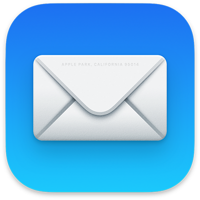

Our recommendation list contains email clients that support both [OpenPGP](encryption.md#openpgp) and strong authentication such as [Open Authorization (OAuth)](https://en.wikipedia.org/wiki/OAuth). OAuth allows you to use [Multi-Factor Authentication](multi-factor-authentication) and prevent account theft.

??? Attention "Email does not provide forward secrecy"

    When using end-to-end encryption (E2EE) technology like [OpenPGP](https://en.wikipedia.org/wiki/Pretty_Good_Privacy), email will still have [some metadata](email.md#email-metadata-overview) that is not encrypted in the header of the email.

    OpenPGP also does not support [forward secrecy](https://en.wikipedia.org/wiki/Forward_secrecy), which means if either your or the recipient's private key is ever stolen, all previous messages encrypted with it will be exposed: [How do I protect my private keys?](email.md#email-encryption-overview). Consider using a medium that provides forward secrecy:

    [Real-time Communication](real-time-communication.md){ .md-button }

### Thunderbird

!!! recommendation

    { align=right }

    **Thunderbird** is a free, open source, cross-platform email, newsgroup, news feed, and chat (XMPP, IRC, Twitter) client developed by the Thunderbird community, and previously by the Mozilla Foundation.

    [Visit thunderbird.net](https://www.thunderbird.net){ .md-button .md-button--primary } [Privacy Policy](https://www.mozilla.org/privacy/thunderbird){ .md-button }

    ??? downloads

        - [:fontawesome-brands-windows: Windows](https://www.thunderbird.net)
        - [:fontawesome-brands-apple: macOS](https://www.thunderbird.net)
        - [:fontawesome-brands-linux: Linux](https://www.thunderbird.net)
        - [:pg-flathub: Flatpak](https://flathub.org/apps/details/org.mozilla.Thunderbird)
        - [:fontawesome-brands-git: Source](https://hg.mozilla.org/comm-central)

### Apple Mail

!!! note

    For iOS devices we suggest [Canary Mail](#canary-mail) as it has PGP support which means you can send end-to-end encrypted email.

!!! recommendation

    { align=right }

    **Apple Mail** is included in macOS and can be extended to have OpenPGP support with [GPG Suite](encryption/#gpg-suite), which adds the ability to send encrypted email.

    [Visit apple.com](https://support.apple.com/guide/mail/welcome/mac){ .md-button .md-button--primary } [Privacy Policy](https://www.apple.com/legal/privacy/en-ww/){ .md-button }

### GNOME Evolution

!!! recommendation

    { align=right }

    **Evolution** is a personal information management application that provides integrated mail, calendaring and address book functionality. Evolution has extensive [documentation](https://help.gnome.org/users/evolution/stable/) to help you get started.

    [Visit gnome.org](https://wiki.gnome.org/Apps/Evolution){ .md-button .md-button--primary } [Privacy Policy](https://wiki.gnome.org/Apps/Evolution/PrivacyPolicy){ .md-button }

    ??? downloads

        - [:pg-flathub: Flatpak](https://flathub.org/apps/details/org.gnome.Evolution)
        - [:fontawesome-brands-gitlab: Source](https://gitlab.gnome.org/GNOME/evolution)

### Kontact

!!! recommendation

    { align=right }

    **Kontact** is a personal information manager (PIM) application from the [KDE](https://kde.org) project. It provides a mail client, address book, organizer and RSS client.

    [Visit kontact.kde.org](https://kontact.kde.org){ .md-button .md-button--primary } [Privacy Policy](https://kde.org/privacypolicy-apps){ .md-button }

    ??? downloads

        - [:fontawesome-brands-linux: Linux](https://kontact.kde.org/download)
        - [:pg-flathub: Flatpak](https://flathub.org/apps/details/org.kde.kontact)
        - [:fontawesome-brands-git: Source](https://invent.kde.org/pim/kmail)

### Mailvelope

!!! recommendation

    { align=right }

    **Mailvelope** is a browser extension that enables the exchange of encrypted emails following the OpenPGP encryption standard.

    [Visit mailvelope.com](https://www.mailvelope.com){ .md-button .md-button--primary } [Privacy Policy](https://www.mailvelope.com/en/privacy-policy){ .md-button }

    ??? downloads

        - [:fontawesome-brands-firefox: Firefox](https://addons.mozilla.org/firefox/addon/mailvelope)
        - [:fontawesome-brands-chrome: Chrome](https://chrome.google.com/webstore/detail/mailvelope/kajibbejlbohfaggdiogboambcijhkke)
        - [:fontawesome-brands-edge: Edge](https://microsoftedge.microsoft.com/addons/detail/mailvelope/dgcbddhdhjppfdfjpciagmmibadmoapc)
        - [:fontawesome-brands-github: Source](https://github.com/mailvelope/mailvelope)

### K-9 Mail

!!! recommendation

    { align=right }

    **K-9 Mail** is an independent mail application that supports both POP3 and IMAP mailboxes, but only supports push mail for IMAP.

    [Visit k9mail.app](https://k9mail.app){ .md-button .md-button--primary } [Privacy Policy](https://k9mail.app/privacy){ .md-button }

    ??? downloads

        - [:fontawesome-brands-google-play: Google Play](https://play.google.com/store/apps/details?id=com.fsck.k9)
        - [:pg-f-droid: F-Droid](https://f-droid.org/packages/com.fsck.k9)
        - [:fontawesome-brands-github: Source](https://github.com/k9mail)

### FairEmail

!!! recommendation

    { align=right }

    **FairEmail** is a minimal, open source email app, using open standards (IMAP, SMTP, OpenPGP) with a low data and battery usage.

    [Visit email.faircode.eu](https://email.faircode.eu){ .md-button .md-button--primary } [Privacy Policy](https://github.com/M66B/FairEmail/blob/master/PRIVACY.md){ .md-button }

    ??? downloads

        - [:fontawesome-brands-google-play: Google Play](https://play.google.com/store/apps/details?id=eu.faircode.email)
        - [:pg-f-droid: F-Droid](https://f-droid.org/packages/eu.faircode.email/)
        - [:fontawesome-brands-github: Source](https://github.com/M66B/FairEmail)

### Canary Mail

!!! recommendation

    { align=right }

    **Canary Mail** is a paid email client designed to make end-to-end encryption seamless with security features such as a biometric app lock.

    [Visit canarymail.io](https://canarymail.io){ .md-button .md-button--primary } [Privacy Policy](https://canarymail.io/privacy.html){ .md-button }

    ??? downloads

        - [:fontawesome-brands-windows: Windows](https://download.canarymail.io/get_windows)
        - [:fontawesome-brands-app-store: Mac App Store](https://apps.apple.com/app/id1236045954)
        - [:fontawesome-brands-app-store-ios: App Store](https://apps.apple.com/app/id1236045954)
        - [:fontawesome-brands-google-play: Google Play](https://play.google.com/store/apps/details?id=io.canarymail.android)

!!! attention

    Canary Mail only recently released a Windows and Android client, we don't believe they are as stable as their iOS and Mac counterparts.

Canary Mail is closed source. We recommend it, due to the few choices there are for email clients on iOS that support [Pretty Good Privacy (PGP)](https://en.wikipedia.org/wiki/Pretty_Good_Privacy) E2EE.

### NeoMutt

!!! recommendation

    { align=right }

    NeoMutt is an open-source command line mail reader (or MUA) for Linux and BSD. It's a fork of [Mutt](https://en.wikipedia.org/wiki/Mutt_(email_client)) with added features.

    NeoMutt is a text-based client that has a steep learning curve. It is however, very customizable.

    [Visit neomutt.org](https://neomutt.org){ .md-button .md-button--primary }

    ??? downloads

        - [:fontawesome-brands-linux: Linux](https://neomutt.org/distro)
        - [:fontawesome-brands-apple: macOS](https://neomutt.org/distro)
        - [:fontawesome-brands-github: Source](https://github.com/neomutt/neomutt)

--8<-- "includes/abbreviations.en.md"
