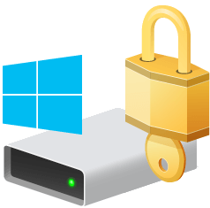
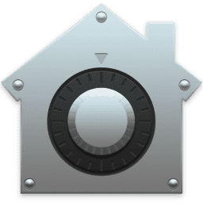
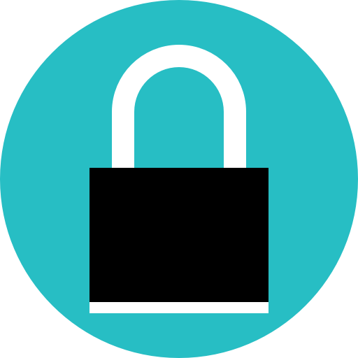

הצפנה של נתונים היא הדרך היחידה לשלוט מי יכול לגשת אליו. אם אינך משתמש כעת בתוכנת הצפנה עבור הדיסק הקשיח, הודעות הדוא"ל או הקבצים שלך, עליך לבחור אפשרות כאן.

## מרובה-פלטפורמות

האפשרויות המפורטות כאן הן מרובות פלטפורמות ונהדרות ליצירת גיבויים מוצפנים של הנתונים שלך.

### Cryptomator (ענן)

!!! recommendation

    { align=right }
    
    **Cryptomator** הוא פתרון הצפנה המיועד לשמירה פרטית של קבצים לכל ספק ענן. הוא מאפשר לך ליצור כספות המאוחסנות בכונן וירטואלי, שתוכנן מוצפן ומסונכרן עם ספק אחסון הענן שלך.
    
    [:octicons-home-16: Homepage](https://cryptomator.org){ .md-button .md-button--primary }
    [:octicons-eye-16:](https://cryptomator.org/privacy){ .card-link title="מדיניות פרטיות" }
    [:octicons-info-16:](https://docs.cryptomator.org/){ .card-link title=תיעוד}
    [:octicons-code-16:](https://github.com/cryptomator){ .card-link title="קוד מקור" }
    [:octicons-heart-16:](https://cryptomator.org/donate/){ .card-link title=לתרומה }
    
    ??? downloads "הורדות"
    
        - [:simple-googleplay: Google Play](https://play.google.com/store/apps/details?id=org.cryptomator)
        - [:simple-appstore: App Store](https://apps.apple.com/us/app/cryptomator-2/id1560822163)
        - [:simple-android: Android](https://cryptomator.org/android)
        - [:simple-windows11: Windows](https://cryptomator.org/downloads)
        - [:simple-apple: macOS](https://cryptomator.org/downloads)
        - [:simple-linux: Linux](https://cryptomator.org/downloads)
        - [:simple-flathub: Flathub](https://flathub.org/apps/details/org.cryptomator.Cryptomator)

Cryptomator משתמש בהצפנת AES-256 כדי להצפין קבצים ושמות קבצים. Cryptomator אינו יכול להצפין מטא-נתונים כגון חותמות זמן של גישה, שינוי ויצירה, וגם לא את המספר והגודל של קבצים ותיקיות.

חלק מספריות ההצפנה של Cryptomator [נבדקו](https://community.cryptomator.org/t/has-there-been-a-security-review-audit-of-cryptomator/44) על ידי Cure53. היקף הספריות המבוקרות כולל: [cryptolib](https://github.com/cryptomator/cryptolib), [cryptofs](https://github.com/cryptomator/cryptofs), [siv-mode](https://github.com/cryptomator/siv-mode) ו [cryptomator-objc-cryptor](https://github.com/cryptomator/cryptomator-objc-cryptor). הביקורת לא התרחבה ל-[cryptolib-swift](https://github.com/cryptomator/cryptolib-swift), שהיא ספרייה המשמשת את Cryptomator עבור iOS.

התיעוד של Cryptomator מפרט בפירוט רב יותר את [יעד האבטחה המיועד](https://docs.cryptomator.org/en/latest/security/security-target/), [ארכיטקטורת האבטחה](https://docs.cryptomator.org/en/latest/security/architecture/) ושיטות העבודה ה[מומלצות לשימוש](https://docs.cryptomator.org/en/latest/security/best-practices/).

### Picocrypt (קובץ)

!!! recommendation

    { align=right }
    
    **Picocrypt** הוא כלי הצפנה קטן ופשוט המספק הצפנה מודרנית. Picocrypt משתמשת בצופן XChaCha20 המאובטח ובפונקציית נגזרת המפתח Argon2id כדי לספק רמה גבוהה של אבטחה. הוא משתמש במודולי x/crypto הסטנדרטיים של Go עבור תכונות ההצפנה שלו.
    
    [:octicons-repo-16: מאגר](https://github.com/HACKERALERT/Picocrypt){ .md-button .md-button--primary }
    [:octicons-code-16:](https://github.com/HACKERALERT/Picocrypt){ .card-link title="קוד מקור" }
    [:octicons-heart-16:](https://opencollective.com/picocrypt){ .card-link title=לתרומה }
    
    ??? downloads "הורדות"
    
        - [:simple-windows11: Windows](https://github.com/HACKERALERT/Picocrypt/releases)
        - [:simple-apple: macOS](https://github.com/HACKERALERT/Picocrypt/releases)
        - [:simple-linux: Linux](https://github.com/HACKERALERT/Picocrypt/releases)

### VeraCrypt (דיסק)

!!! recommendation

    { align=right }
    { align=right }
    
    **VeraCrypt** הוא כלי תוכנה חופשית זמין במקור המשמש להצפנה תוך כדי תנועה. הוא יכול ליצור דיסק מוצפן וירטואלי בתוך קובץ, להצפין מחיצה או להצפין את התקן האחסון כולו באמצעות אימות טרום-אתחול.
    
    [:octicons-home-16: דף הבית](https://veracrypt.fr){ .md-button .md-button--primary }
    [:octicons-info-16:](https://veracrypt.fr/en/Documentation.html){ .card-link title=תיעוד}
    [:octicons-code-16:](https://veracrypt.fr/code/){ .card-link title="קוד מקור" }
    [:octicons-heart-16:](https://veracrypt.fr/en/Donation.html){ .card-link title=לתרומה }
    
    ??? downloads "הורדות"
    
        - [:simple-windows11: Windows](https://www.veracrypt.fr/en/Downloads.html)
        - [:simple-apple: macOS](https://www.veracrypt.fr/en/Downloads.html)
        - [:simple-linux: Linux](https://www.veracrypt.fr/en/Downloads.html)

VeraCrypt היא נגזרת של פרויקט TrueCrypt שהופסק. לדברי המפתחים שלה, שיפורי אבטחה יושמו ובעיות שהועלו על ידי ביקורת קוד TrueCrypt הראשונית טופלו.

בעת הצפנה עם VeraCrypt, יש לך אפשרות לבחור מתוך[פונקציות גיבוב](https://en.wikipedia.org/wiki/VeraCrypt#Encryption_scheme) שונות. אנו מציעים לך **רק** לבחור [SHA -512](https://en.wikipedia.org/wiki/SHA-512) ולהיצמד [AES](https://en.wikipedia.org/wiki/Advanced_Encryption_Standard) צופן בלוקים.

Truecrypt נבדק [מספר פעמים](https://en.wikipedia.org/wiki/TrueCrypt#Security_audits), ו - VeraCrypt נבדק גם [ בנפרד](https://en.wikipedia.org/wiki/VeraCrypt#VeraCrypt_audit).

## הצפנת דיסק מלא של מערכת ההפעלה

מערכות הפעלה מודרניות כוללות [FDE](https://en.wikipedia.org/wiki/Disk_encryption) ויהיה [מעבד קריפטו מאובטח](https://en.wikipedia.org/wiki/Secure_cryptoprocessor).

### BitLocker

!!! recommendation

    { align=right }
    
    **BitLocker** הוא פתרון ההצפנה בנפח מלא עם חלונות של מייקרוסופט. הסיבה העיקרית להמלצה היא [השימוש ב - TPM]( https://docs.microsoft.com/en-us/windows/security/information-protection/tpm/how-windows-uses-the-tpm). [ElcomSoft](https://en.wikipedia.org/wiki/ElcomSoft), חברת זיהוי פלילי, כתבה על כך ב -[ הבנה של BitLocker TPM Protection]( https://blog.elcomsoft.com/2021/01/understanding-bitLocker-tpm-protection/).
    
    [:octicons-info-16:](https://docs.microsoft.com/en-us/windows/security/information-protection/BitLocker/BitLocker-overview){ .card-link title=Documentation}

BitLocker [נתמך רק](https://support.microsoft.com/en-us/windows/turn-on-device-encryption-0c453637-bc88-5f74-5105-741561aae838) במהדורות Pro, Enterprise ו- Education של Windows. זה יכול להיות מופעל במהדורות הבית בתנאי שהם עומדים בדרישות המוקדמות.

??? example "הפיכת BitLocker לזמין ב- Windows Home"

    כדי להפוך את BitLocker לזמין במהדורות "בית" של Windows, עליך לאתחל מחיצות באמצעות [טבלת מחיצות GUID](https://en.wikipedia.org/wiki/GUID_Partition_Table) ומודול TPM ייעודי (v1.2, 2.0+).

    1. פתח שורת פקודה ובדוק את תבנית טבלת המחיצות של הכונן באמצעות הפקודה הבאה. אתה צריך לראות "**GPT**" המפורטים תחת "סגנון מחיצה ":

        ```
        powershell Get-Disk
        ```

    2. הפעל פקודה זו (בשורת הפקודה של מנהל המערכת) כדי לבדוק את גירסת TPM שברשותך. אתה אמור לראות `2.0` או `1.2` רשום ליד `SpecVersion`:

        ```
        powershell Get-WmiObject -Namespace "root/cimv2/security/microsofttpm" -Class WIN32_tpm
        ```

    3. גישה [אפשרויות הפעלה מתקדמות](https://support.microsoft.com/en-us/windows/advanced-startup-options-including-safe-mode-b90e7808-80b5-a291-d4b8-1a1af602b617). עליך לאתחל מחדש בעת לחיצה על מקש F8 לפני הפעלת Windows ולהיכנס לשורת הפקודה ** ב - **פתרון בעיות** → **אפשרויות מתקדמות** → **שורת הפקודה**.

    4. היכנס באמצעות חשבון מנהל המערכת שלך והקלד זאת בשורת הפקודה כדי להתחיל בהצפנה:

        ```
        manage-bde -on c: -used
        ```

    5. סגור את שורת הפקודה והמשך אתחול ל - Windows רגיל.

    6. פתח שורת פקודה של מנהל מערכת והפעל את הפקודות הבאות:

        ```
        manage-bde c: -protectors -add -rp -tpm
        manage-bde -protectors -enable c:
        manage-bde -protectors -get c: > %UserProfile%\Desktop\BitLocker-Recovery-Key.txt
        ```

        !!! tip
   
        גיבוי `BitLocker-Recovery-Key.txt` בשולחן העבודה שלך למכשיר אחסון נפרד. אובדן קוד שחזור זה עלול לגרום לאובדן נתונים.

### FileVault

!!! recommendation

    { align=right }
    
    **FileVault** הוא פתרון הצפנת אמצעי אחסון תוך כדי תנועה המובנה ב-macOS. FileVault מומלץ מכיוון שהוא מכיל [leverages](https://support.apple.com/guide/security/volume-encryption-with-filevault-sec4c6dc1b6e/web) יכולות אבטחת חומרה הנמצאות על שבב אבטחת סיליקון מסוג Apple SoC או T2.
    
    [:octicons-info-16:](https://support.apple.com/guide/mac-help/encrypt-mac-data-with-filevault-mh11785/mac){ .card-link title=Documentation}

אנו ממליצים לאחסן מפתח שחזור מקומי במקום מאובטח, בניגוד לשימוש בחשבון iCloud לצורך שחזור.

### הגדרת מפתח מאוחדת של לינוקס

!!! recommendation

    { align=right }
    
    **LUKS** היא שיטת ברירת המחדל של FDE עבור לינוקס. ניתן להשתמש בו כדי להצפין אמצעי אחסון מלאים, מחיצות או ליצור גורמים מכילים מוצפנים.
    
    [:octicons-home-16: Homepage](https://gitlab.com/cryptsetup/cryptsetup/-/blob/main/README.md){ .md-button .md-button--primary }
    [:octicons-info-16:](https://gitlab.com/cryptsetup/cryptsetup/-/wikis/home){ .card-link title=תיעוד}
    [:octicons-code-16:](https://gitlab.com/cryptsetup/cryptsetup/){ .card-link title="קוד מקור" }

??? example "יצירה ופתיחה של גורמים מכילים מוצפנים"

    ```
    dd if=/dev/urandom of=/path-to-file bs=1M count=1024 status=progress
    sudo cryptsetup luksFormat /path-to-file
    ```

    #### פתיחת קונטיינרים מוצפנים
    אנו ממליצים לפתוח קונטיינרים ואמצעי אחסון עם `udisksctl' מכיוון שמשתמש עם זה [Polkit](https://en.wikipedia.org/wiki/Polkit). רוב מנהלי הקבצים, כגון אלה הכלולים בסביבות שולחן עבודה פופולריות, יכולים לבטל את הנעילה של קבצים מוצפנים. כלים כמו [udiskie](https://github.com/coldfix/udiskie) יכול לפעול במגש המערכת ולספק ממשק משתמש מועיל.
    ```
    udisksctl loop-setup -f /path-to-file
    udisksctl unlock -b /dev/loop0
    ```

!!! note "זכור לגבות את כותרות עוצמת הקול"

    אנו ממליצים לך תמיד [לגבות את כותרות LUKS שלך](https://wiki.archlinux.org/title/Dm-crypt/Device_encryption#Backup_and_restore) במקרה של כשל חלקי בכונן. ניתן לעשות זאת באמצעות:

    ```
    cryptsetup luksHeaderBackup /dev/device --header-backup-file /mnt/backup/קובץ.img
    ```

## מבוסס-דפדפן

הצפנה מבוססת דפדפן יכולה להיות שימושית כאשר עליך להצפין קובץ, אך אינך יכול להתקין תוכנה או אפליקציה במכשיר שלך.

### hat.sh

!!! recommendation

    { align=right }
    { align=right }
    
    **Hat.sh** הוא יישום אינטרנט המספק הצפנת קבצים מאובטחת בצד הלקוח בדפדפן שלך. הוא גם יכול להיות באחסון עצמי והוא שימושי אם אתה צריך להצפין קובץ אבל לא יכול להתקין שום תוכנה במכשיר שלך בגלל מדיניות ארגונית.
    
    [:octicons-globe-16: Website](https://hat.sh){ .md-button .md-button--primary }
    [:octicons-eye-16:](https://hat.sh/about/){ .card-link title="מדיניות פרטיות" }
    [:octicons-info-16:](https://hat.sh/about/){ .card-link title=תיעוד}
    [:octicons-code-16:](https://github.com/sh-dv/hat.sh){ .card-link title="קוד מקור" }
    :octicons-heart-16:{ .card-link title="שיטות תרומה ניתן למצוא בתחתית האתר" }

## שורת פקודה

כלים עם ממשקי שורת פקודה שימושיים לשילוב [shell scripts](https://en.wikipedia.org/wiki/Shell_script).

### Kryptor

!!! recommendation

    { align=right }
    
    **Kryptor** הוא כלי חופשי וקוד פתוח להצפנה וחתימה על קבצים העושה שימוש באלגוריתמים קריפטוגרפיים מודרניים ומאובטחים. מטרתו להיות גרסה טובה יותר [age](https://github.com/FiloSottile/age) ו [Minisign](https://jedisct1.github.io/minisign/) כדי לספק חלופה פשוטה וקלה יותר ל-GPG.
    
    [:octicons-home-16: Homepage](https://www.kryptor.co.uk){ .md-button .md-button--primary }
    [:octicons-eye-16:](https://www.kryptor.co.uk/features#privacy){ .card-link title="מדיניות פרטיות" }
    [:octicons-info-16:](https://www.kryptor.co.uk/tutorial){ .card-link title=תיעוד}
    [:octicons-code-16:](https://github.com/samuel-lucas6/Kryptor){ .card-link title="קוד מקור" }
    [:octicons-heart-16:](https://www.kryptor.co.uk/#donate){ .card-link title=לתרומה }
    
    ??? downloads "הורדות"
    
        - [:simple-windows11: Windows](https://www.kryptor.co.uk)
        - [:simple-apple: macOS](https://www.kryptor.co.uk)
        - [:simple-linux: Linux](https://www.kryptor.co.uk)

### Tomb

!!! recommendation

    { align=right }
    
    **Tomb** הוא עטיפת מעטפת שורת פקודה עבור LUKS. הוא תומך סטגנוגרפיה באמצעות [כלי צד שלישי](https://github.com/dyne/Tomb#how-does-it-work).
    
    [:octicons-home-16: דף הבית](https://www.dyne.org/software/tomb){ .md-button .md-button--primary }
    [:octicons-info-16:](https://github.com/dyne/Tomb/wiki){ .card-link title=תיעוד}
    [:octicons-code-16:](https://github.com/dyne/Tomb){ .card-link title="קוד מקור" }
    [:octicons-heart-16:](https://www.dyne.org/donate){ .card-link title=לתרומה }

## OpenPGP

OpenPGP נחוץ לעתים למשימות ספציפיות כגון חתימה דיגיטלית והצפנת דואר אלקטרוני. ל PGP יש תכונות רבות והוא [מורכב](https://latacora.micro.blog/2019/07/16/the-pgp-problem.html) כפי שהוא כבר זמן רב. עבור משימות כגון חתימה או הצפנה של קבצים, אנו מציעים את האפשרויות לעיל.

בעת הצפנה עם PGP, יש לך אפשרות להגדיר אפשרויות שונות בקובץ `gpg.conf`. אנו ממליצים להישאר עם האפשרויות הסטנדרטיות שצוינו ב [שאלות נפוצות למשתמש GnuPG](https://www.gnupg.org/faq/gnupg-faq.html#new_user_gpg_conf).

!!! tip "השתמש בברירות מחדל עתידיות בעת יצירת מפתח"

    כאשר [יצירת מפתחות](https://www.gnupg.org/gph/en/manual/c14.html) אנו מציעים להשתמש בפקודה 'ברירת מחדל עתידית', שכן זו תנחה את GnuPG להשתמש בקריפטוגרפיה מודרנית כגון [Curve25519](https://en.wikipedia.org/wiki/Curve25519#History) ו-[Ed25519](https://ed25519.cr.yp.to/):

    ```bash
    gpg --quick-gen-key alice@example.com ברירת מחדל עתידית
    ```

### GNU Privacy Guard

!!! recommendation

    { align=right }
    
    **GnuPG** היא חלופה ברישיון GPL לחבילת תוכנות ההצפנה PGP. GnuPGGnuPG תואם ל-[RFC 4880](https://tools.ietf.org/html/rfc4880), שהוא מפרט ה-IETF הנוכחי של OpenPGP. פרויקט GnuPG עובד על [טיוטה מעודכנת](https://datatracker.ietf.org/doc/draft-ietf-openpgp-crypto-refresh/) בניסיון להפוך את OpenPGP למודרני. GnuPG הוא חלק מפרויקט התוכנה GNU של קרן התוכנה החופשית וקיבל [funding]מרכזי (https://gnupg.org/blog/20220102-a-new-future-for-gnupg.html) מממשלת גרמניה.
    
    [:octicons-home-16: Homepage](https://gnupg.org){ .md-button .md-button--primary }
    [:octicons-eye-16:](https://gnupg.org/privacy-policy.html){ .card-link title="מדיניות פרטיות" }
    [:octicons-info-16:](https://gnupg.org/documentation/index.html){ .card-link title=תיעוד}
    [:octicons-code-16:](https://git.gnupg.org/cgi-bin/gitweb.cgi?p=gnupg.git){ .card-link title="קוד מקור" }
    
    ??? downloads "הורדות"
    
        - [:simple-googleplay: Google Play](https://play.google.com/store/apps/details?id=org.sufficientlysecure.keychain)
        - [:simple-windows11: Windows](https://gpg4win.org/download.html)
        - [:simple-apple: macOS](https://gpgtools.org)
        - [:simple-linux: Linux](https://gnupg.org/download/index.html#binary)

### GPG4win

!!! recommendation

    { align=right }
    
    **GPG4win** היא חבילה עבור Windows מתוך [Intevation וקוד g10](https://gpg4win.org/impressum.html). הוא כולל [כלים שונים](https://gpg4win.org/about.html) שיכולים לסייע לך בשימוש ב- GPG ב- Microsoft Windows. הפרויקט יזם ובמקור [מומן על ידי] (https://web.archive.org/web/20190425125223/https://joinup.ec.europa.eu/news/government-בשימוש-קריפטוגרפיה) המשרד הפדרלי לאבטחת מידע בגרמניה (BSI) בשנת 2005.
    
    [:octicons-home-16: Homepage](https://gpg4win.org){ .md-button .md-button--primary }
    [:octicons-eye-16:](https://gpg4win.org/privacy-policy.html){ .card-link title="מדיניות פרטיות" }
    [:octicons-info-16:](https://gpg4win.org/documentation.html){ .card-link title=תיעוד}
    [:octicons-code-16:](https://git.gnupg.org/cgi-bin/gitweb.cgi?p=gpg4win.git;a=summary){ .card-link title="קוד מקור" }
    [:octicons-heart-16:](https://gpg4win.org/donate.html){ .card-link title=לתרומה }
    
    ??? downloads "הורדות"
    
        - [:simple-windows11: Windows](https://gpg4win.org/download.html)

### GPG Suite

!!! note "הערה"

    אנו מציעים [דואר קנרי](email-clients.md#canary-mail) לשימוש ב-PGP עם דוא"ל במכשירי iOS.

!!! recommendation

    { align=right }
    
    **GPG Suite** מספקת תמיכה ב-OpenPGP עבור [Apple Mail] (דוא"ל-clients.md#apple-mail) ו-macOS.
    
    אנו ממליצים להעיף מבט על [הצעדים הראשונים](https://gpgtools.tenderapp.com/kb/how-אל/צעדים ראשונים-איפה-לעשות-אני-להתחיל-איפה-לעשות-אני-להתחיל-הגדרה-gpgtools-ליצור-מפתח-חדש-שלך-ראשון-מוצפן-דוא"ל) ו [מאגר ידע](https://gpgtools.tenderapp.com/kb) לתמיכה.
    
    [:octicons-home-16: Homepage](https://gpgtools.org){ .md-button .md-button--primary }
    [:octicons-eye-16:](https://gpgtools.org/privacy){ .card-link title="מדיניות פרטיות" }
    [:octicons-info-16:](https://gpgtools.tenderapp.com/kb){ .card-link title=תיעוד}
    [:octicons-code-16:](https://github.com/GPGTools){ .card-link title="קוד מקור" }
    
    ??? downloads "הורדות"
    
        - [:simple-apple: macOS](https://gpgtools.org)

### OpenKeychain

!!! recommendation

    { align=right }
    
    **OpenKeychain ** הוא יישום אנדרואיד של GnuPG. זה נדרש בדרך כלל על ידי לקוחות דואר כגון [K-9 Mail](email-clients.md#k-9-mail) ו-[FairEmail](email-clients.md#fairemail) ואפליקציות אנדרואיד אחרות כדי לספק תמיכה בהצפנה. Cure53 השלימה [ביקורת אבטחה](https://www.openkeychain.org/openkeychain-3-6) של OpenKeychain 3.6 באוקטובר 2015. פרטים טכניים על הביקורת ועל הפתרונות של OpenKeychain ניתן למצוא [here](https://github.com/open-keychain/open-keychain/wiki/cure53-Security-Audit-2015).
    
    [:octicons-home-16: דף הבית](https://www.openkeychain.org){ .md-button .md-button--primary }
    [:octicons-eye-16:](https://www.openkeychain.org/help/privacy-policy){ .card-link title="מדיניות פרטיות" }
    [:octicons-info-16:](https://www.openkeychain.org/faq/){ .card-link title=תיעוד}
    [:octicons-code-16:](https://github.com/open-keychain/open-keychain){ .card-link title="קוד מקור" }
    :octicons-heart-16:{ .card-link title="ניתן לתרום בתוך האפליקציה" }
    
    ??? downloads "הורדות"
    
        - [:simple-googleplay: Google Play](https://play.google.com/store/apps/details?id=org.sufficientlysecure.keychain)

## קריטריונים

**שים לב שאיננו קשורים לאף אחד מהפרויקטים שאנו ממליצים עליהם.** בנוסף [לקריטריונים הסטנדרטיים שלנו](about/criteria.md), פיתחנו סט ברור של דרישות כדי לאפשר לנו לספק המלצות אובייקטיביות. אנו מציעים לך להכיר את הרשימה הזו לפני שתבחר להשתמש בפרויקט, ולערוך מחקר משלך כדי להבטיח שזו הבחירה הנכונה עבורך.

!!! example "חלק זה הוא חדש"

    אנו עובדים על קביעת קריטריונים מוגדרים לכל קטע באתר שלנו, והדבר עשוי להשתנות. אם יש לך שאלות לגבי הקריטריונים שלנו, אנא [שאל בפורום שלנו]( https://discuss.privacyguides.net/latest) ואל תניח שלא שקלנו משהו בעת ביצוע ההמלצות שלנו אם זה לא מופיע כאן. ישנם גורמים רבים שנלקחים בחשבון ונדונים כאשר אנו ממליצים על פרויקט, ותיעוד כל אחד מהם הוא עבודה בתהליך.

### כישורים מינימליים

- אפליקציות הצפנה חוצות פלטפורמות חייבות להיות בקוד פתוח.
- יישומי הצפנת קבצים חייבים לתמוך בפענוח ב - Linux, MacOS ו - Windows.
- יישומי הצפנת דיסק חיצוניים חייבים לתמוך בפענוח ב - Linux, MacOS ו - Windows.
- יישומי הצפנת דיסק פנימיים (OS) חייבים להיות חוצי פלטפורמות או מובנים במערכת ההפעלה באופן מקורי.

### המקרה הטוב ביותר

הקריטריונים שלנו במקרה הטוב ביותר מייצגים את מה שהיינו רוצים לראות מהפרויקט המושלם בקטגוריה זו. ההמלצות שלנו לא יכולות לכלול את כל הפונקציונליות הזו או את כולה, אך אלה שכן דורגו גבוה יותר מאחרים בדף זה.

- יישומי הצפנה של מערכת הפעלה (FDE) צריכים להשתמש באבטחת חומרה כגון TPM או Secure Enclave.
- אפליקציות להצפנת קבצים צריכות לקבל תמיכה ראשונה או שלישית בפלטפורמות לנייד.
