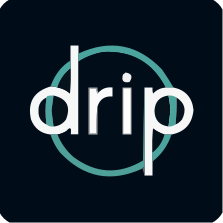

Many people use apps and databases to track a variety of data related to their fitness and health, but some apps and services are more privacy respecting than others, and making the wrong choice could have serious consequences.

## Health Databases

### Apple Health

!!! recommendation

    **Apple Health** is a health information management app which organizes and centralizes your health and fitness data securely on your mobile device. Your data can be safely shared with family or your healthcare provider. Apple Health collects data from your device's built-in fitness sensors, many health-related apps, and your healthcare provider's own records system.

    [:octicons-home-16: Homepage](https://www.apple.com/ios/health/)

Unfortunately, when it comes to Android devices an all-in-one alternative to Apple Health does not really exist. There have been various attempts to create a singular health ecosystem in the form of Google Fit and Samsung S Health, both of which are cloud-based solutions which are not privacy-friendly. Android has announced a new "Health Connect" API which allows you to manage data sharing locally on your device, but it has not yet been widely implemented, and data privacy will come down to the privacy policies of the third-party apps which connect with it.

## Medical Record Storage

These apps help you collect and manage your personal health data, and share it with health services, organizations, and apps you trust.

### Apple Health Records

!!! recommendation

    **Apple Health Records** allows you to aggregate your health records from one or multiple supported institutions and store SMART Health Cards in one place. Your health data is received directly from your medical provider, stored locally on your iOS device with strong encryption, and (optional) iCloud backups are secured with zero-knowledge encryption to ensure Apple never has access to any information stored.

    [:octicons-book-16: Setup Guide](https://support.apple.com/en-us/HT208680){ .md-button .md-button--primary }
    [:octicons-info-16:](https://www.apple.com/healthcare/health-records/){ .card-link title=Documentation}

### CommonHealth

!!! recommendation

    **CommonHealth** was developed as an open source, Android alternative to Apple Health. Currently, CommonHealth only replicates Apple's Health Records feature, but they plan to include more patient-generated fitness/health tracking functionality in the future. CommonHealth implements SMART Health Cards and integrates with thousands of healthcare providers and care facilities to enable you to privately collect and manage your personal health data. Your data stored in CommonHealth is stored only on your device, never with any online service.

    [:octicons-home-16: Homepage](https://www.commonhealth.org/){ .md-button .md-button--primary }
    [:octicons-mark-github-16:](https://github.com/the-commons-project){ .card-link title='GitHub Directory'}

## Medication Tracking

iOS 16+ users should consider using Apple Health's native medication tracking feature, which has automatic reminders, medication logging, and drug interaction warnings built in. Using native, locally-based solutions instead of third-party apps reduces your attack surface by limiting the number of parties that may have access to or be responsible for protecting your data.

## Sexual Health

If you need to keep track of menstrual cycles or any other sexual-health-related data, privacy is of the utmost importance. However, many popular cycle tracking apps integrate a number of tracking networks, cloud/internet integrations, and advertisements which can compromise that privacy. The apps we recommend here operate exclusively on your mobile device to ensure only you have access to that data.

iOS users should consider using Apple Health's built-in [Cycle Tracking](https://support.apple.com/en-us/HT210407) feature, which lets you log your period, record symptoms like cramps, and track cycle factors like lactation in your Apple Health app, rather than relying on one of these third party solutions. Using native, locally-based solutions instead of third-party apps reduces your attack surface by limiting the number of parties that may have access to or be responsible for protecting your data.

### Drip (Android & iOS)

!!! recommendation

{ align=right }

**Drip** is a minimal, open-source period tracker app. All data is stored locally on your device. It features data import and export, and a pin to lock the app.

[:octicons-home-16: Homepage](https://bloodyhealth.gitlab.io/){ .md-button .md-button--primary }
[:octicons-eye-16:](https://bloodyhealth.gitlab.io/privacy-policy.html){ .card-link title="Privacy Policy" }
[:octicons-info-16:](https://gitlab.com/bloodyhealth/drip/-/blob/main/README.md){ .card-link title=Documentation}
[:octicons-code-16:](https://gitlab.com/bloodyhealth/drip){ .card-link title="Source Code" }
[:octicons-heart-16:](https://gitlab.com/bloodyhealth/drip/-/blob/main/CONTRIBUTING.md){ .card-link title=Contribute }

??? downloads

    - [:fontawesome-brands-app-store-ios: App Store](https://apps.apple.com/us/app/drip./id1584564949)
    - [:fontawesome-brands-google-play: Google Play](https://play.google.com/store/apps/details?id=com.drip)
    - [:pg-f-droid: F-Droid](https://f-droid.org/packages/com.drip/)

### Euki (Android & iOS)

!!! recommendation

{ align=right }

**Euki** is a free period tracker app that features comprehensive sexual and reproductive health information. It can be locked with a pin.

[:octicons-home-16: Homepage](https://eukiapp.com/){ .md-button .md-button--primary }
[:octicons-eye-16:](https://eukiapp.com/privacy-policy){ .card-link title="Privacy Policy" }

??? downloads

    - [:fontawesome-brands-app-store-ios: App Store](https://apps.apple.com/us/app/euki/id1469213846)
    - [:fontawesome-brands-google-play: Google Play](https://play.google.com/store/apps/details?id=com.kollectivemobile.euki)

### Periodical

## Sleep Tracking

Apple Watch users should consider using WatchOS' native sleep tracking functionality. Using native, locally-based solutions instead of third-party apps reduces your attack surface by limiting the number of parties that may have access to or be responsible for protecting your data.

### AutoSleep

!!! recommendation

    **AutoSleep** is an iOS app which uses your Apple Watch to track your sleep. AutoSleep operates entirely on your device, with no advertising, tracking, or cloud integrations.

### Sleep as Android

!!! recommendation

    **Sleep as Android** is an advanced sleep phase tracking and alarm app for Android devices.

## Workouts/Exercise Tracking

### Apple Fitness
