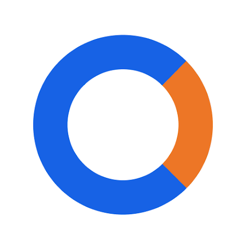

<small>Protects against the following threat(s):</small>

- [:material-server-network: Service Providers](basics/common-threats.md#privacy-from-service-providers){ .pg-teal }

Keep track of your health and fitness-related goals with these apps. Unlike their mainstream alternatives, your personal health information will be kept private.

## Menstrual Cycle Tracking

Popular menstrual trackers like [Flo](https://techcrunch.com/2021/01/13/flo-gets-ftc-slap-for-sharing-user-data-when-it-promised-privacy) are notorious for collecting and sharing your user data. Depending on your jurisdiction, this may lead to [legal consequences](https://forbes.com/sites/abigaildubiniecki/2024/11/14/post-roe-your-period-app-data-could-be-used-against-you) affecting your reproductive autonomy.

### Drip

{ align=right }

**Drip** is a gender-inclusive and open source menstrual cycle tracker available on all mobile platforms. It relies on the "sympto-thermal method" to predict ovulation. All user data is stored locally on your device and can be protected with a password.

[:octicons-home-16: Homepage](https://bloodyhealth.gitlab.io){ .md-button .md-button--primary }
[:octicons-eye-16:](https://bloodyhealth.gitlab.io/privacy-policy.html){ .card-link title="Privacy Policy" }
[:octicons-info-16:](https://bloodyhealth.gitlab.io/faq){ .card-link title="Documentation" }
[:octicons-code-16:](https://gitlab.com/bloodyhealth/drip){ .card-link title="Source Code" }

Downloads

- [:simple-googleplay: Google Play](https://play.google.com/store/apps/details?id=com.drip)
- [:simple-appstore: App Store](https://apps.apple.com/us/app/drip/id1584564949)
- [:simple-android: Android](https://bloodyhealth.gitlab.io)

### Euki

{ align=right }

**Euki** is a nonprofit-backed menstrual cycle tracker that also doubles as a medication tracker and sexual wellness knowledge base. It allows you to schedule the automatic deletion of your personal data in the app. All user data is stored locally on your device and can be protected with a password.

[:octicons-home-16: Homepage](https://eukiapp.org){ .md-button .md-button--primary }
[:octicons-eye-16:](https://eukiapp.org/privacy-policy){ .card-link title="Privacy Policy" }
[:octicons-code-16:](https://github.com/Euki-Inc/Euki-Android){ .card-link title="Source Code" }
[:octicons-heart-16:](https://every.org/euki-app){ .card-link title="Contribute" }

Downloads

- [:simple-googleplay: Google Play](https://play.google.com/store/apps/details?id=com.kollectivemobile.euki)
- [:simple-appstore: App Store](https://apps.apple.com/app/euki/id1469213846)

## Fitness Trackers

These general purpose apps can do everything from counting steps and tracking sleep to measuring your heartbeat.

### Apple Health

{ align=right }{ align=right }

**Apple Health** is the default health and fitness app for iOS. Apple Health always uses end-to-end encryption when syncing across multiple devices. Additionally, almost all measured data is processed on your device.

[:octicons-home-16: Homepage](https://apple.com/health){ .md-button .md-button--primary }
[:octicons-eye-16:](https://apple.com/legal/privacy/consumer-health-personal-data/en-ww){ .card-link title="Privacy Policy" }

Downloads

- [:simple-appstore: App Store](https://apps.apple.com/app/apple-health/id1242545199)

### Gadgetbridge

{ align=right }{ align=right }

**Gadgetbridge** is an open-source Android application which allows you to pair and manage your Bluetooth device without relying on the vendor’s application. When paired with a compatible smartwatch, it can mimic the health and wellness functionality of these watches without third-party data collection.

[:octicons-home-16: Homepage](https://gadgetbridge.org){ .md-button .md-button--primary }
[:octicons-info-16:](https://gadgetbridge.org/basics){ .card-link title="Documentation" }
[:octicons-code-16:](https://codeberg.org/Freeyourgadget/Gadgetbridge){ .card-link title="Source Code" }
[:octicons-heart-16:](https://liberapay.com/Gadgetbridge/donate){ .card-link title="Contribute" }

Downloads

- [:simple-fdroid: F-Droid](https://f-droid.org/packages/nodomain.freeyourgadget.gadgetbridge)

Gadgetbridge's app functionality includes, but is not limited to: step counting, sleep tracking, heart rate monitoring, etc.

Make sure to review the smartwatch [compatibility list](https://gadgetbridge.org/gadgets) before purchasing a device. Some devices require you to download the vendor's app and connect the smartwatch to their servers prior to installing Gadgetbridge.

## Health Records

These apps help you collect and manage personal health data and share it with health providers, organizations, and other apps.

### Apple Health Records

{ align=right }{ align=right }

**Apple Health Records** is a built-in feature within [Apple Health](#apple-health) that allows you to view, store, and share your health records. It shares the security and privacy features of Apple Health.

[:octicons-home-16: Homepage](https://apple.com/health){ .md-button .md-button--primary }
[:octicons-eye-16:](https://apple.com/legal/privacy/consumer-health-personal-data/en-ww){ .card-link title="Privacy Policy" }

Downloads

- [:simple-appstore: App Store](https://apps.apple.com/app/apple-health/id1242545199)

### CommonHealth

{ align=right }

**CommonHealth** is a privacy-respecting Android app that allows people to access their electronic health records and securely share it to providers. All health data is stored on your device and can be protected with a passcode or biometric authentication.

[:octicons-home-16: Homepage](https://commonhealth.org){ .md-button .md-button--primary }
[:octicons-eye-16:](https://commonhealth.org/privacy){ .card-link title="Privacy Policy" }

Downloads

- [:simple-googleplay: Google Play](https://play.google.com/store/apps/details?id=org.thecommonsproject.android.phr)

CommonHealth is only available in the United States. Although the app itself is closed source, the [developer SDK is open source](https://github.com/the-commons-project).

## Criteria

**Please note we are not affiliated with any of the projects we recommend.** In addition to [our standard criteria](about/criteria.md), we have developed a clear set of requirements to allow us to provide objective recommendations. We suggest you familiarize yourself with this list before choosing to use a project, and conduct your own research to ensure it's the right choice for you.

### Minimum Requirements

- Must support automatic updates.
- Must not store unencrypted data outside the device.
- Must function offline.
