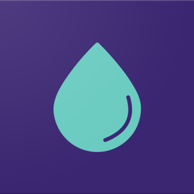

<small>Protects against the following threat(s):</small>

- [:material-account-cash: Surveillance Capitalism](basics/common-threats.md#surveillance-as-a-business-model){ .pg-brown }
- [:material-account-cash: Mass Surveillance](basics/common-threats.md#mass-surveillance){ .pg-red }

These are our currently recommended **mobile web browsers** and configurations for standard/non-anonymous internet browsing. If you need to browse the internet anonymously, you should use [Tor](tor.md) instead.

# Period Trackers

## drip.

{ align=right }

Placeholder description

[:octicons-home-16: Homepage](https://bloodyhealth.gitlab.io/){ .md-button .md-button--primary }
[:octicons-eye-16:](https://bloodyhealth.gitlab.io/privacy-policy.html){ .card-link title="Privacy Policy" }
[:octicons-code-16:](https://gitlab.com/bloodyhealth/drip){ .card-link title="Source Code" }

Downloads

- [:simple-googleplay: Google Play](https://play.google.com/store/apps/details?id=com.drip)
- [:simple-appstore: App Store](https://apps.apple.com/us/app/drip/id1584564949)
- [:simple-android: F-Droid](https://f-droid.org/packages/com.drip/)
- [:simple-gitlab: GitLab](https://gitlab.com/bloodyhealth/drip)

## Euki

{ align=right }

**Euki** is a 

[:octicons-home-16: Homepage](https://eukiapp.org){ .md-button .md-button--primary }
[:octicons-eye-16:](https://eukiapp.org/privacy-policy){ .card-link title="Privacy Policy" }

Downloads

- [:simple-appstore: App Store](https://apps.apple.com/us/app/euki/id1469213846?ls=1)
- [:simple-googleplay: Google Play](https://play.google.com/store/apps/details?id=com.kollectivemobile.euki)

## Criteria

**Please note we are not affiliated with any of the projects we recommend.** In addition to [our standard criteria](about/criteria.md), we have developed a clear set of requirements to allow us to provide objective recommendations. We suggest you familiarize yourself with this list before choosing to use a project, and conduct your own research to ensure it's the right choice for you.

### Minimum Requirements

- Must support automatic updates.
- Must receive engine updates from upstream releases quickly.
- Must support content blocking.
- Any changes required to make the browser more privacy-respecting should not negatively impact user experience.
