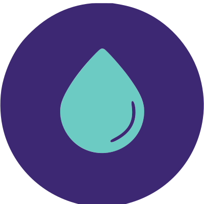
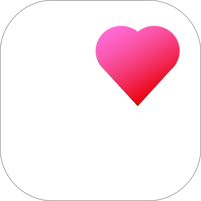

<small>Protects against the following threat(s):</small>

- [:material-server-network: Service Providers](basics/common-threats.md#privacy-from-service-providers){ .pg-teal }

Keep track of your health and fitness-related goals with these apps. Unlike their mainstream alternatives, your personal health information will be kept private. 

## Menstrual Cycle Tracking 

Popular menstrual trackers like [Flo](https://techcrunch.com/2021/01/13/flo-gets-ftc-slap-for-sharing-user-data-when-it-promised-privacy/) are notorious for collecting and sharing your user data. Depending on your jurisidiction, this may lead to [legal consquences](https://www.forbes.com/sites/abigaildubiniecki/2024/11/14/post-roe-your-period-app-data-could-be-used-against-you/) affecting your reproductive autonomy.

### drip.

{ align=right }

**drip.** is a gender-inclusive and open source menstrual cycle tracker available on all mobile platforms. It relies on the sympto-thermal method to predict ovulation. In addition to pin protection, all user data is stored locally on the device.

[:octicons-home-16: Homepage](https://bloodyhealth.gitlab.io/){ .md-button .md-button--primary }
[:octicons-eye-16:](https://bloodyhealth.gitlab.io/privacy-policy.html){ .card-link title="Privacy Policy" }
[:octicons-code-16:](https://gitlab.com/bloodyhealth/drip){ .card-link title="Source Code" }

Downloads

- [:simple-googleplay: Google Play](https://play.google.com/store/apps/details?id=com.drip)
- [:simple-appstore: App Store](https://apps.apple.com/us/app/drip/id1584564949)
- [:simple-android: F-Droid](https://f-droid.org/packages/com.drip/)
- [:simple-gitlab: GitLab](https://gitlab.com/bloodyhealth/drip)

### Euki

{ align=right }

**Euki** is a nonprofit-backed menstrual cycle tracker that also doubles as a medication tracker and sexual wellness knowledge base. It allows you to regularly delete personal data through scheduled "sweeps" and features no third-party tracking. Pin protection is also included with this app.

[:octicons-home-16: Homepage](https://eukiapp.org){ .md-button .md-button--primary }
[:octicons-eye-16:](https://eukiapp.org/privacy-policy){ .card-link title="Privacy Policy" }
[:octicons-code-16:](https://github.com/Euki-Inc/Euki-Android){ .card-link title="Source Code" }
[:octicons-heart-16:](https://www.every.org/euki-app){ .card-link title="Contribute" }

Downloads

- [:simple-appstore: App Store](https://apps.apple.com/us/app/euki/id1469213846?ls=1)
- [:simple-googleplay: Google Play](https://play.google.com/store/apps/details?id=com.kollectivemobile.euki)
- [:simple-github: Github](https://github.com/Euki-Inc/Euki-Android)

## Fitness Trackers

These general purpose apps can do everything from counting steps and tracking sleep to measuring your heartbeat.

### Apple Health

  
{ align=right }

**Apple Health** is the default healh and fitness app in iOS. Their privacy policy states that your personal data in encrypted at-rest and in-transit. Apple Health utilizes end-to-end encryption when syncing across multiple devices. Additionally, almost all measured data is processed on your phone. 

[:octicons-home-16: Homepage](https://www.apple.com/health/){ .md-button .md-button--primary }
[:octicons-eye-16:](https://www.apple.com/legal/privacy/consumer-health-personal-data/en-ww/){ .card-link title="Privacy Policy" }

Downloads

- [:simple-appstore: App Store](https://apps.apple.com/us/app/apple-health/id1242545199)

### Gadgetbridge

  
{ align=right }

**Gadgetbridge** allows you to pair and manage your bluetooth devices without using the vendor’s application. When paired with a compatible smartwatch, it can mimic the health and wellness functionality of these watches without third-party data collection. Gadgetbridge features include but are not limited to: a step counter, sleep tracker, and a heartbeat rate monitor.

[:octicons-home-16: Homepage](https://gadgetbridge.org/){ .md-button .md-button--primary }
[:octicons-code-16:](https://codeberg.org/Freeyourgadget/website){ .card-link title="Source Code" }

Downloads

- [:simple-android: F-Droid](https://f-droid.org/packages/nodomain.freeyourgadget.gadgetbridge/)
- [:simple-code: Codeberg](https://codeberg.org/Freeyourgadget/Gadgetbridge)

Make sure to review the smartwatch [compatibility list](https://gadgetbridge.org/gadgets/) before purchasing a device. Some brands require you to download their app and connect the smartwatch to their servers prior to installing Gadgetbridge. 

## Health Records

These apps help you collect and manage personal health data and share it with health providers, organizations and other apps.

### Apple Health Records

  
{ align=right }

**Apple Health Records** is a built-in feature within **Apple Health** that allows you to view, store, and share your health records. It shares the security and privacy features of Apple Health.

[:octicons-home-16: Homepage](https://www.apple.com/health/){ .md-button .md-button--primary }
[:octicons-eye-16:](https://www.apple.com/legal/privacy/consumer-health-personal-data/en-ww/){ .card-link title="Privacy Policy" }

Downloads

- [:simple-appstore: App Store](https://apps.apple.com/us/app/apple-health/id1242545199)

### CommonHealth
 

{ align=right }

**CommonHealth** is a privacy-respecting android alternative to Apple Health Records. It allows people to access their electronic health records and securely share it to providers.

[:octicons-home-16: Homepage](https://www.commonhealth.org/){ .md-button .md-button--primary }
[:octicons-eye-16:](https://www.commonhealth.org/privacy){ .card-link title="Privacy Policy" }

Downloads

- [:simple-googleplay: Google Play](https://play.google.com/store/apps/details?hl=en_US&id=org.thecommonsproject.android.phr)

CommonHealth is only available in the United States. It may not work on [rooted devices](https://www.commonhealth.org/ehr-implementation-guide#ehr-link-7) or devices with a custom ROM like Graphene OS. Although the app itself is closed source, the [developer SDK is open source](https://github.com/the-commons-project).

## Criteria

**Please note we are not affiliated with any of the projects we recommend.** In addition to [our standard criteria](about/criteria.md), we have developed a clear set of requirements to allow us to provide objective recommendations. We suggest you familiarize yourself with this list before choosing to use a project, and conduct your own research to ensure it's the right choice for you.

### Minimum Requirements

- Must support automatic updates.
- Must not store unencrypted data outside of the device.
- Must function offline.
- Must be reliably maintained for the foreseeable future.
