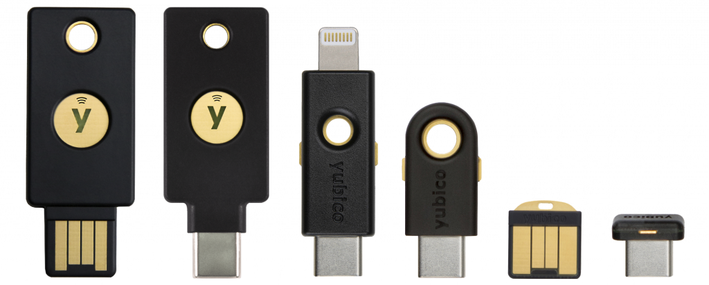
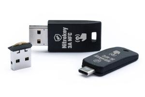

## מפתחות אבטחה לחומרה

### YubiKey

!!! recommendation

    
    
    **YubiKeys ** הם בין מפתחות האבטחה הפופולריים ביותר. לדגמים מסוימים של YubiKey יש מגוון רחב של תכונות כגון: [Universal 2nd Factor (U2F)](https://en.wikipedia.org/wiki/Universal_2nd_Factor), [FIDO2 and WebAuthn](basics/multi-factor-authentication.md#fido-fast-identity-online), [Yubico OTP](basics/multi-factor-authentication.md#yubico-otp), [Personal Identity Verification (PIV)] (https://developers.yubico.com/PIV), [OpenPGP](https://developers.ubico.com/PGP/),[ TOOTTP and HPP (https://developers.OATico.com/pication).
    
    אחד היתרונות של YubiKey הוא שמפתח אחד יכול לעשות כמעט הכל (YubiKey 5), אתה יכול לצפות ממפתח אבטחת חומרה. אנו ממליצים לך לקחת את [quiz](https://www.yubico.com/quiz/) לפני הרכישה כדי לוודא שאתה עושה את הבחירה הנכונה.
    
    [:octicons-home-16: Homepage](https://www.yubico.com){ .md-button .md-button--primary }
    [:octicons-eye-16:](https://www.yubico.com/support/terms-conditions/privacy-notice){ .card-link title="מדיניות פרטיות" }
    [:octicons-info-16:](https://docs.yubico.com/){ .card-link title=תיעוד}

[טבלת ההשוואה](https://www.yubico.com/store/compare/) מציגה את התכונות ואת אופן ההשוואה של YubiKeys. אנו ממליצים בחום לבחור במפתחות מסדרת YubiKey 5.

ניתן לתכנת את [YubiKey מנהל](https://www.yubico.com/support/download/yubikey-manager/) או [YubiKey כלי התאמה אישית](https://www.yubico.com/support/download/yubikey-personalization-tools/). לניהול קודי TOTP, תוכל להשתמש ב - [Yubico Authenticator](https://www.yubico.com/products/yubico-authenticator/). כל הקליינטים של Yubico הם בקוד פתוח.

עבור דגמים התומכים ב - HOTP וב - TOTP, ישנם 2 חריצים בממשק ה - OTP שניתן להשתמש בהם עבור HOTP ו -32 חריצים לאחסון סודות TOTP. סודות אלה מאוחסנים מוצפנים על המפתח ואף פעם לא לחשוף אותם למכשירים הם מחוברים. ברגע שזרע (סוד משותף) ניתן למאמת Yubico, הוא ייתן רק את הקודים בני שש הספרות, אך לעולם לא את הזרע. מודל אבטחה זה עוזר להגביל את מה שתוקף יכול לעשות אם הוא מסכן את אחד המכשירים המריצים את המאמת של Yubico והופך את ה - YubiKey לעמיד בפני תוקף פיזי.

!!! אזהרה
    הקושחה של YubiKey אינה קוד פתוח ואינה ניתנת לעדכון. אם אתה רוצה תכונות בגירסאות קושחה חדשות יותר, או אם יש פגיעות בגירסת הקושחה בה אתה משתמש, אתה צריך לרכוש מפתח חדש.

### Nitrokey / Librem Key

!!! recommendation

    { align=right }
    
    ** ל - Nitrokey ** יש מפתח אבטחה המסוגל [FIDO2 and WebAuthn ](basics/multi-factor-authentication.md#fido-fast- Identity-online) בשם ** Nitrokey FIDO2 **. לקבלת תמיכה PGP, אתה צריך לרכוש אחד המפתחות האחרים שלהם כגון ** Nitrokey Start **,** Nitrokey Pro 2** או **Nitrokey Storage 2 **.
    
    [:octicons-home-16: Homepage](https://www.nitrokey.com){ .md-button .md-button--primary }
    [:octicons-eye-16:](https://www.nitrokey.com/data-privacy-policy){ .card-link title="מדיניות פרטיות" }
    [:octicons-info-16:](https://docs.nitrokey.com/){ .card-link title=תיעוד}

[טבלת ההשוואה](https://www.nitrokey.com/#comparison) מציגה את התכונות ואת ההשוואה בין המודלים של Nitrokey. ל-**Nitrokey 3** המופיע ברשימה תהיה ערכת תכונות משולבת.

ניתן להגדיר מודלים של Nitrokey באמצעות [אפליקציית Nitrokey](https://www.nitrokey.com/download).

עבור הדגמים התומכים ב - HOTP וב - TOTP, ישנם 3 חריצים עבור HOTP ו -15 עבור TOTP. Nitrokeys מסוימים יכולים לשמש כמנהל סיסמאות. הם יכולים לאחסן 16 אישורים שונים ולהצפין אותם באמצעות אותה סיסמה כמו ממשק OpenPGP.

!!! אזהרה

    בעוד ש-Nitrokeys אינם משחררים את סודות ה-HOTP/TOTP למכשיר שאליו הם מחוברים, אחסון ה-HOTP וה-TOTP **לא** מוצפן ופגיע להתקפות פיזיות. אם אתם מחפשים לאחסן HOTP או TOTP סודות אלה, אנו ממליצים בחום להשתמש ב- Yubikey במקום זאת.

!!! אזהרה

    איפוס ממשק OpenPGP על Nitrokey גם יגרום למסד הנתונים סיסמה [inaccessible](https://docs.nitrokey.com/pro/factory-reset.html).

 Nitrokey Pro 2, Nitrokey Storage 2, ואת Nitrokey 3 הקרוב תומך אימות שלמות המערכת עבור מחשבים ניידים עם [Coreboot](https://www.coreboot.org/) + [Heads](https://osresearch.net/) הקושחה. [מפתח Librem ](https://puri.sm/products/librem-key/)של Purism הוא NitroKey Pro 2 ממותג מחדש עם קושחה דומה וניתן להשתמש בו גם לאותן מטרות.

הקושחה של Nitrokey היא קוד פתוח, בניגוד ל YubiKey. הקושחה בדגמי NitroKey מודרניים (למעט **NitroKey Pro 2**) ניתנת לעדכון.

!!! טיפ

    אפליקציית Nitrokey, למרות שהיא תואמת ל-Librem Keys, דורשת 'libnitrokey' מגרסה 3.6 ומעלה כדי לזהות אותם. נכון לעכשיו, החבילה מיושנת ב-Windows, macOS ומאגר רוב הפצות הלינוקס, כך שסביר להניח שתצטרכו להרכיב את אפליקציית Nitrokey בעצמכם כדי לגרום לה לעבוד עם מפתח ליברם. על לינוקס, אתה יכול לקבל גרסה מעודכנת מ [Flathub](https://flathub.org/apps/details/com.nitrokey.nitrokey-app).

## אפליקציות מאמתות

יישומי אימות מיישמים תקן אבטחה שאומץ על ידי כוח המשימה להנדסת אינטרנט (IETF) הנקרא **סיסמאות חד פעמיות חד פעמיות מבוססות זמן**, או **TOTP**. זוהי שיטה שבה אתרי אינטרנט משתפים איתך סוד המשמש את אפליקציית האימות שלך כדי ליצור קוד בן שש ספרות (בדרך כלל) בהתבסס על השעה הנוכחית, שאותה אתה מזין בעת הכניסה לאתר כדי לבדוק. בדרך כלל קודים אלה מתחדשים כל 30 שניות, וברגע שנוצר קוד חדש הקוד הישן הופך לחסר תועלת. גם אם האקר מקבל קוד אחד בן שש ספרות, אין דרך להפוך את הקוד כדי לקבל את הסוד המקורי או אחרת להיות מסוגל לחזות מה כל קודים עתידיים עשויים להיות.

אנו ממליצים בחום להשתמש באפליקציות TOTP למכשירים ניידים במקום בחלופות לשולחן העבודה, מכיוון שלאנדרואיד ול-iOS יש אבטחה ובידוד אפליקציות טובים יותר מרוב מערכות ההפעלה השולחניות.

### Aegis Authenticator

!!! recommendation

    { align=right }
    
    **Aegis Authenticator** היא אפליקציית קוד פתוח חינמית, מאובטחת ופתוחה לניהול אסימוני האימות הדו-שלביים שלכם עבור השירותים המקוונים שלכם.
    
    [:octicons-home-16: Homepage](https://getaegis.app){ .md-button .md-button--primary }
    [:octicons-eye-16:](https://getaegis.app/aegis/privacy.html){ .card-link title="מדיניות פרטיות" }
    [:octicons-info-16:](https://github.com/beemdevelopment/Aegis/wiki){ .card-link title=תיעוד}
    [:octicons-code-16:](https://github.com/beemdevelopment/Aegis){ .card-link title="קוד מקור" }
    [:octicons-heart-16:](https://www.buymeacoffee.com/beemdevelopment){ .card-link title=לתרומה }
    
    ??? downloads "הורדות"
    
        - [:simple-googleplay: Google Play](https://play.google.com/store/apps/details?id=com.beemdevelopment.aegis)
        - [:simple-github: GitHub](https://github.com/beemdevelopment/Aegis/releases)

### Raivo OTP

!!! recommendation

    { align=right }
    
    **Raivo OTP** הוא קליינט סיסמאות מקורי, קל משקל ומאובטח מבוסס זמן (TOTP) & ומבוסס נגד (HOTP) עבור iOS. Raivo OTP מציע אופציונלי גיבוי iCloud & סנכרון. Raivo OTP זמין גם עבור macOS בצורה של יישום שורת מצב, אולם יישום Mac אינו פועל ללא תלות ביישום iOS.
    
    [:octicons-home-16: Homepage](https://raivo-otp.com){ .md-button .md-button--primary }
    [:octicons-eye-16:](https://raivo-otp.com/privacy-policy){ .card-link title="מדיניות פרטיות" }
    [:octicons-code-16:](https://github.com/raivo-otp/ios-application){ .card-link title="קוד מקור" }
    [:octicons-heart-16:](https://raivo-otp.com/donate){ .card-link title=לתרומה }
    
    ??? downloads "הורדות"
    
        - [:simple-appstore: App Store](https://apps.apple.com/us/app/raivo-otp/id1459042137)
