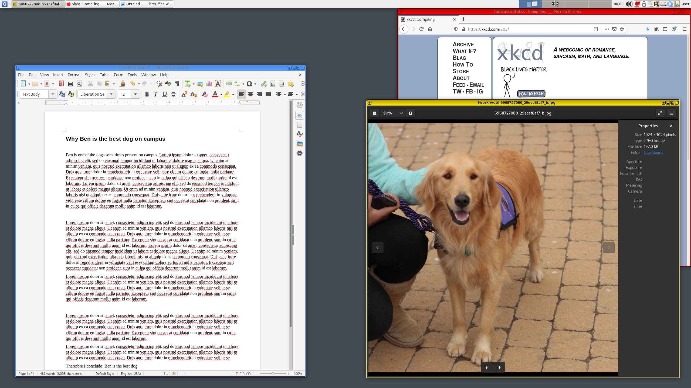

[**Qubes OS**](../desktop.md#qubes-os) is een besturingssysteem dat gebruik maakt van de [Xen](https://en.wikipedia.org/wiki/Xen) hypervisor om sterke beveiliging te bieden voor desktop computing via geïsoleerde virtuele machines. Elke VM wordt een *Qube* genoemd en u kunt elke Qube een vertrouwensniveau toewijzen op basis van het doel ervan. Omdat Qubes OS beveiliging biedt door isolatie te gebruiken en alleen acties per geval toe te staan, is dit het tegenovergestelde van [slechtheids opsomming](https://www.ranum.com/security/computer_security/editorials/dumb/).

## Hoe werkt Qubes OS?

Qubes gebruikt [compartimentering](https://www.qubes-os.org/intro/) om het systeem veilig te houden. Qubes worden aangemaakt op basis van sjablonen, waarbij de standaard opties Fedora, Debian en [Whonix](../desktop.md#whonix)zijn. Met Qubes OS kunt u ook [wegwerpbare](https://www.qubes-os.org/doc/how-to-use-disposables/) virtuele machines creëren.

<figcaption>Qubes Architectuur, Krediet: Wat is Qubes OS Intro</figcaption>

Elke Qube-applicatie heeft een [gekleurde rand](https://www.qubes-os.org/screenshots/) die u kan helpen bij het bijhouden van de virtuele machine waarin het draait. U kunt bijvoorbeeld een specifieke kleur gebruiken voor uw bankbrowser, en een andere kleur voor een algemene niet-vertrouwde browser.

<figcaption>Qubes vensterranden, krediet: Qubes Screenshots</figcaption>

## Waarom zou ik Qubes gebruiken?

Qubes OS is nuttig als uw [bedreigingsmodel](../basics/threat-modeling.md) een sterke compartimentering en beveiliging vereist, bijvoorbeeld als u denkt dat u onvertrouwde bestanden van onvertrouwde bronnen zult openen. Een typische use-case voor Qubes OS is het openen van documenten van een onbekende bron.

Qubes OS maakt gebruik van [Dom0](https://wiki.xenproject.org/wiki/Dom0) Xen VM (dwz een "AdminVM") voor het besturen van andere gast-VM 's of Qubes op het host-besturingssysteem. Andere VM 's geven individuele toepassingsvensters weer binnen de desktopomgeving van Dom0. Hiermee kun je vensters een kleurcode geven op basis van vertrouwensniveaus en apps draaien die met elkaar kunnen communiceren met zeer fijnmazige controle.

### Tekst kopiëren en plakken

U kunt [tekst kopiëren en plakken](https://www.qubes-os.org/doc/how-to-copy-and-paste-text/) met behulp van `qvm-copy-to-vm` of de onderstaande instructies:

1. Druk op **Ctrl+C** om de VM waarin je je bevindt te vertellen dat je iets wilt kopiëren.
2. Druk op **Ctrl+Shift+C** om de VM te vertellen deze buffer beschikbaar te maken voor het algemene klembord.
3. Druk op **Ctrl+Shift+V** in de doel-VM om het globale klembord beschikbaar te maken.
4. Druk op **Ctrl+V** in de bestemmings-VM om de inhoud in de buffer te plakken.

### Bestandsuitwisseling

Om bestanden en mappen (mappen) van de ene VM naar de andere te kopiëren en te plakken, kunt u de optie **Kopiëren naar andere AppVM...** of **Verplaatsen naar andere AppVM...**gebruiken. Het verschil is dat de optie **Verplaatsen** het oorspronkelijke bestand verwijdert. Beide opties beschermen uw klembord tegen uitlekken naar andere Qubes. Dit is veiliger dan bestandsoverdracht via air-gapped, omdat een air-gapped computer nog steeds gedwongen wordt partities of bestandssystemen te parseren. Dat is niet nodig met het inter-qube kopieersysteem.

??? info "AppVM's of qubes hebben geen eigen bestandssystemen"

    U kunt [bestanden kopiëren en verplaatsen] (https://www.qubes-os.org/doc/how-to-copy-and-move-files/) tussen Qubes. Daarbij worden de wijzigingen niet onmiddellijk aangebracht en kunnen ze bij een ongeval gemakkelijk ongedaan worden gemaakt.

### Inter-VM Interacties

Het [qrexec framework](https://www.qubes-os.org/doc/qrexec/) is een kernonderdeel van Qubes dat communicatie tussen virtuele machines in domeinen mogelijk maakt. Het is gebouwd bovenop de Xen-bibliotheek *vchan*, die [isolatie vergemakkelijkt door middel van beleid](https://www.qubes-os.org/news/2020/06/22/new-qrexec-policy-system/).

## Extra bronnen

Voor aanvullende informatie raden wij u aan de uitgebreide Qubes OS documentatiepagina's te raadplegen op de [Qubes OS Website](https://www.qubes-os.org/doc/). Offline kopieën kunnen worden gedownload van het Qubes OS [documentatie archief](https://github.com/QubesOS/qubes-doc).

- Open Technologie Fonds: [*Ongetwijfeld 's werelds veiligste besturingssysteem*](https://www.opentech.fund/news/qubes-os-arguably-the-worlds-most-secure-operating-system-motherboard/)
- J. Rutkowska: [*Softwarecompartimentering versus fysieke scheiding*](https://invisiblethingslab.com/resources/2014/Software_compartmentalization_vs_physical_separation.pdf)
- J. Rutkowska: [*De verdeling van mijn digitale leven in veiligheidsdomeinen*](https://blog.invisiblethings.org/2011/03/13/partitioning-my-digital-life-into.html)
- Qubes OS: [*Verwante artikelen*](https://www.qubes-os.org/news/categories/#articles)
