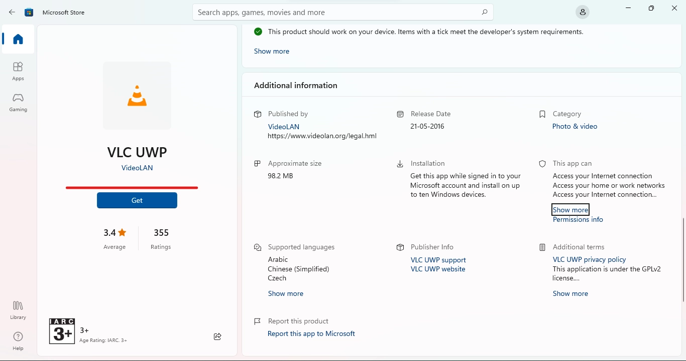
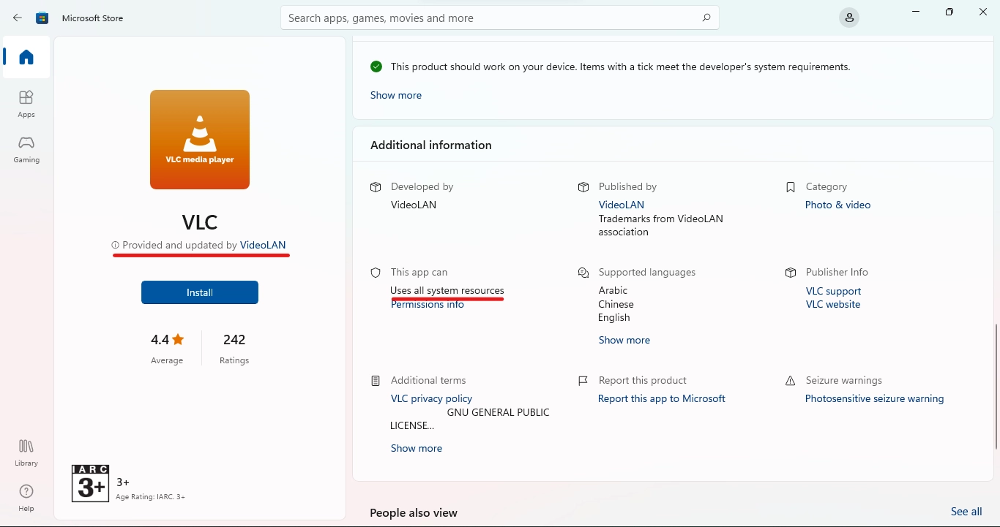

## Native Application Sandboxing

### Application Packaging by Windows

Windows has two types of application packaging such as `.exe`/`.msi` (Win32) and `.appx`/`.msix` (UWA).

#### Universal Windows Application (UWA)

UWAs are processes that operate within the `AppContainer` is an application sandbox environment, which implements mechanisms for the restriction of `AppContainer` processes in terms of what system resources they can access. Basically, Application that is fully isolated and only given access to certain resources.

#### Win32 Apps

Win32 is the application platform of choice for developing and running classic Windows applications, that 
is, Win32 applications, that require direct access to Windows and hardware. 

The core of Win32 is the Win32 API implemented in the Windows SubDLLs (DLLs) and the ntdll.dll library file. With the combination of `SubDLLs` and `ntdll.dll`, the Win32 application has direct access to full system resources.

#### A comparison between UWA and Win32

| UWAs    | Windows |
| :--------- | :---------------------------------- |
|UWAs run as restricted, containerized `AppContainer` processes that run by accessing the WinRT API, a subset of COM functionalities and the Win32 API. They have specific properties that define process restrictions in terms of the system resources that processes can access.| Win32 applications run as Windows native, traditional processes that run by accessing the Win32 API and COM functionalities to their full extent and a subset of the WinRT API to directly access all system resources. They do not run as restricted processes, all system functionalities are by design directly available to them.|
|Only a single instance of a given UWA may run at a given time. | Any number of instances of a given Win32 application may run simultaneously.
|UWAs are distributed as application packages, archive files with a pre-defined format and required content that is necessary for the deployment and operation of UWAs |The way in which Win32 applications are distributed is not restricted by the operating system. It is defined by the application vendors.

The above comparison gives a clear cut that UWA/UWP apps are the best ones to use in terms of sandboxing the app.

### Choosing the way to install software

UWA apps are primarily distributed through Microsoft store and are counter-signed by Microsoft while as third party UWA's are signed by the vendor without Microsoft's signature.

It is recommended to use the UWA apps as they are sandboxed into their own containers.

And for Win32 apps. If you are required to use Win32 apps. Install the application in the host and run it using [Windows Sandbox](/windows/sandboxing/#run-programs-instantly-in-sandbox).

It is **recommended** to install in host and use in Sandbox to reduce your time installing the software again and again in Windows Sandbox.

### Finding Win32 and UWP apps in Windows Store

Generally, apps available in Microsoft store was UWP only before Windows 11 was launched but after the launch both Win32 and UWP apps co-exist in the store.

At this point, it is difficult to differentiate between Win32 and UWP apps. To find which is UWP or Win32. Read below:

When you see an app in store and scroll down to *Additional Information*  section and see if it asks for certain permissions like in the image below:

If the Win32 App, Microsoft store will explicitly state that it is`Provided and Updated by `****` ` and `Uses all System resources` as in the image below:

!!! note "Un-sandboxed UWP apps"
    Some UWP apps in the store due to the lift of restrictions in Microsoft store developers can submit the app with a property named `runFullTrust` which disables sandboxing of that UWP application and shows that `Uses all System Resources` in *Additional Information* section such as Firefox. By this you can know if a UWP app is sandboxed or not.

    If it is sandboxed, it will show only certain permissions in *Additional Information* section.

!!! abstract "Note"
    Most apps will ask that if the app needs to be used for all users or just for your user account. It is best you keep the app to your user Account. So, We achieve better sandboxing between different user accounts.

##### Another way to find

[rg-adguard.net](https://store.rg-adguard.net/) is a third party Microsoft store app which can be used to download `.appx` files (Installer for UWP) and install UWP apps. You can use this site to download Age Restricted apps in store and Install it. **Note** that paid apps don't work unless you connect a Microsoft Account.

## Using Winget to Install Sofware

Windows Package Manager winget command-line tool is bundled with Windows 11 and modern versions of Windows 10 by default as the App Installer.

The winget command line tool enables users to discover, install, upgrade, remove and configure applications on Windows 10 and Windows 11 computers. This tool is the client interface to the Windows Package Manager service.

More information here : [https://learn.microsoft.com/en-us/windows/package-manager/winget/](https://learn.microsoft.com/en-us/windows/package-manager/winget/)

The Winget tool is a powerful tool to install apps that are safe, trusted and official ones. This should be used to avoid sketchy installers.

Even you have apps installed via the traditional installer setup. You can continue using winget

A Quick demo by ThioJoe - [https://youtu.be/uxr7m8wDeGA](https://youtu.be/uxr7m8wDeGA)

Detailed info about the tool by Microsoft - [https://youtu.be/Lk1gbe_JTpY](https://youtu.be/Lk1gbe_JTpY)

If you understood about Winget, then this tool - [https://winstall.app/](https://winstall.app/) is suggested to bulk install apps.

Note : Be sure to install via Winget or using MSI installer to upgrade the app easily.

#### Benefits of winget

There are general advantages in having a package manager regardless of the operating system.

- Security : The packages that the package manager includes are usually safe because they’re verified by maintainers.
- Automation : It’s easier to install or uninstall N applications using a package manager. No need to do it manually.
- Maintenance : With a package manager usually you can update all your applications, including configurations.
Exploration. Instead of searching manually in a browser for an application you can use the package manager. Since it’s centralized it should be easier to find what you want.

## Windows Sandbox

Windows Sandbox provides a lightweight desktop environment to safely run applications in isolation. Software installed inside the Windows Sandbox environment remains "sandboxed" and runs separately from the host machine.

The sandbox is temporary like TailsOS running on a USB drive. When it's closed, all the software and files and the state are deleted. You get a brand-new instance of the sandbox every time you open it.

You can know more from the Official [Documentation](https://docs.microsoft.com/en-us/windows/security/threat-protection/windows-sandbox/windows-sandbox-overview).

**Use case of Sandbox:** The Windows Sandbox can be used to run unknown software or if you want to isolate your Workspace from the host with only Specific set of apps, etc.

### Using Sandbox

To use Sandbox, you can create a configuration file as per the official Microsoft [Documentation](https://docs.microsoft.com/en-us/windows/security/threat-protection/windows-sandbox/windows-sandbox-configure-using-wsb-file) for your needs.

So, when opening the file, sandbox opens with the Configurations you had set up in your file.

If you do not understand the documentation, you can use [Windows Sandbox Editor](https://github.com/damienvanrobaeys/Windows_Sandbox_Editor) instead. It is a GUI application that can be used to create configuration files easily.

??? note "Regarding Windows Sandbox Editor"
    The repository doesn't provide a package. So, you need to download the whole codebase. After, extracting the zip Windows Defender or other Antivirus software may flag the [exe](https://github.com/damienvanrobaeys/Windows_Sandbox_Editor/tree/master/EXE) file as a malware. So, it is recommended to install it via the [Powershell Script](https://github.com/damienvanrobaeys/Windows_Sandbox_Editor/tree/master/Install%20on%20desktop%20(in%20case%20of%20issue%20with%20EXE)) they provide.

    By default, You cannot execute Scripts in Powershell and it is restricted to commands only. It is recommend you allow the Terminal to `Unrestricted` mode and use it to install the editor via Script after that change it back to `Restricted` [execution policy](https://docs.microsoft.com/en-us/powershell/module/microsoft.powershell.core/about/about_execution_policies?view=powershell-7.2) to prevent accidental execution of malicious scripts in the future.

### Run programs instantly in Sandbox

[Run in Sandbox](https://github.com/damienvanrobaeys/Run-in-Sandbox) is a tool to quickly run files in Windows Sandbox with a right click.

We recommend you to use this software as it is convenient and easy to use and even credited by Microsoft. 

A full guide on How to use it can be found here: [https://www.systanddeploy.com/2021/11/run-in-sandbox-quick-way-to-runextract.html](https://www.systanddeploy.com/2021/11/run-in-sandbox-quick-way-to-runextract.html)

Note: The same note of installing sandbox editor via PowerShell also applies here except this doesn't provide an `exe` at all.

This page is based on the German BSI project - [SiSyPHuS Win10](https://www.bsi.bund.de/EN/Topics/Cyber-Security/Recommendations/SiSyPHuS_Win10/SiSyPHuS_node.html)'s Work Package 9 Dcoument.

**For Advanced Users :**

Sandboxie Plus, is a Sandboxing tool which uses File system and registry Virtualization techniques to sandbox every apps and at the same data not being lost like Windows Sandbox.

Use this at your own Risk !

*[UWA]:Universal Windows Applications
*[UWP]:Universal Windows Platform
*[SubDLLs]: Subsystem Dynamic link libraries
*[ntdll.dll]: A core Windows library file that implements functions for interaction with the kernel.
*[WinRT]: Windows Runtime
*[COM]: Component Object Model
