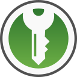
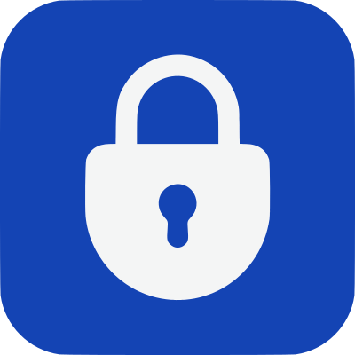

Stay safe and secure online with an encrypted and open-source password manager.

## Password Best Practices

- Always use unique passwords. Don't make yourself a victim of "[credential stuffing](https://en.wikipedia.org/wiki/Credential_stuffing)"
- Store an exported backup of your passwords in an [encrypted container](encryption.md) on another storage device. This can be useful if something happens to your device or the service you are using
- If possible, store TOTP tokens in a separate [TOTP app](basics/multi-factor-authentication.md#authenticator-apps) and not your password manager. TOTP codes are generated from a "[shared secret](https://en.wikipedia.org/wiki/Time-based_one-time_password#Security)." If the secret is obtained by an adversary, he can generate TOTP values. Typically, mobile platforms have better app isolation and more secure methods for storing sensitive credentials

## Local Storage

These password managers store the password database locally.

### KeePassDX

!!! recommendation

    { align=right }

    **KeePassDX** is a lightweight password manager for Android, allows editing encrypted data in a single file in KeePass format and can fill in the forms in a secure way. [Contributor Pro](https://play.google.com/store/apps/details?id=com.kunzisoft.keepass.pro) allows unlocking cosmetic content and non-standard protocol features, but more importantly, it helps and encourages development.

    [:octicons-home-16: Homepage](https://www.keepassdx.com){ .md-button .md-button--primary }
    [:octicons-info-16:](https://github.com/Kunzisoft/KeePassDX/wiki){ .card-link title=Documentation}
    [:octicons-code-16:](https://github.com/Kunzisoft/KeePassDX){ .card-link title="Source Code" }
    [:octicons-heart-16:](https://www.keepassdx.com/#donation){ .card-link title=Contribute }

    ??? downloads

        - [:fontawesome-brands-google-play: Google Play](https://play.google.com/store/apps/details?id=com.kunzisoft.keepass.free)
        - [:pg-f-droid: F-Droid](https://www.f-droid.org/packages/com.kunzisoft.keepass.libre)
        - [:fontawesome-brands-github: GitHub](https://github.com/Kunzisoft/KeePassDX/releases)

### KeePassXC

!!! recommendation

    { align=right }

    **KeePassXC** is a community fork of KeePassX, a native cross-platform port of KeePass Password Safe, with the goal to extend and improve it with new features and bugfixes to provide a feature-rich, cross-platform and modern open-source password manager.

    [:octicons-home-16: Homepage](https://keepassxc.org){ .md-button .md-button--primary }
    [:octicons-eye-16:](https://keepassxc.org/privacy){ .card-link title="Privacy Policy" }
    [:octicons-info-16:](https://keepassxc.org/docs/){ .card-link title=Documentation}
    [:octicons-code-16:](https://github.com/keepassxreboot/keepassxc){ .card-link title="Source Code" }
    [:octicons-heart-16:](https://keepassxc.org/donate/){ .card-link title=Contribute }

    ??? downloads

        - [:fontawesome-brands-windows: Windows](https://keepassxc.org/download/#windows)
        - [:fontawesome-brands-apple: macOS](https://keepassxc.org/download/#mac)
        - [:fontawesome-brands-linux: Linux](https://keepassxc.org/download/#linux)
        - [:pg-flathub: Flatpak](https://flathub.org/apps/details/org.keepassxc.KeePassXC)
        - [:fontawesome-brands-firefox: Firefox](https://addons.mozilla.org/firefox/addon/keepassxc-browser)
        - [:fontawesome-brands-chrome: Chrome](https://chrome.google.com/webstore/detail/keepassxc-browser/oboonakemofpalcgghocfoadofidjkkk)

KeePassXC stores its export data as [CSV](https://en.wikipedia.org/wiki/Comma-separated_values) files. This may mean data loss if you import this file into another password manager. We advise you check each record manually.

### Strongbox

!!! recommendation

     { align=right }

    **Strongbox** is a password manager for iOS and MacOS that supports Keepass and Password Safe formats.

## Cloud Sync

These password managers sync your passwords to a cloud server for easy accessibility from all your devices and safety against device loss.

### Bitwarden

!!! recommendation

    { align=right }

    **Bitwarden** is a free and open-source password manager. It aims to solve password management problems for individuals, teams, and business organizations. Bitwarden is among the best and safest solutions to store all of your logins and passwords while conveniently keeping them synced between all of your devices.

    [:octicons-home-16: Homepage](https://bitwarden.com){ .md-button .md-button--primary }
    [:octicons-eye-16:](https://bitwarden.com/privacy){ .card-link title="Privacy Policy" }
    [:octicons-info-16:](https://bitwarden.com/help/){ .card-link title=Documentation}
    [:octicons-code-16:](https://github.com/bitwarden){ .card-link title="Source Code" }

    ??? downloads

        - [:fontawesome-brands-windows: Windows](https://bitwarden.com/download)
        - [:fontawesome-brands-app-store: Mac App Store](https://apps.apple.com/app/bitwarden/id1352778147)
        - [:fontawesome-brands-linux: Linux](https://bitwarden.com/download)
        - [:pg-flathub: Flatpak](https://flathub.org/apps/details/com.bitwarden.desktop)
        - [:fontawesome-brands-app-store-ios: App Store](https://apps.apple.com/app/bitwarden-password-manager/id1137397744)
        - [:fontawesome-brands-google-play: Google Play](https://play.google.com/store/apps/details?id=com.x8bit.bitwarden)
        - [:pg-f-droid: F-Droid](https://mobileapp.bitwarden.com/fdroid)
        - [:fontawesome-brands-firefox: Firefox](https://addons.mozilla.org/firefox/addon/bitwarden-password-manager)
        - [:fontawesome-brands-chrome: Chrome](https://chrome.google.com/webstore/detail/bitwarden-free-password-m/nngceckbapebfimnlniiiahkandclblb)
        - [:fontawesome-brands-edge: Edge](https://microsoftedge.microsoft.com/addons/detail/jbkfoedolllekgbhcbcoahefnbanhhlh)

Bitwarden also features [Bitwarden Send](https://bitwarden.com/products/send/), which allows you to share text and files securely with [end-to-end encryption](https://bitwarden.com/help/send-encryption). A [password](https://bitwarden.com/help/send-privacy/#send-passwords) can be required along with the send link. Bitwarden Send also features [automatic deletion](https://bitwarden.com/help/send-lifespan).

You need the [Premium Plan](https://bitwarden.com/help/about-bitwarden-plans/#compare-personal-plans) to be able to share files. The free plan only allows text sharing.

Bitwarden's server-side code is [open-source](https://github.com/bitwarden/server), so if you don't want to use the Bitwarden cloud, you can easily host your own Bitwarden sync server.

**Vaultwarden** is an alternative implementation of Bitwarden's sync server written in Rust and compatible with official Bitwarden clients, perfect for self-hosted deployment where running the official resource-heavy service might not be ideal. If you are looking to self-host Bitwarden on your own server, you almost certainly want to use Vaultwarden over Bitwarden's official server code.

[:octicons-repo-16: Vaultwarden Repository](https://github.com/dani-garcia/vaultwarden){ .md-button }
[:octicons-info-16:](https://github.com/dani-garcia/vaultwarden/wiki){ .card-link title=Documentation}
[:octicons-code-16:](https://github.com/dani-garcia/vaultwarden){ .card-link title="Source Code" }
[:octicons-heart-16:](https://github.com/sponsors/dani-garcia){ .card-link title=Contribute }

### 1Password

1Password is a very capable, paid password manager with many features geared towards families and less technical people, as well as advanced functionality. Traditionally, 1Password has offered the best password manager user experience for people using macOS and iOS, however it has now achieved feature-parity across all platforms.

!!! recommendation

    { align=right }

    **1Password** is a password manager with a strong focus on security and ease-of-use, which allows you to store passwords, credit cards, software licenses, and any other sensitive information in a secure digital vault. Your vault is hosted on 1Password's servers for a monthly fee. 1Password is [audited](https://support.1password.com/security-assessments/) on a regular basis and provides exceptional customer support. 1Password is closed source, however the security of the product is thoroughly documented in their [security white paper](https://1passwordstatic.com/files/security/1password-white-paper.pdf).

    [:octicons-home-16: Homepage](https://1password.com/){ .md-button .md-button--primary }
    [:octicons-eye-16:](https://support.1password.com/1password-privacy/){ .card-link title="Privacy Policy" }
    [:octicons-info-16:](https://support.1password.com/){ .card-link title=Documentation}

Your 1Password vault is secured with both your master password and a randomized 34-character security key to encrypt your data on their servers. This security key adds a layer of protection to your data because your data is secured with high entropy regardless of your master password. Many other password manager solutions are entirely reliant on the strength of your master password to secure your data.

One advantage 1Password has over Bitwarden is its first-class support for native clients. While Bitwarden relegates many duties to their web vault interface, especially account management features, 1Password makes nearly every feature available within its native mobile or desktop clients. 1Password's clients also have a more intuitive UI, which makes them easier to use and navigate.

Another consideration we made with this recommendation was 1Password's track record of customer support, available in a wide variety of channels including over the phone. For some less technical people or family members, being able to call and talk to a real person can make the difference between using a password manager and giving up. The best password manager is the one you use, and you virtually can't go wrong with any of the options on this page.

### Psono

!!! recommendation

    { align=right }

    **Psono** is a free and open-source password manager from Germany, with a focus on password management for teams. Psono supports secure sharing of passwords, files, bookmarks, and emails. All secrets are protected by a master password.

    [:octicons-home-16: Homepage](https://psono.com){ .md-button .md-button--primary }
    [:octicons-eye-16:](https://psono.com/privacy-policy){ .card-link title="Privacy Policy" }
    [:octicons-info-16:](https://doc.psono.com/){ .card-link title=Documentation}
    [:octicons-code-16:](https://gitlab.com/psono){ .card-link title="Source Code" }

    ??? downloads

        - [:fontawesome-brands-firefox: Firefox](https://addons.mozilla.org/firefox/addon/psono-pw-password-manager)
        - [:fontawesome-brands-chrome: Chrome](https://chrome.google.com/webstore/detail/psonopw-password-manager/eljmjmgjkbmpmfljlmklcfineebidmlo)
        - [:fontawesome-brands-google-play: Google Play](https://play.google.com/store/apps/details?id=com.psono.psono)
        - [:fontawesome-brands-app-store-ios: App Store](https://apps.apple.com/us/app/psono-password-manager/id1545581224)
        - [:fontawesome-brands-docker: Docker Hub](https://hub.docker.com/r/psono/psono-client)

Psono provides [extensive documentation](https://doc.psono.com/) for their product. The [web-client](https://doc.psono.com/admin/installation/install-webclient.html#installation-with-docker) for Psono can be self-hosted; alternatively, you can choose the full [Community Edition](https://doc.psono.com/admin/installation/install-server-ce.html) or the [Enterprise Edition](https://doc.psono.com/admin/installation/install-server-ee.html) with additional features.

## Minimal Password Managers

These products are minimal password managers that can be used within scripting applications.

### gopass

!!! recommendation

    { align=right }

    **gopass** is a password manager for the command line written in Go. It works on all major desktop and server operating systems (Linux, macOS, BSD, Windows).

    [:octicons-home-16: Homepage](https://www.gopass.pw){ .md-button .md-button--primary }
    [:octicons-info-16:](https://github.com/gopasspw/gopass/tree/master/docs){ .card-link title=Documentation}
    [:octicons-code-16:](https://github.com/gopasspw/gopass){ .card-link title="Source Code" }
    [:octicons-heart-16:](https://github.com/sponsors/dominikschulz){ .card-link title=Contribute }

    ??? downloads

        - [:fontawesome-brands-windows: Windows](https://www.gopass.pw/#install-windows)
        - [:fontawesome-brands-apple: macOS](https://www.gopass.pw/#install-macos)
        - [:fontawesome-brands-linux: Linux](https://www.gopass.pw/#install-linux)
        - [:fontawesome-brands-freebsd: FreeBSD](https://www.gopass.pw/#install-bsd)
