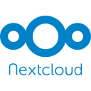

רוב חבילות אופיס המקוונות אינן תומכות ב - E2EE, כלומר לספק הענן יש גישה לכל מה שאתה עושה. מדיניות הפרטיות עשויה להגן באופן חוקי על זכויותיך, אך היא אינה מספקת מגבלות גישה טכניות.

## חבילות אופיס

### Nextcloud

אנו ממליצים להפעיל חבילת אופיס מקומית. המלצה

    { align=right }
    
    **Nextcloud** היא חבילה של תוכנת שרת-לקוח חינמית וקוד פתוח ליצירת שירותי אירוח קבצים משלך בשרת פרטי בשליטתך.
    
    [:octicons-home-16: דף הבית](https://nextcloud.com){ .md-button .md-button--primary }
    [:octicons-eye-16:](https://nextcloud.com/privacy){ .card-link title="מדיניות פרטיות" }
    [:octicons-info-16:](https://nextcloud.com/support/){ .card-link title=תיעוד}
    [:octicons-code-16:](https://github.com/nextcloud){ .card-link title="קוד מקור" }
    [:octicons-heart-16:](https://nextcloud.com/contribute/){ .card-link title=לתרומה }
    
    ??? הורדות
    
        - [:simple-googleplay: Google Play](https://play.google.com/store/apps/details?id=com.nextcloud.client)
        - [:simple-appstore: App Store](https://apps.apple.com/app/id1125420102)
        - [:simple-github: GitHub](https://github.com/nextcloud/android/releases)
        - [:simple-windows11: Windows](https://nextcloud.com/install/#install-clients)
        - [:simple-apple: macOS](https://nextcloud.com/install/#install-clients)
        - [:simple-linux: Linux](https://nextcloud.com/install/#install-clients)
        - [:simple-freebsd: FreeBSD](https://www.freshports.org/www/nextcloud)

!!! danger

    { align=right }
    
    **OnlyOffice** היא חבילת משרדים חינמית וקוד פתוח מבוססת ענן עם פונקציונליות נרחבת, כולל אינטגרציה עם Nextcloud. [:octicons-home-16: Homepage](https://www.onlyoffice.com){ .md-button .md-button--primary }
    [:octicons-eye-16:](https://help.onlyoffice.com/products/files/doceditor.aspx?fileid=5048502&doc=SXhWMEVzSEYxNlVVaXJJeUVtS0kyYk14YWdXTEFUQmRWL250NllHNUFGbz0_IjUwNDg1MDIi0){ .card-link title="מדיניות פרטיות" }
    [:octicons-info-16:](https://helpcenter.onlyoffice.com/userguides.aspx){ .card-link title=תיעוד}
    [:octicons-code-16:](https://github.com/ONLYOFFICE){ .card-link title="קוד מקור" }
    
    ???

### CryptPad

!!! recommendation

    { align=right }
    
    **CryptPad** הוא אלטרנטיבה פרטית-עיצובית לכלי משרד פופולריים. כל התוכן בשירות אינטרנט זה מוצפן מקצה לקצה וניתן לשתף אותו עם משתמשים אחרים בקלות.
    
    [:octicons-home-16: דף הבית](https://cryptpad.fr){ .md-button .md-button--primary }
    [:octicons-eye-16:](https://cryptpad.fr/pad/#/2/pad/view/GcNjAWmK6YDB3EO2IipRZ0fUe89j43Ryqeb4fjkjehE/){ .card-link title="מדיניות פרטיות" }
    [:octicons-info-16:](https://docs.cryptpad.fr/){ .card-link title=תיעוד}
    [:octicons-code-16:](https://github.com/xwiki-labs/cryptpad){ .card-link title="קוד מקור" }
    [:octicons-heart-16:](https://opencollective.com/cryptpad){ .card-link title=לתרומה }

### קריטריונים

**שים לב שאיננו קשורים לאף אחד מהפרויקטים שאנו ממליצים עליהם.** בנוסף ל [הקריטריונים הסטנדרטיים שלנו](about/criteria.md), פיתחנו סט ברור של דרישות כדי לאפשר לנו לספק המלצות אובייקטיביות. אנו מציעים לך להכיר את הרשימה הזו לפני שתבחר להשתמש בפרויקט, ולערוך מחקר משלך כדי להבטיח שזו הבחירה הנכונה עבורך.

!!! דוגמה: "חלק זה הוא חדש"

    אנו עובדים על קביעת קריטריונים מוגדרים לכל קטע באתר שלנו, והדבר עשוי להשתנות. אם יש לך שאלות לגבי הקריטריונים שלנו, אנא [שאל בפורום שלנו]( https://discuss.privacyguides.net/latest) ואל תניח שלא שקלנו משהו בעת ביצוע ההמלצות שלנו אם זה לא מופיע כאן. ישנם גורמים רבים שנלקחים בחשבון ונדונים כאשר אנו ממליצים על פרויקט, ותיעוד כל אחד מהם הוא עבודה בתהליך.

באופן כללי, אנו מגדירים פלטפורמות שיתוף פעולה כחבילות מלאות שיכולות לשמש באופן סביר כתחליף לפלטפורמות שיתוף פעולה כמו Google Drive.

- קוד פתוח.
- הופך את הקבצים לנגישים דרך WebDAV אלא אם כן זה בלתי אפשרי בגלל E2EE.
- יש לקוחות סנכרון עבור לינוקס, macOS ו- Windows.
- תומך בעריכת מסמכים וגיליונות אלקטרוניים.
- תומך בשיתוף פעולה מסמכים בזמן אמת.
- תומך בייצוא מסמכים לפורמטים סטנדרטיים של מסמכים (למשל ODF).

#### המקרה הטוב ביותר

הקריטריונים שלנו במקרה הטוב ביותר מייצגים את מה שהיינו רוצים לראות מהפרויקט המושלם בקטגוריה זו. ההמלצות שלנו לא יכולות לכלול את כל הפונקציונליות הזו או את כולה, אך אלה שכן דורגו גבוה יותר מאחרים בדף זה.

- צריך לאחסן קבצים במערכת קבצים קונבנציונלית.
- אמור לתמוך באימות רב-גורמי TOTP או WebAuthn, או באימות Passkey.

## חבילות אופיס

### LibreOffice

!!! recommendation

    { align=right }
    
    **LibreOffice** היא חבילת משרד חינמית וקוד פתוח עם פונקציונליות נרחבת.
    
    [:octicons-home-16: דף הבית](https://www.libreoffice.org){ .md-button .md-button--primary }
    [:octicons-eye-16:](https://www.libreoffice.org/about-us/privacy/privacy-policy-en/){ .card-link title="מדיניות פרטיות" }
    [:octicons-info-16:](https://documentation.libreoffice.org/en/english-documentation/){ .card-link title=תיעוד}
    [:octicons-code-16:](https://www.libreoffice.org/about-us/source-code){ .card-link title="קוד מקור" }
    [:octicons-heart-16:](https://www.libreoffice.org/donate/){ .card-link title=לתרומה }
    
    ??? הורדות
    
    
        - [:simple-googleplay: Google Play](https://www.libreoffice.org/download/android-and-ios/)
        - [:simple-appstore: App Store](https://www.libreoffice.org/download/android-and-ios/)
        - [:simple-windows11: Windows](https://www.libreoffice.org/download/download/)
        - [:simple-apple: macOS](https://www.libreoffice.org/download/download/)
        - [:simple-linux: Linux](https://www.libreoffice.org/download/download/)
        - [:simple-flathub: Flathub](https://flathub.org/apps/details/org.libreoffice.LibreOffice)
        - [:simple-freebsd: FreeBSD](https://www.freshports.org/editors/libreoffice/)

### OnlyOffice

!!! recommendation

    { align=right }
    
    **OnlyOffice** היא חבילת משרדים חינמית וקוד פתוח מבוססת ענן עם פונקציונליות נרחבת, כולל אינטגרציה עם Nextcloud.
    
    [:octicons-home-16: דף הבית](https://www.onlyoffice.com){ .md-button .md-button--primary }
    [:octicons-eye-16:](https://help.onlyoffice.com/products/files/doceditor.aspx?fileid=5048502&doc=SXhWMEVzSEYxNlVVaXJJeUVtS0kyYk14YWdXTEFUQmRWL250NllHNUFGbz0_IjUwNDg1MDIi0){ .card-link title="Privacy Policy" }
    [:octicons-info-16:](https://helpcenter.onlyoffice.com/userguides.aspx){ .card-link title=תיעוד}
    [:octicons-code-16:](https://github.com/ONLYOFFICE){ .card-link title="קוד מקור" }
    
    ??? הורדות
    
    
        - [:simple-googleplay: Google Play](https://play.google.com/store/apps/details?id=com.onlyoffice.documents)
        - [:simple-appstore: App Store](https://apps.apple.com/app/id944896972)
        - [:simple-windows11: Windows](https://www.onlyoffice.com/download-desktop.aspx)
        - [:simple-apple: macOS](https://www.onlyoffice.com/download-desktop.aspx)
        - [:simple-linux: Linux](https://www.onlyoffice.com/download-desktop.aspx)
        - [:simple-flathub: Flathub](https://flathub.org/apps/details/org.onlyoffice.desktopeditors)
        - [:simple-freebsd: FreeBSD](https://www.freshports.org/www/onlyoffice-documentserver/)

### קריטריונים

**שים לב שאיננו קשורים לאף אחד מהפרויקטים שאנו ממליצים עליהם.** בנוסף [לקריטריונים הסטנדרטיים שלנו](about/criteria.md), פיתחנו סט ברור של דרישות כדי לאפשר לנו לספק המלצות אובייקטיביות. אנו מציעים לך להכיר את הרשימה הזו לפני שתבחר להשתמש בפרויקט, ולערוך מחקר משלך כדי להבטיח שזו הבחירה הנכונה עבורך.

!!! דוגמה: "חלק זה הוא חדש"

    אנו עובדים על קביעת קריטריונים מוגדרים לכל קטע באתר שלנו, והדבר עשוי להשתנות. אם יש לך שאלות לגבי הקריטריונים שלנו, אנא [שאל בפורום שלנו]( https://discuss.privacyguides.net/latest) ואל תניח שלא שקלנו משהו בעת ביצוע ההמלצות שלנו אם זה לא מופיע כאן. ישנם גורמים רבים שנשקלים ונדונים כאשר אנו ממליצים על פרויקט, ותיעוד כל אחד מהם הוא עבודה בתהליך.

באופן כללי, אנו מגדירים חבילות Office כיישומים שיכולים לשמש באופן סביר כתחליף ל- Microsoft Word עבור רוב מקרי השימוש.

- חייב להיות חוצה פלטפורמות.
- זה חייב להיות קוד פתוח.
- חייב לתפקד במצב לא מקוון.
- חייב לתמוך בעריכת מסמכים, גיליונות אלקטרוניים ומצגות שקופיות.
- יש לייצא קבצים לפורמטים סטנדרטיים של מסמכים.

## שירותי הדבקה

### PrivateBin

!!! recommendation

    { align=right }
    
    **PrivateBin** הוא pastebin מקוון מינימליסטי בקוד פתוח שבו לשרת יש אפס ידע על נתונים מודבקים. הנתונים מוצפנים/מפוענחים בדפדפן באמצעות AES של 256 סיביות. זוהי הגרסה המשופרת של ZeroBin. יש [רשימה של מהדורות](https://privatebin.info/directory/).
    
    [:octicons-home-16: דף הבית](https://privatebin.info){ .md-button .md-button--primary }
    [:octicons-server-16:](https://privatebin.info/directory/){ .card-link title="מופעים ציבוריים"}
    [:octicons-info-16:](https://github.com/PrivateBin/PrivateBin/wiki/FAQ){ .card-link title=תיעוד}
    [:octicons-code-16:](https://github.com/PrivateBin/PrivateBin){ .card-link title="קוד מקור" }
