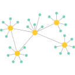
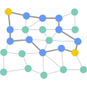

## Centralized

### Signal

!!! recommendation

    { align=right }

    **Signal** is a mobile app developed by Signal Messenger LLC. The app provides instant messaging, as well as voice and video calling.

    All communications are E2EE. Contact lists are encrypted using your login PIN and the server does not have access to them. Personal profiles are also encrypted and only shared with contacts who add you.

    [:octicons-home-16: Homepage](https://signal.org/){ .md-button .md-button--primary }
    [:octicons-eye-16:](https://signal.org/legal/#privacy-policy){ .card-link title="Privacy Policy" }
    [:octicons-info-16:](https://support.signal.org/hc/en-us){ .card-link title=Documentation}
    [:octicons-code-16:](https://github.com/signalapp){ .card-link title="Source Code" }
    [:octicons-heart-16:](https://signal.org/donate/){ .card-link title=Contribute }

    ??? downloads

        - [:fontawesome-brands-windows: Windows](https://signal.org/download)
        - [:fontawesome-brands-apple: macOS](https://signal.org/download)
        - [:fontawesome-brands-linux: Linux](https://signal.org/download)
        - [:fontawesome-brands-google-play: Google Play](https://play.google.com/store/apps/details?id=org.thoughtcrime.securesms)
        - [:fontawesome-brands-app-store-ios: App Store](https://apps.apple.com/app/id874139669)

Signal has minimal metadata when [Sealed Sender](https://signal.org/blog/sealed-sender/) is enabled. The sender address is encrypted along with the message body, and only the recipient address is visible to the server.

Signal requires your phone number as a personal identifier.

[Sealed Sender](https://signal.org/blog/sealed-sender/) is only enabled for people in your contacts list, but can be enabled for all recipients with the increased risk of receiving spam.

The protocol was independently [audited](https://eprint.iacr.org/2016/1013.pdf) in 2016. The specification for the Signal protocol can be found in their [documentation](https://signal.org/docs/).

## Federated

### Element

!!! recommendation

    { align=right }

    **Element** is the reference client for the [Matrix](https://matrix.org/docs/guides/introduction) protocol, an [open standard](https://matrix.org/docs/spec) for secure decentralized real-time communication.

    Messages and files shared in private rooms (those which require an invite) are by default E2EE as are 1 to 1 voice and video calls.

    [:octicons-home-16: Homepage](https://element.io/){ .md-button .md-button--primary }
    [:octicons-eye-16:](https://element.io/privacy){ .card-link title="Privacy Policy" }
    [:octicons-info-16:](https://element.io/help){ .card-link title=Documentation}
    [:octicons-code-16:](https://github.com/vector-im){ .card-link title="Source Code" }

    ??? downloads

        - [:fontawesome-brands-windows: Windows](https://element.io/get-started)
        - [:fontawesome-brands-apple: macOS](https://element.io/get-started)
        - [:fontawesome-brands-linux: Linux](https://element.io/get-started)
        - [:octicons-globe-16: Web](https://app.element.io)
        - [:fontawesome-brands-google-play: Google Play](https://play.google.com/store/apps/details?id=im.vector.app)
        - [:pg-f-droid: F-Droid](https://f-droid.org/packages/im.vector.app/)
        - [:fontawesome-brands-app-store-ios: App Store](https://apps.apple.com/app/vector/id1083446067)

Profile pictures, reactions, and nicknames are not encrypted.

Group voice and video calls are [not](https://github.com/vector-im/element-web/issues/12878) E2EE, and use Jitsi, but this is expected to change with [Native Group VoIP Signalling](https://github.com/matrix-org/matrix-doc/pull/3401). Group calls have [no authentication](https://github.com/vector-im/element-web/issues/13074) currently, meaning that non room participants can also join the calls. We recommend that you do not use this feature for private meetings.

When using [element-web](https://github.com/vector-im/element-web), you must trust the server hosting the Element client. If your [threat model](basics/threat-modeling.md) requires stronger protection, then use a desktop or mobile client instead.

The protocol was independently [audited](https://matrix.org/blog/2016/11/21/matrixs-olm-end-to-end-encryption-security-assessment-released-and-implemented-cross-platform-on-riot-at-last) in 2016. The specification for the Matrix protocol can be found in their [documentation](https://spec.matrix.org/latest/). The [Olm](https://matrix.org/docs/projects/other/olm) cryptographic ratchet used by Matrix is an implementation of Signal’s [Double Ratchet algorithm](https://signal.org/docs/specifications/doubleratchet/).

## Anonymous Routing

### Briar (Android)

!!! recommendation

    { align=right }

    **Briar** is an encrypted instant messenger that [connects](https://briarproject.org/how-it-works/) to other clients using the Tor Network. Briar can also connect via Wi-Fi or Bluetooth when in local proximity. Briar’s local mesh mode can be useful when internet availability is a problem.

    [:octicons-home-16: Homepage](https://briarproject.org/){ .md-button .md-button--primary }
    [:octicons-eye-16:](https://briarproject.org/privacy-policy/){ .card-link title="Privacy Policy" }
    [:octicons-info-16:](https://code.briarproject.org/briar/briar/-/wikis/home){ .card-link title=Documentation}
    [:octicons-code-16:](https://code.briarproject.org/briar/briar){ .card-link title="Source Code" }
    [:octicons-heart-16:](https://briarproject.org/){ .card-link title="Donation options are listed on the bottom of the homepage" }

    ??? downloads

        - [:pg-flathub: Flatpak](https://flathub.org/apps/details/org.briarproject.Briar)
        - [:fontawesome-brands-google-play: Google Play](https://play.google.com/store/apps/details?id=org.briarproject.briar.android)
        - [:pg-f-droid: F-Droid](https://f-droid.org/packages/org.briarproject.briar.android)

To add a contact on Briar, you must both add each other first. You can either exchange `briar://` links or scan a contact’s QR code if they are nearby.

The client software was independently [audited](https://briarproject.org/news/2017-beta-released-security-audit/) and the anonymous routing protocol uses the Tor network which has also been audited.

Briar has a fully [published specification](https://code.briarproject.org/briar/briar-spec).

Briar supports perfect forward secrecy by using the Bramble [Handshake](https://code.briarproject.org/briar/briar-spec/blob/master/protocols/BHP.md) and [Transport](https://code.briarproject.org/briar/briar-spec/blob/master/protocols/BTP.md) protocol.

### Session

!!! recommendation

    { align=right }

    **Session** is a decentralized messenger with a focus on private, secure, and anonymous communications. Session offers support for direct messages, group chats, and voice calls.

    Session utilizes the decentralized [Oxen Service Node Network](https://oxen.io/) to store and route messages. Every encrypted message is routed through three nodes in the Oxen Service Node Network, making it virtually impossible for the nodes to compile meaningful information on those using the network.

    [:octicons-home-16: Homepage](https://getsession.org/){ .md-button .md-button--primary }
    [:octicons-eye-16:](https://getsession.org/privacy-policy){ .card-link title="Privacy Policy" }
    [:octicons-info-16:](https://getsession.org/faq){ .card-link title=Documentation}
    [:octicons-code-16:](https://github.com/oxen-io){ .card-link title="Source Code" }

    ??? downloads

        - [:fontawesome-brands-windows: Windows](https://getsession.org/download)
        - [:fontawesome-brands-apple: macOS](https://getsession.org/download)
        - [:fontawesome-brands-app-store-ios: App Store](https://apps.apple.com/app/id1470168868)
        - [:fontawesome-brands-linux: Linux](https://getsession.org/download)
        - [:fontawesome-brands-google-play: Google Play](https://play.google.com/store/apps/details?id=network.loki.messenger)
        - [:pg-f-droid: F-Droid](https://fdroid.getsession.org)

Session allows for E2EE in one-on-one chats or closed groups which allow for up to 100 members. Open groups have no restriction on the number of members, but are open by design.

Session does [not](https://getsession.org/blog/session-protocol-technical-information) support perfect forward secrecy, which is when an encryption system automatically and frequently changes the keys it uses to encrypt and decrypt information, such that if the latest key is compromised it exposes a smaller portion of sensitive information.

Oxen requested an independent audit for Session in March of 2020. The audit [concluded](https://getsession.org/session-code-audit) in April of 2021, “The overall security level of this application is good and makes it usable for priva### Signal

## Types of Communication Networks

There are several network architectures commonly used to relay messages between people. These networks can provide different different privacy guarantees, which is why it's worth considering your [threat model](https://en.wikipedia.org/wiki/Threat_model) when making a decision about which app to use.

### Centralized Networks

{ align=left }

Centralized messengers are those where all participants are on the same server or network of servers controlled by the same organization.

Some self-hosted messengers allow you to set up your own server. Self-hosting can provide additional privacy guarantees such as no usage logs or limited access to metadata (data about who is talking to whom). Self-hosted centralized messengers are isolated and everyone must be on the same server to communicate.

**Advantages:**

- New features and changes can be implemented more quickly.
- Easier to get started with and to find contacts.
- Most mature and stable features ecosystems, as they are easier to program in a centralized software.
- Privacy issues may be reduced when you trust a server that you're self-hosting.

**Disadvantages:**

- Can include [restricted control or access](https://drewdevault.com/2018/08/08/Signal.html). This can include things like:
- Being [forbidden from connecting third-party clients](https://github.com/LibreSignal/LibreSignal/issues/37#issuecomment-217211165) to the centralized network that might provide for greater customization or a better experience. Often defined in Terms and Conditions of usage.
- Poor or no documentation for third-party developers.
- The [ownership](https://web.archive.org/web/20210729191953/https://blog.privacytools.io/delisting-wire/), privacy policy, and operations of the service can change easily when a single entity controls it, potentially compromising the service later on.
- Self-hosting requires effort and knowledge of how to set up a service.

### Federated Networks

{ align=left }

Federated messengers use multiple, independent, decentralized servers that are able to talk to each other (email is one example of a federated service). Federation allows system administrators to control their own server and still be a part of the larger communications network.

When self-hosted, members of a federated server can discover and communicate with members of other servers, although some servers may choose to remain private by being non-federated (e.g., work team server).

**Advantages:**

- Allows for greater control over your own data when running your own server.
- Allows you to choose who to trust your data with by choosing between multiple "public" servers.
- Often allows for third party clients which can provide a more native, customized, or accessible experience.
- Server software can be verified that it matches public source code, assuming you have access to the server or you trust the person who does (e.g., a family member)

**Disadvantages:**

- Adding new features is more complex, because these features need to be standardized and tested to ensure they work with all servers on the network.
- Due to the previous point, features can be lacking, or incomplete or working in unexpected ways compared to centralized platforms, such as message relay when offline or message deletion.
- Some metadata may be available (e.g., information like "who is talking to whom," but not actual message content if E2EE is used).
- Federated servers generally require trusting your server's administrator. They may be a hobbyist or otherwise not a "security professional," and may not serve standard documents like a privacy policy or terms of service detailing how your data is utilized.
- Server administrators sometimes choose to block other servers, which are a source of unmoderated abuse or break general rules of accepted behavior. This will hinder your ability to communicate with members of those servers.

### Peer-to-Peer Networks

{ align=left }

P2P messengers connect to a [distributed network](https://en.wikipedia.org/wiki/Distributed_networking) of nodes to relay a message to the recipient without a third-party server.

Clients (peers) usually find each other through the use of a [distributed computing](https://en.wikipedia.org/wiki/Distributed_computing) network. Examples of this include [Distributed Hash Tables](https://en.wikipedia.org/wiki/Distributed_hash_table) (DHT), used by [torrents](https://en.wikipedia.org/wiki/BitTorrent_(protocol)) and [IPFS](https://en.wikipedia.org/wiki/InterPlanetary_File_System) for example. Another approach is proximity based networks, where a connection is established over WiFi or Bluetooth (for example, Briar or the [Scuttlebutt](https://www.scuttlebutt.nz) social network protocol).

Once a peer has found a route to its contact via any of these methods, a direct connection between them is made. Although messages are usually encrypted, an observer can still deduce the location and identity of the sender and recipient.

P2P networks do not use servers, as peers communicate directly between each other, and hence cannot be self-hosted. However, some additional services may rely on centralized servers, such as user discovery or relaying offline messages, which can benefit from self-hosting.

**Advantages:**

- Minimal information is exposed to third parties.
- Modern P2P platforms implement E2EE by default. There are no servers that could potentially intercept and decrypt your transmissions, unlike centralized and federated models.

**Disadvantages:**

- Reduced feature set:
- Messages can only be sent when both peers are online, however, your client may store messages locally to wait for the contact to return online.
- Generally increases battery usage on mobile devices, because the client must stay connected to the distributed network to learn about who is online.
- Some common messenger features may not be implemented or incompletely, such as message deletion.
- Your IP address and that of the contacts you're communicating with may be exposed if you do not use the software in conjunction with a [VPN](vpn.md) or [self contained network](self-contained-networks.md), such as [Tor](https://www.torproject.org) or [I2P](https://geti2p.net/). Many countries have some form of mass surveillance and/or metadata retention.

### Anonymous Routing

{ align=left }

A messenger using [anonymous routing](https://doi.org/10.1007/978-1-4419-5906-5_628) hides either the identity of the sender, the receiver, or evidence that they have been communicating. Ideally, a messenger should hide all three.

There are [many](https://doi.org/10.1145/3182658) different ways to implement anonymous routing. One of the most famous is [onion routing](https://en.wikipedia.org/wiki/Onion_routing) (i.e. [Tor](https://en.wikipedia.org/wiki/Tor_(anonymity_network))), which communicates encrypted messages through a virtual [overlay network](https://en.wikipedia.org/wiki/Overlay_network) that hides the location of each node as well as the recipient and sender of each message. The sender and recipient never interact directly, and only meet through a secret rendezvous node, so that there is no leak of IP addresses nor physical location. Nodes cannot decrypt messages nor the final destination, only the recipient can. Each intermediary node can only decrypt a part that indicates where to send the still encrypted message next, until it arrives at the recipient who can fully decrypt it, hence the "onion layers".

Self-hosting a node in an anonymous routing network does not provide the hoster with additional privacy benefits, but rather contributes to the whole network's resilience against identification attacks for everyone's benefit.

**Advantages:**

- Minimal to no information is exposed to other parties.
- Messages can be relayed in a decentralized manner even if one of the parties is offline.

**Disadvantages:**

- Slow message propagation.
- Often limited to fewer media types, mostly text since the network is slow.
- Less reliable if nodes are selected by randomized routing, some nodes may be very far from the sender and receiver, adding latency or even failing to transmit messages if one of the nodes goes offline.
- More complex to get started as the creation and secured backup of a cryptographic private key is required.
- Just like other decentralized platforms, adding features is more complex for developers than on a centralized platform, hence features may be lacking or incompletely implemented, such as offline message relaying or message deletion.

--8<-- "includes/abbreviations.en.md"
