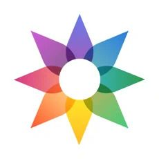
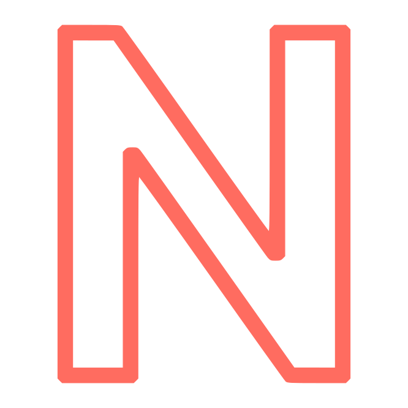

If you're looking for a specific solution to something, these are the hardware and software tools we recommend in a variety of categories. Our recommended privacy tools are primarily chosen based on security features, with additional emphasis on decentralized and open-source tools. They are applicable to a variety of threat models ranging from protection against global mass surveillance programs and avoiding big tech companies to mitigating attacks, but only you can determine what will work best for your use case.

## Tor Anonymity Network Resources

!!! tool "[{ align=right } **Tor Browser**: Best For Browsing The Web Anonymously](tor.md#tor-browser)"

    Tor Browser is your choice if you need anonymity. It's a fork of Firefox designed for anonymous browsing for desktop computers and Android, and it includes default settings and extensions that are automatically configured based on your set security level.

    <small>More information: [Tor Overview](basics/tor-overview.md)</small>

!!! tool "[{ align=right } **Orbot**: Proxy All Your Traffic on iOS and Android Over Tor](tor.md#orbot)"

    Orbot is a free Tor VPN for smartphones which routes traffic from any app on your device through the Tor network. Orbot is often outdated on the Guardian Project's F-Droid repository and Google Play, so consider downloading directly from the [GitHub repository](https://github.com/guardianproject/orbot/releases) instead.

!!! tool annotate "[{ align=right }{ align=right } **Snowflake**: Easily Support the Tor Network by Donating Bandwidth](tor.md#orbot)"

    Snowflake allows you to donate bandwidth to the Tor Project by operating a "Snowflake proxy" within your browser. Snowflake does not increase your privacy, it allows you to easily contribute to the Tor network and help people in censored networks achieve better privacy.

[Learn more :material-arrow-right-drop-circle:](tor.md)

## Desktop Web Browsing

!!! tool "[{ align=right } **Firefox**: Browse With Strong Privacy Protections](desktop-browsers.md#firefox)"

    Firefox is a fast, reliable, and secure web browser which provides strong privacy settings such as Enhanced Tracking Protection, which can help block various types of tracking.

!!! tool "[{ align=right } **Brave**: Best Chromium-Based Privacy Browser](desktop-browsers.md#brave)"

    Brave Browser is a private web browser based on the open-source Chromium web browser project, so it should feel familiar to people switching from Google Chrome and have minimal website compatibility issues.

!!! tool "[{ align=right } **uBlock Origin**: Block Ads, Trackers, and Fingerprinting Scripts](desktop-browsers.md#ublock-origin)"

    uBlock Origin is a popular content blocker for Firefox and Chromium-based browsers that could help you block ads, trackers, and fingerprinting scripts.

[Learn more :material-arrow-right-drop-circle:](desktop-browsers.md)

## Mobile Web Browsing

!!! tool "[{ align=right } **Brave**: Best Web Browser for Android](mobile-browsers.md#brave)"

    Chromium-based browsers like Brave are the most secure options on Android, because alternative browser platforms do not meet modern security standards. Brave is a great choice, and securely syncs with Brave Browser on the desktop!

!!! tool "[{ align=right } **Safari**: Best Web Browser for iOS](mobile-browsers.md#safari)"

    We recommend Safari for iOS users, because iOS requires all browsers to use Safari's web engine under the hood. If you have to trust iOS and Safari anyways, there's little reason to also trust a third-party browser developer.

!!! tool "[{ align=right } **AdGuard**: Best Content Blocking Extension for iOS](mobile-browsers.md#safari)"

    AdGuard for iOS is a free and open-source content-blocking extension for Safari that uses the native Content Blocker API. AdGuard for iOS has some premium features; however, standard Safari content blocking is free of charge.

[Learn more :material-arrow-right-drop-circle:](mobile-browsers.md)

## Operating Systems

### Android

- { .twemoji }{ .twemoji } [GrapheneOS](android.md#grapheneos)
- { .twemoji } [DivestOS](android.md#divestos)

[Learn more :material-arrow-right-drop-circle:](android.md)

### Android Apps

- { .twemoji } [Aurora Store (Google Play Client)](android.md#aurora-store)
- { .twemoji } [Shelter (Work Profiles)](android.md#shelter)
- { .twemoji }{ .twemoji } [Auditor (Supported Devices)](android.md#auditor)
- { .twemoji }{ .twemoji } [Secure Camera](android.md#secure-camera)
- { .twemoji }{ .twemoji } [Secure PDF Viewer](android.md#secure-pdf-viewer)

[Learn more :material-arrow-right-drop-circle:](android.md#general-apps)

### Linux

- { .twemoji } [Fedora Workstation](linux-desktop.md#fedora-workstation)
- { .twemoji } [OpenSUSE Tumbleweed](linux-desktop.md#opensuse-tumbleweed)
- { .twemoji } [Arch Linux](linux-desktop.md#arch-linux)
- { .twemoji } [Fedora Silverblue & Kinoite](linux-desktop.md#fedora-silverblue)
- { .twemoji } [NixOS](linux-desktop.md#nixos)
- { .twemoji } [Whonix (Tor)](linux-desktop.md#whonix)
- { .twemoji } [Tails (Live Boot)](linux-desktop.md#tails)
- { .twemoji } [Qubes OS (Xen VM Distribution)](qubes.md) (1)

1. Qubes uses Xen to provide strong sandboxing between multiple Linux virtual machine installations, and can run most Linux applications. [Learn more about Qubes...](qubes.md)

[Learn more :material-arrow-right-drop-circle:](linux-desktop.md)

### Router Firmware

- { .twemoji }{ .twemoji } [OpenWrt](router.md#openwrt)
- { .twemoji } [OPNsense](router.md#opnsense)

[Learn more :material-arrow-right-drop-circle:](router.md)

## Service Providers

### Cloud Storage

- { .twemoji }{ .twemoji } [Cryptee](cloud.md#cryptee)
- { .twemoji } [Nextcloud (Self-Hostable)](cloud.md#nextcloud)
- { .twemoji } [Proton Drive](cloud.md#proton-drive)

[Learn more :material-arrow-right-drop-circle:](cloud.md)

### DNS

#### DNS Providers

We [recommend](dns.md#recommended-providers) a number of encrypted DNS servers based on a variety of criteria, such as [Mullvad](https://mullvad.net/en/help/dns-over-https-and-dns-over-tls) and [Quad9](https://quad9.net/) amongst others. We recommend for you to read our pages on DNS before choosing a provider. In many cases, using an alternative DNS provider is not recommended.

[Learn more :material-arrow-right-drop-circle:](dns.md)

#### Encrypted DNS Proxies

- { .twemoji }{ .twemoji } [RethinkDNS](dns.md#rethinkdns)
- { .twemoji } [dnscrypt-proxy](dns.md#dnscrypt-proxy)

[Learn more :material-arrow-right-drop-circle:](dns.md#encrypted-dns-proxies)

#### Self-hosted Solutions

- { .twemoji } [AdGuard Home](dns.md#adguard-home)
- { .twemoji } [Pi-hole](dns.md#pi-hole)

[Learn more :material-arrow-right-drop-circle:](dns.md#self-hosted-solutions)

### Email

- { .twemoji } [Proton Mail](email.md#proton-mail)
- { .twemoji } [Mailbox.org](email.md#mailboxorg)
- { .twemoji }{ .twemoji } [StartMail](email.md#startmail)
- { .twemoji } [Tutanota](email.md#tutanota)

[Learn more :material-arrow-right-drop-circle:](email.md)

#### Email Aliasing Services

- { .twemoji }{ .twemoji } [AnonAddy](email.md#anonaddy)
- { .twemoji } [SimpleLogin](email.md#simplelogin)

[Learn more :material-arrow-right-drop-circle:](email.md#email-aliasing-services)

#### Self-Hosting Email

- { .twemoji } [mailcow](email.md#self-hosting-email)
- { .twemoji } [Mail-in-a-Box](email.md#self-hosting-email)

[Learn more :material-arrow-right-drop-circle:](email.md#self-hosting-email)

### Search Engines

- { .twemoji } [Brave Search](search-engines.md#brave-search)
- { .twemoji } [DuckDuckGo](search-engines.md#duckduckgo)
- { .twemoji } [SearXNG](search-engines.md#searxng)
- { .twemoji }{ .twemoji } [Startpage](search-engines.md#startpage)

[Learn more :material-arrow-right-drop-circle:](search-engines.md)

### VPN Providers

??? danger "VPNs do not provide anonymity"

    Using a VPN will **not** keep your browsing habits anonymous, nor will it add additional security to non-secure (HTTP) traffic.

    If you are looking for **anonymity**, you should use the Tor Browser **instead** of a VPN.

    If you're looking for added **security**, you should always ensure you're connecting to websites using HTTPS. A VPN is not a replacement for good security practices.

    [Learn more :material-arrow-right-drop-circle:](vpn.md)

- { .twemoji } [Proton VPN](vpn.md#proton-vpn)
- { .twemoji } [IVPN](vpn.md#ivpn)
- { .twemoji } [Mullvad](vpn.md#mullvad)

[Learn more :material-arrow-right-drop-circle:](vpn.md)

## Software

### Calendar/Contacts Sync

- { .twemoji } [Tutanota](calendar-contacts.md#tutanota)
- { .twemoji } [EteSync](calendar-contacts.md#etesync)
- { .twemoji } [Proton Calendar](calendar-contacts.md#proton-calendar)

[Learn more :material-arrow-right-drop-circle:](calendar-contacts.md)

### Data and Metadata Redaction

- { .twemoji } [ExifCleaner](data-redaction.md#exifcleaner)
- { .twemoji } [MAT2](data-redaction.md#mat2)
- { .twemoji } [ExifEraser (Android)](data-redaction.md#exiferaser-android)
- { .twemoji } [Metapho (iOS)](data-redaction.md#metapho-ios)
- { .twemoji } [PrivacyBlur](data-redaction.md#privacyblur)
- { .twemoji } [ExifTool (CLI)](data-redaction.md#exiftool)

[Learn more :material-arrow-right-drop-circle:](data-redaction.md)

### Email Clients

- { .twemoji } [Thunderbird](email-clients.md#thunderbird)
- { .twemoji } [Apple Mail (macOS)](email-clients.md#apple-mail-macos)
- { .twemoji } [Canary Mail (iOS)](email-clients.md#canary-mail-ios)
- { .twemoji } [FairEmail (Android)](email-clients.md#fairemail-android)
- { .twemoji } [GNOME Evolution (Linux)](email-clients.md#gnome-evolution-gnome)
- { .twemoji } [K-9 Mail (Android)](email-clients.md#k-9-mail-android)
- { .twemoji } [Kontact (Linux)](email-clients.md#kontact-kde)
- { .twemoji } [Mailvelope (PGP in standard webmail)](email-clients.md#mailvelope-browser)
- { .twemoji } [NeoMutt (CLI)](email-clients.md#neomutt-cli)

[Learn more :material-arrow-right-drop-circle:](email-clients.md)

### Encryption Software

??? info "Operating System Disk Encryption"

    For encrypting your operating system drive, we typically recommend using whichever encryption tool your operating system provides, whether that is **BitLocker** on Windows, **FileVault** on macOS, or **LUKS** on Linux. These tools are included with the operating system and typically use hardware encryption elements such as a TPM that other full-disk encryption software like VeraCrypt do not. VeraCrypt is still suitable for non-operating system disks such as external drives, especially drives that may be accessed from multiple operating systems.

    [Learn more :material-arrow-right-drop-circle:](encryption.md##operating-system-included-full-disk-encryption-fde)

- { .twemoji } [Cryptomator](encryption.md#cryptomator-cloud)
- { .twemoji } [Picocrypt](encryption.md#picocrypt-file)
- { .twemoji }{ .twemoji } [VeraCrypt (FDE)](encryption.md#veracrypt-disk)
- { .twemoji }{ .twemoji } [Hat.sh (Browser-based)](encryption.md#hatsh)
- { .twemoji } [Kryptor](encryption.md#kryptor)
- { .twemoji } [Tomb](encryption.md#tomb)

[Learn more :material-arrow-right-drop-circle:](encryption.md)

#### OpenPGP Clients

- { .twemoji } [GnuPG](encryption.md#gnu-privacy-guard)
- { .twemoji } [GPG4Win (Windows)](encryption.md#gpg4win)
- { .twemoji } [GPG Suite (macOS)](encryption.md#gpg-suite)
- { .twemoji } [OpenKeychain](encryption.md#openkeychain)

[Learn more :material-arrow-right-drop-circle:](encryption.md#openpgp)

### File Sharing and Sync

- { .twemoji } [Send](file-sharing.md#send)
- { .twemoji } [OnionShare](file-sharing.md#onionshare)
- { .twemoji } [FreedomBox](file-sharing.md#freedombox)
- { .twemoji } [Syncthing](file-sharing.md#syncthing)

[Learn more :material-arrow-right-drop-circle:](file-sharing.md)

### Frontends

- { .twemoji }{ .twemoji } [Librarian (LBRY, Web)](frontends.md#librarian)
- { .twemoji } [Nitter (Twitter, Web)](frontends.md#nitter)
- { .twemoji } [FreeTube (YouTube, Desktop)](frontends.md#freetube)
- { .twemoji } [NewPipe (YouTube, Android)](frontends.md#newpipe-android)
- { .twemoji }{ .twemoji } [Invidious (YouTube, Web)](frontends.md#invidious)
- { .twemoji } [Piped (YouTube, Web)](frontends.md#piped)

[Learn more :material-arrow-right-drop-circle:](frontends.md)

### Multi-Factor Authentication Tools

- { .twemoji } [YubiKey](multi-factor-authentication.md#yubikey)
- { .twemoji } [Nitrokey](multi-factor-authentication.md#nitrokey-librem-key)
- { .twemoji } [Aegis Authenticator](multi-factor-authentication.md#aegis-authenticator)
- { .twemoji } [Raivo OTP](multi-factor-authentication.md#raivo-otp)

[Learn more :material-arrow-right-drop-circle:](multi-factor-authentication.md)

### News Aggregators

- { .twemoji } [Akregator](news-aggregators.md#akregator)
- { .twemoji} [Feeder](news-aggregators.md#feeder)
- { .twemoji } [Fluent Reader](news-aggregators.md#fluent-reader)
- { .twemoji } [GNOME Feeds](news-aggregators.md#gnome-feeds)
- { .twemoji }{ .twemoji } [Miniflux](news-aggregators.md#miniflux)
- { .twemoji } [NetNewsWire](news-aggregators.md#netnewswire)
- { .twemoji } [Newsboat](news-aggregators.md#newsboat)

[Learn more :material-arrow-right-drop-circle:](news-aggregators.md)

### Notebooks

- { .twemoji } [EteSync Notes](notebooks.md#etesync-notes)
- { .twemoji } [Joplin](notebooks.md#joplin)
- { .twemoji } [Standard Notes](notebooks.md#standard-notes)
- { .twemoji } [Org-mode](notebooks.md#org-mode)

[Learn more :material-arrow-right-drop-circle:](notebooks.md)

### Password Managers

- { .twemoji } [Bitwarden](passwords.md#bitwarden)
- { .twemoji } [1Password](passwords.md#1password)
- { .twemoji } [Psono](passwords.md#psono)
- { .twemoji } [KeePassXC](passwords.md#keepassxc)
- { .twemoji } [KeePassDX (Android)](passwords.md#keepassdx-android)
- { .twemoji } [Strongbox (iOS & macOS)](passwords.md#strongbox-ios-macos)
- { .twemoji } [gopass](passwords.md#gopass)

[Learn more :material-arrow-right-drop-circle:](passwords.md)

### Productivity Tools

- { .twemoji } [LibreOffice](productivity.md#libreoffice)
- { .twemoji } [OnlyOffice](productivity.md#onlyoffice)
- { .twemoji } [CryptPad](productivity.md#cryptpad)
- { .twemoji } [PrivateBin (Pastebin)](productivity.md#privatebin)

[Learn more :material-arrow-right-drop-circle:](productivity.md)

### Real-Time Communication

- { .twemoji } [Signal](real-time-communication.md#signal)
- { .twemoji } [Element](real-time-communication.md#element)
- { .twemoji } [Session](real-time-communication.md#session)
- { .twemoji } [Briar (Android)](real-time-communication.md#briar-android)

[Learn more :material-arrow-right-drop-circle:](real-time-communication.md)

### Video Streaming Clients

- { .twemoji } [LBRY](video-streaming.md#lbry)

[Learn more :material-arrow-right-drop-circle:](video-streaming.md)
