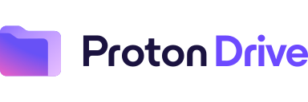
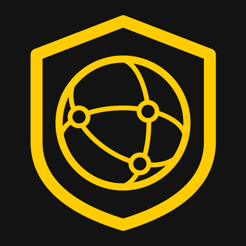
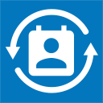
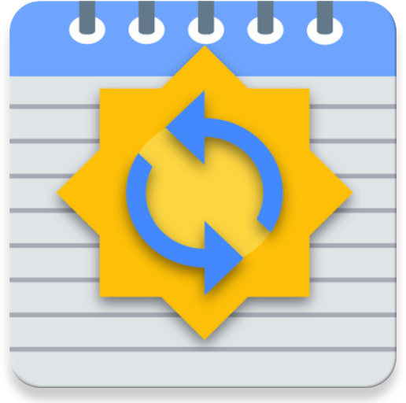
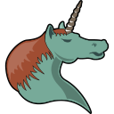
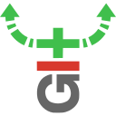
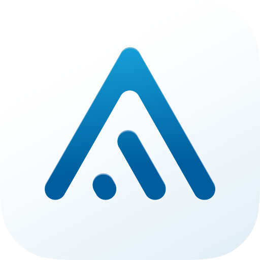
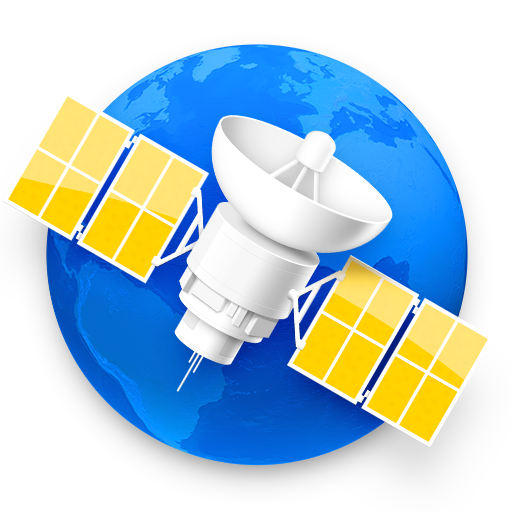

If you're looking for a specific solution to something, these are the hardware and software tools we recommend in a variety of categories. Our recommended privacy tools are primarily chosen based on security features, with additional emphasis on decentralized and open-source tools. They are applicable to a variety of threat models ranging from protection against global mass surveillance programs and avoiding big tech companies to mitigating attacks, but only you can determine what will work best for your use case.

If you want assistance figuring out the best privacy tools and alternative programs for your workload/use-case, start a discussion in our [Reddit](https://www.reddit.com/r/privacyguides) or [Matrix](https://matrix.to/#/#privacyguides:matrix.org) communities!

For your convenience, everything we recommend is listed below with a link to the project's homepage. For more details about each project, why they were chosen, and additional tips or tricks we recommend, click the "Learn more" link in each section.

## Web Browsers

- { .twemoji } [Tor Browser](browsers.md#tor-browser)
- { .twemoji } [Firefox (Desktop)](browsers.md#firefox)
- { .twemoji } [Brave (Desktop)](browsers.md#brave)
- { .twemoji } [Bromite (Android)](browsers.md#bromite)
- { .twemoji } [Safari (iOS)](browsers.md#safari)

[Learn more :hero-arrow-circle-right-fill:](browsers.md)

**Additional Resources:**

- { .twemoji } [uBlock Origin](browsers.md#ublock-origin)
- { .twemoji } [AdGuard for iOS](browsers.md#adguard-for-ios)
- { .twemoji }{ .twemoji } [Snowflake](browsers.md#snowflake) (1)
- { .twemoji } [Terms of Service; Didn't Read](browsers.md#terms-of-service-didnt-read) (2)

1. Snowflake does not increase privacy, however it allows you to easily contribute to the Tor network and help people in censored networks achieve better privacy.
2. We do not recommend installing ToS;DR as a browser extension. The same information is provided on their website.

[Learn more :hero-arrow-circle-right-fill:](browsers.md#additional-resources)

## Operating Systems

### Android

- { .twemoji }{ .twemoji } [GrapheneOS](android.md#grapheneos)
- { .twemoji } [CalyxOS](android.md#calyxos)
- { .twemoji } [DivestOS](android.md#divestos)

[Learn more :hero-arrow-circle-right-fill:](android.md)

**Android Apps:**

- { .twemoji } [Neo Store (F-Droid Client)](android.md#neo-store)
- { .twemoji } [Orbot (Tor Proxy)](android.md#orbot)
- { .twemoji } [Shelter (Work Profiles)](android.md#shelter)
- { .twemoji }{ .twemoji } [Auditor (Supported Devices)](android.md#auditor)
- { .twemoji }{ .twemoji } [Secure Camera](android.md#secure-camera)
- { .twemoji }{ .twemoji } [Secure PDF Viewer](android.md#secure-pdf-viewer)
- { .twemoji } [PrivacyBlur](android.md#privacyblur)

[Learn more :hero-arrow-circle-right-fill:](android.md#general-apps)

### Linux

- { .twemoji } [Fedora Workstation](linux-desktop.md#fedora-workstation)
- { .twemoji } [OpenSUSE Tumbleweed](linux-desktop.md#opensuse-tumbleweed)
- { .twemoji } [Arch Linux](linux-desktop.md#arch-linux)
- { .twemoji } [Fedora Silverblue & Kinoite](linux-desktop.md#fedora-silverblue)
- { .twemoji } [NixOS](linux-desktop.md#nixos)
- { .twemoji } [Whonix (Tor)](linux-desktop.md#whonix)
- { .twemoji } [Tails (Live Boot)](linux-desktop.md#tails)
- { .twemoji } [Qubes OS (Xen VM Distribution)](qubes.md) (1)

1. Qubes uses Xen to provide strong sandboxing between multiple Linux virtual machine installations, and can run most Linux applications. [Learn more about Qubes...](qubes.md)

[Learn more :hero-arrow-circle-right-fill:](linux-desktop.md)

### Router Firmware

- { .twemoji }{ .twemoji } [OpenWrt](router.md#openwrt)
- { .twemoji }{ .twemoji } [pfSense](router.md#pfsense)

[Learn more :hero-arrow-circle-right-fill:](router.md)

## Service Providers

### Cloud Storage

- { .twemoji } [Nextcloud (Self-Hostable)](cloud.md#nextcloud)
- { .twemoji } [Proton Drive](cloud.md#proton-drive)
- { .twemoji }{ .twemoji } [Cryptee](cloud.md#cryptee)
- { .twemoji }{ .twemoji } [Tahoe-LAFS (Advanced)](cloud.md#tahoe-lafs)

[Learn more :hero-arrow-circle-right-fill:](cloud.md)

### DNS

**DNS Providers:**

We [recommend](dns.md#recommended-providers) a number of encrypted DNS servers based on a variety of criteria, such as [Mullvad](https://mullvad.net/en/help/dns-over-https-and-dns-over-tls) and [Quad9](https://quad9.net/) amongst others. We recommend for you to read our pages on DNS before choosing a provider. In many cases, using an alternative DNS provider is not recommended.

[Learn more :hero-arrow-circle-right-fill:](dns.md)

**Encrypted DNS Proxies:**

- { .twemoji }{ .twemoji } [RethinkDNS](dns.md#rethinkdns)
- { .twemoji } [DNSCloak](dns.md#dnscloak)
- { .twemoji } [dnscrypt-proxy](dns.md#dnscrypt-proxy)

[Learn more :hero-arrow-circle-right-fill:](dns.md#encrypted-dns-proxies)

**Self-hosted Solutions:**

- { .twemoji } [AdGuard Home](dns.md#adguard-home)
- { .twemoji } [Pi-hole](dns.md#pi-hole)

[Learn more :hero-arrow-circle-right-fill:](dns.md#self-hosted-solutions)

### Email

- { .twemoji } [Proton Mail](email.md#protonmail)
- { .twemoji } [Mailbox.org](email.md#mailboxorg)
- { .twemoji } [Tutanota](email.md#tutanota)
- { .twemoji }{ .twemoji } [StartMail](email.md#startmail)

[Learn more :hero-arrow-circle-right-fill:](email.md)

**Email Aliasing Services:**

- { .twemoji } [SimpleLogin](email.md#simplelogin)
- { .twemoji }{ .twemoji } [AnonAddy](email.md#anonaddy)

[Learn more :hero-arrow-circle-right-fill:](email.md#email-aliasing-services)

**Self-Hosting Email:**

- { .twemoji } [Mail-in-a-Box](email.md#self-hosting-email)
- { .twemoji } [mailcow](email.md#self-hosting-email)

[Learn more :hero-arrow-circle-right-fill:](email.md#self-hosting-email)

### Search Engines

- { .twemoji } [DuckDuckGo](search-engines.md#duckduckgo)
- { .twemoji }{ .twemoji } [Startpage](search-engines.md#startpage)
- { .twemoji } [Brave Search](search-engines.md#brave-search)
- { .twemoji } [SearXNG](search-engines.md#searxng)

[Learn more :hero-arrow-circle-right-fill:](search-engines.md)

### VPN Providers

??? danger "VPNs do not provide anonymity"

    Using a VPN will **not** keep your browsing habits anonymous, nor will it add additional security to non-secure (HTTP) traffic.

    If you are looking for **anonymity**, you should use the Tor Browser **instead** of a VPN.

    If you're looking for added **security**, you should always ensure you're connecting to websites using HTTPS. A VPN is not a replacement for good security practices.

    [Learn more :hero-arrow-circle-right-fill:](vpn.md)

- { .twemoji } [Mullvad](vpn.md#mullvad)
- { .twemoji } [Proton VPN](vpn.md#protonvpn)
- { .twemoji } [IVPN](vpn.md#ivpn)

[Learn more :hero-arrow-circle-right-fill:](vpn.md)

## Software

### Calendar/Contacts Sync

- { .twemoji } [Tutanota (SaaS)](calendar-contacts.md#tutanota)
- { .twemoji } [Proton Calendar (SaaS)](calendar-contacts.md#proton-calendar)
- { .twemoji } [EteSync](calendar-contacts.md#etesync)
- { .twemoji } [Nextcloud](calendar-contacts.md#nextcloud)
- { .twemoji } [DecSync CC](calendar-contacts.md#decsync-cc)

[Learn more :hero-arrow-circle-right-fill:](calendar-contacts.md)

### Notebooks

- { .twemoji } [Joplin](notebooks.md#joplin)
- { .twemoji } [Standard Notes](notebooks.md#standard-notes)
- { .twemoji } [EteSync Notes](notebooks.md#etesync-notes)
- { .twemoji } [Org-mode](notebooks.md#org-mode)

[Learn more :hero-arrow-circle-right-fill:](notebooks.md)

### Email Clients

- { .twemoji } [Thunderbird](email-clients.md#thunderbird)
- { .twemoji } [Apple Mail (macOS)](email-clients.md#apple-mail)
- { .twemoji } [GNOME Evolution (Linux)](email-clients.md#gnome-evolution)
- { .twemoji } [Kontact (Linux)](email-clients.md#kontact)
- { .twemoji } [Mailvelope (PGP in standard webmail)](email-clients.md#mailvelope)
- { .twemoji } [K-9 Mail (Android)](email-clients.md#k-9-mail)
- { .twemoji } [FairEmail (Android)](email-clients.md#fairemail)
- { .twemoji } [Canary Mail (iOS)](email-clients.md#canary-mail)
- { .twemoji } [NeoMutt (CLI)](email-clients.md#neomutt)

[Learn more :hero-arrow-circle-right-fill:](email-clients.md)

### Encryption Tools

??? info "Operating System Disk Encryption"

    For encrypting your operating system drive, we typically recommend using whichever encryption tool your operating system provides, whether that is **BitLocker** on Windows, **FileVault** on macOS, or **LUKS** on Linux. These tools are included with the operating system and typically utilize hardware encryption elements such as a TPM that other full-disk encryption software like VeraCrypt do not. VeraCrypt is still suitable for non-operating system disks such as external drives, especially drives that may be accessed from multiple operating systems.

    [Learn more :hero-arrow-circle-right-fill:](encryption.md##operating-system-included-full-disk-encryption-fde)

- { .twemoji }{ .twemoji } [VeraCrypt (FDE)](encryption.md#veracrypt)
- { .twemoji } [Cryptomator](encryption.md#cryptomator)
- { .twemoji } [Picocrypt](encryption.md#picocrypt)
- { .twemoji }{ .twemoji } [Hat.sh (Browser-based)](encryption.md#hatsh)
- { .twemoji } [Kryptor](encryption.md#kryptor)
- { .twemoji } [Tomb](encryption.md#tomb)

[Learn more :hero-arrow-circle-right-fill:](encryption.md)

**OpenPGP Clients:**

- { .twemoji } [GnuPG](encryption.md#gnu-privacy-guard)
- { .twemoji } [GPG4Win (Windows)](encryption.md#gpg4win)
- { .twemoji } [GPG Suite (macOS)](encryption.md#gpg-suite)
- { .twemoji } [OpenKeychain](encryption.md#openkeychain)

[Learn more :hero-arrow-circle-right-fill:](encryption.md#openpgp)

### File Sharing

- { .twemoji } [OnionShare](file-sharing.md#onionshare)
- { .twemoji } [Magic Wormhole](file-sharing.md#magic-wormhole)
- { .twemoji } [FreedomBox](file-sharing.md#freedombox)
- { .twemoji } [Syncthing](file-sharing.md#syncthing)
- { .twemoji } [git-annex](file-sharing.md#git-annex)

[Learn more :hero-arrow-circle-right-fill:](file-sharing.md)

### Metadata Removal Tools

- { .twemoji } [MAT2](metadata-removal-tools.md#mat2)
- { .twemoji } [ExifCleaner](metadata-removal-tools.md#exifcleaner)
- { .twemoji } [Scrambled Exif (Android)](metadata-removal-tools.md#scrambled-exif)
- { .twemoji } [Imagepipe (Android)](metadata-removal-tools.md#imagepipe)
- { .twemoji } [Metapho (iOS)](metadata-removal-tools.md#metapho)
- { .twemoji } [ExifTool (CLI)](metadata-removal-tools.md#exiftool)

[Learn more :hero-arrow-circle-right-fill:](metadata-removal-tools.md)

### Multi-Factor Authentication Tools

- { .twemoji } [YubiKey](multi-factor-authentication.md#yubikey)
- { .twemoji } [Nitrokey](multi-factor-authentication.md#nitrokey-librem-key)
- { .twemoji } [Aegis Authenticator](multi-factor-authentication.md#aegis-authenticator)
- { .twemoji } [Raivo OTP](multi-factor-authentication.md#raivo-otp)

[Learn more :hero-arrow-circle-right-fill:](multi-factor-authentication.md)

### Password Managers

- { .twemoji } [KeePassXC](passwords.md#keepassxc)
- { .twemoji } [KeePassDX (Android)](passwords.md#keepassdx)
- { .twemoji } [Bitwarden](passwords.md#bitwarden)
- { .twemoji } [Psono](passwords.md#psono)
- { .twemoji } [gopass](passwords.md#gopass)
- { .twemoji }{ .twemoji } [Vaultwarden (Bitwarden Server)](passwords.md#vaultwarden)

[Learn more :hero-arrow-circle-right-fill:](passwords.md)

### Productivity Tools

- { .twemoji } [LibreOffice](productivity.md#libreoffice)
- { .twemoji } [OnlyOffice](productivity.md#onlyoffice)
- { .twemoji } [Framadate (Appointment Planning)](productivity.md#framadate)
- { .twemoji } [PrivateBin (Pastebin)](productivity.md#privatebin)
- { .twemoji } [CryptPad](productivity.md#cryptpad)
- { .twemoji }{ .twemoji } [Write.as (Blogging Platform)](productivity.md#writeas)
- { .twemoji } [VSCodium (Source-Code Editor)](productivity.md#vscodium)

[Learn more :hero-arrow-circle-right-fill:](productivity.md)

### Real-Time Communication

- { .twemoji } [Signal](real-time-communication.md#signal)
- { .twemoji } [Element](real-time-communication.md#element)
- { .twemoji } [Briar (Android)](real-time-communication.md#briar)
- { .twemoji } [Session](real-time-communication.md#session)

[Learn more :hero-arrow-circle-right-fill:](real-time-communication.md)

### News Aggregators

- { .twemoji } [Fluent Reader](news-aggregators.md#fluent-reader)
- { .twemoji } [GNOME Feeds](news-aggregators.md#gnome-feeds)
- { .twemoji } [Akregator](news-aggregators.md#akregator)
- { .twemoji} [Feeder](news-aggregators.md#feeder)
- { .twemoji } [NetNewsWire](news-aggregators.md#netnewswire)
- { .twemoji }{ .twemoji } [Miniflux](news-aggregators.md#miniflux)
- { .twemoji } [Newsboat](news-aggregators.md#newsboat)

[Learn more :hero-arrow-circle-right-fill:](news-aggregators.md)

### Self-Contained Networks

- { .twemoji } [Tor](self-contained-networks.md#tor)
- { .twemoji } { .twemoji } [I2P](self-contained-networks.md#invisible-internet-project)
- { .twemoji } [Freenet](self-contained-networks.md#the-freenet-project)

[Learn more :hero-arrow-circle-right-fill:](self-contained-networks.md)

### Video Streaming Clients

- { .twemoji } [FreeTube (YouTube, Desktop)](video-streaming.md#freetube)
- { .twemoji } [LBRY](video-streaming.md#lbry)
- { .twemoji } [NewPipe (YouTube, Android)](video-streaming.md#newpipe)
- { .twemoji } [NewPipe x Sponsorblock](video-streaming.md#sponsorblock)
- { .twemoji }{ .twemoji } [Invidious (YouTube, Web)](video-streaming.md#invidious)
- { .twemoji } [Piped (YouTube, Web)](video-streaming.md#piped)
- { .twemoji }{ .twemoji } [Librarian (LBRY, Web)](video-streaming.md#librarian)

[Learn more :hero-arrow-circle-right-fill:](video-streaming.md)

--8<-- "includes/abbreviations.en.md"
