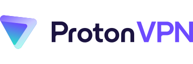

Find a no-logging VPN operator who isn’t out to sell or read your web traffic.

??? danger "VPNs do not provide anonymity"

    Using a VPN will **not** keep your browsing habits anonymous, nor will it add additional security to non-secure (HTTP) traffic.

    If you are looking for **anonymity**, you should use the Tor Browser **instead** of a VPN.

    If you're looking for added **security**, you should always ensure you're connecting to websites using HTTPS. A VPN is not a replacement for good security practices.

    [Download Tor](https://www.torproject.org/){ .md-button .md-button--primary } [Tor Myths & FAQ](basics/tor-overview.md){ .md-button }

??? question "When are VPNs useful?"

    If you're looking for additional **privacy** from your ISP, on a public Wi-Fi network, or while torrenting files, a VPN may be the solution for you as long as you understand the risks involved.

    [More Info](basics/vpn-overview.md){ .md-button }

## Recommended Providers

!!! summary "Criteria"

    Our recommended providers use encryption, accept Monero, support WireGuard & OpenVPN, and have a no logging policy. Read our [full list of criteria](#our-criteria) for more information.

### Proton VPN

!!! recommendation annotate

    { align=right }

    **Proton VPN** is a strong contender in the VPN space, and they have been in operation since 2016. Proton AG is based in Switzerland and offers a limited free tier, as well as a more featured premium option.

    **Free** — **Plus Plan USD $71.88/year** (1)

    [:octicons-home-16: Homepage](https://protonvpn.com/){ .md-button .md-button--primary }
    [:octicons-eye-16:](https://protonvpn.com/privacy-policy){ .card-link title="Privacy Policy" }
    [:octicons-info-16:](https://protonvpn.com/support/){ .card-link title=Documentation}
    [:octicons-code-16:](https://github.com/ProtonVPN){ .card-link title="Source Code" }

1. A further 10% is discounted with a 2-year subscription ($119.76).

??? check annotate "63 Countries"

    Proton VPN has [servers in 63 countries](https://protonvpn.com/vpn-servers) (1). Picking a VPN provider with a server nearest to you will reduce latency of the network traffic you send. This is because of a shorter route (less hops) to the destination.

    We also think it's better for the security of the VPN provider's private keys if they use [dedicated servers](https://en.wikipedia.org/wiki/Dedicated_hosting_service), instead of cheaper shared solutions (with other customers) such as [virtual private servers](https://en.wikipedia.org/wiki/Virtual_private_server).

1. As of 2022/05/17

??? check "Independently Audited"

    As of January 2020 Proton VPN has undergone an independent audit by SEC Consult. SEC Consult found some medium and low risk vulnerabilities in Proton VPN's Windows, Android, and iOS applications, all of which were "properly fixed" by Proton VPN before the reports were published. None of the issues identified would have provided an attacker remote access to your device or traffic. You can view individual reports for each platform at [protonvpn.com](https://protonvpn.com/blog/open-source/). In April 2022 Proton VPN underwent [another audit](https://protonvpn.com/blog/no-logs-audit/) and the report was [produced by Securitum](https://protonvpn.com/blog/wp-content/uploads/2022/04/securitum-protonvpn-nologs-20220330.pdf).

??? check "Open Source Clients"

    Proton VPN provides the source code for their desktop and mobile clients in their [GitHub organization](https://github.com/ProtonVPN).

??? check "Accepts Cash"

    Proton VPN, in addition to accepting credit/debit cards and PayPal, accepts Bitcoin, and **cash/local currency** as anonymous forms of payment.

??? check "WireGuard Support"

    Proton VPN mostly supports the WireGuard® protocol. [WireGuard](https://www.wireguard.com) is a newer protocol that utilizes state-of-the-art [cryptography](https://www.wireguard.com/protocol/). Additionally, WireGuard aims to be simpler and more performant.

    Proton VPN [recommends](https://protonvpn.com/blog/wireguard/) the use of WireGuard with their service. On Proton VPN's Windows, macOS, iOS, Android, ChromeOS, and Android TV apps, WireGuard is the default protocol; however, [support](https://protonvpn.com/support/how-to-change-vpn-protocols/) for the protocol is not present in their Linux app.

??? warning "Remote Port Forwarding"

    Proton VPN currently only supports remote [port forwarding](https://protonvpn.com/support/port-forwarding/) on Windows, which may impact some applications. Especially Peer-to-Peer applications like Torrent clients.

??? check "Mobile Clients"

    In addition to providing standard OpenVPN configuration files, Proton VPN has mobile clients for [App Store](https://apps.apple.com/us/app/protonvpn-fast-secure-vpn/id1437005085) and [Google Play](https://play.google.com/store/apps/details?id=ch.protonvpn.android&hl=en_US) allowing for easy connections to their servers. The mobile client on Android is also available in [F-Droid](https://f-droid.org/en/packages/ch.protonvpn.android), which ensures that it is compiled with [reproducible builds](https://www.f-droid.org/en/2019/05/05/trust-privacy-and-free-software.html).

??? info "Additional Functionality"

    Proton VPN have their own servers and datacenters in Switzerland, Iceland and Sweden. They offer adblocking and known malware domains blocking with their DNS service. Additionally, Proton VPN also offers "Tor" servers allowing you to easily connect to onion sites, but we still strongly recommend using [the official Tor Browser](https://www.torproject.org/) for this purpose.

### IVPN

!!! recommendation

    { align=right }

    **IVPN** is another premium VPN provider, and they have been in operation since 2009. IVPN is based in Gibraltar.

    **Standard USD $60/year** — **Pro USD $100/year**

    [:octicons-home-16: Homepage](https://www.ivpn.net/){ .md-button .md-button--primary }
    [:octicons-eye-16:](https://www.ivpn.net/privacy/){ .card-link title="Privacy Policy" }
    [:octicons-info-16:](https://www.ivpn.net/knowledgebase/general/){ .card-link title=Documentation}
    [:octicons-code-16:](https://github.com/ivpn){ .card-link title="Source Code" }

??? check annotate "32 Countries"

    IVPN has [servers in 32 countries](https://www.ivpn.net/server-locations) (1). Picking a VPN provider with a server nearest to you will reduce latency of the network traffic you send. This is because of a shorter route (less hops) to the destination.

    We also think it's better for the security of the VPN provider's private keys if they use [dedicated servers](https://en.wikipedia.org/wiki/Dedicated_hosting_service), instead of cheaper shared solutions (with other customers) such as [virtual private servers](https://en.wikipedia.org/wiki/Virtual_private_server).

1. As of 2022/05/17

??? check "Independently Audited"

    IVPN has undergone a [no-logging audit from Cure53](https://cure53.de/audit-report_ivpn.pdf) which concluded in agreement with IVPN's no-logging claim. IVPN has also completed a [comprehensive pentest report Cure53](https://cure53.de/summary-report_ivpn_2019.pdf) in January 2020. IVPN has also said they plan to have [annual reports](https://www.ivpn.net/blog/independent-security-audit-concluded) in the future. A further review was conducted [in April 2022](https://www.ivpn.net/blog/ivpn-apps-security-audit-2022-concluded/) and was produced by Cure53 [on their website](https://cure53.de/pentest-report_IVPN_2022.pdf).

??? check "Open Source Clients"

    As of February 2020 [IVPN applications are now open source](https://www.ivpn.net/blog/ivpn-applications-are-now-open-source). Source code can be obtained from their [GitHub organization](https://github.com/ivpn).

??? check "Accepts Cash and Monero"

    In addition to accepting credit/debit cards and PayPal, IVPN accepts Bitcoin, **Monero** and **cash/local currency** (on annual plans) as anonymous forms of payment.

??? check "WireGuard Support"

    IVPN supports the WireGuard® protocol. [WireGuard](https://www.wireguard.com) is a newer protocol that utilizes state-of-the-art [cryptography](https://www.wireguard.com/protocol/). Additionally, WireGuard aims to be simpler and more performant.

    IVPN [recommends](https://www.ivpn.net/wireguard/) the use of WireGuard with their service and, as such, the protocol is the default on all of IVPN's apps. IVPN also offers a WireGuard configuration generator for use with the official WireGuard [apps](https://www.wireguard.com/install/).

??? check "Remote Port Forwarding"

    Remote [port forwarding](https://en.wikipedia.org/wiki/Port_forwarding) is possible with a Pro plan. Port forwarding [can be activated](https://www.ivpn.net/knowledgebase/81/How-do-I-activate-port-forwarding.html) via the client area. Port forwarding is only available on IVPN when using WireGuard or OpenVPN protocols and is [disabled on US servers](https://www.ivpn.net/knowledgebase/116/Port-forwarding-is-not-working-why.html).

??? check "Mobile Clients"

    In addition to providing standard OpenVPN configuration files, IVPN has mobile clients for [App Store](https://apps.apple.com/us/app/ivpn-serious-privacy-protection/id1193122683) and [Google Play](https://play.google.com/store/apps/details?id=net.ivpn.client) allowing for easy connections to their servers. The mobile client on Android is also available in [F-Droid](https://f-droid.org/en/packages/net.ivpn.client), which ensures that it is compiled with [reproducible builds](https://www.f-droid.org/en/2019/05/05/trust-privacy-and-free-software.html).

??? info "Additional Functionality"

    IVPN clients support two factor authentication (Mullvad and Proton VPN clients do not). IVPN also provides "[AntiTracker](https://www.ivpn.net/antitracker)" functionality, which blocks advertising networks and trackers from the network level.

### Mullvad

!!! recommendation

    { align=right }

    **Mullvad** is a fast and inexpensive VPN with a serious focus on transparency and security. They have been in operation since **2009**. Mullvad is based in Sweden and does not have a free trial.

    **EUR €60/year**

    [:octicons-home-16: Homepage](https://mullvad.net){ .md-button .md-button--primary }
    [:pg-tor:](http://o54hon2e2vj6c7m3aqqu6uyece65by3vgoxxhlqlsvkmacw6a7m7kiad.onion){ .card-link title=Onion }
    [:octicons-eye-16:](https://mullvad.net/en/help/privacy-policy/){ .card-link title="Privacy Policy" }
    [:octicons-info-16:](https://mullvad.net/en/help/){ .card-link title=Documentation}
    [:octicons-code-16:](https://github.com/mullvad){ .card-link title="Source Code" }

??? check annotate "38 Countries"

    Mullvad has [servers in 38 countries](https://mullvad.net/servers/) (1). Picking a VPN provider with a server nearest to you will reduce latency of the network traffic you send. This is because of a shorter route (less hops) to the destination.

    We also think it's better for the security of the VPN provider's private keys if they use [dedicated servers](https://en.wikipedia.org/wiki/Dedicated_hosting_service), instead of cheaper shared solutions (with other customers) such as [virtual private servers](https://en.wikipedia.org/wiki/Virtual_private_server).

1. As of 2022/05/17

??? check "Independently Audited"

    Mullvad's VPN clients have been audited by Cure53 and Assured AB in a pentest report [published at cure53.de](https://cure53.de/pentest-report_mullvad_v2.pdf). The security researchers concluded:

    > Cure53 and Assured AB are happy with the results of the audit and the software leaves an overall positive impression. With security dedication of the in-house team at the Mullvad VPN compound, the testers have no doubts about the project being on the right track from a security standpoint.

    In 2020 a second audit [was announced](https://mullvad.net/blog/2020/6/25/results-available-audit-mullvad-app/) and the [final audit report](https://cure53.de/pentest-report_mullvad_2020_v2.pdf) was made available on Cure53's website:

    > The results of this May-June 2020 project targeting the Mullvad complex are quite positive. [...] The overall application ecosystem used by Mullvad leaves a sound and structured impression. The overall structure of the application makes it easy to roll out patches and fixes in a structured manner. More than anything, the findings spotted by Cure53 showcase the importance of constantly auditing and re-assessing the current leak vectors, in order to always ensure privacy of the end-users. With that being said, Mullvad does a great job protecting the end-user from common PII leaks and privacy related risks.

    In 2021 an infrastructure audit [was announced](https://mullvad.net/en/blog/2021/1/20/no-pii-or-privacy-leaks-found-cure53s-infrastructure-audit/) and the [final audit report](https://cure53.de/pentest-report_mullvad_2021_v1.pdf) was made available on Cure53's website. Another report was comissioned [in June 2022](https://mullvad.net/en/blog/2022/6/22/vpn-server-audit-found-no-information-leakage-or-logging-of-customer-data/) and is available on [Assured's website](https://www.assured.se/publications/Assured_Mullvad_relay_server_audit_report_2022.pdf).

??? check "Open Source Clients"

    Mullvad provides the source code for their desktop and mobile clients in their [GitHub organization](https://github.com/mullvad/mullvadvpn-app).

??? check "Accepts Cash and Monero"

    Mullvad, in addition to accepting credit/debit cards and PayPal, accepts Bitcoin, Bitcoin Cash, **Monero** and **cash/local currency** as anonymous forms of payment. They also accept Swish and bank wire transfers.

??? check "WireGuard Support"

    Mullvad supports the WireGuard® protocol. [WireGuard](https://www.wireguard.com) is a newer protocol that utilizes state-of-the-art [cryptography](https://www.wireguard.com/protocol/). Additionally, WireGuard aims to be simpler and more performant.

    Mullvad [recommends](https://mullvad.net/en/help/why-wireguard/) the use of WireGuard with their service. It is the default or only protocol on Mullvad's Android, iOS, macOS, and Linux apps, but on Windows you have to [manually enable](https://mullvad.net/en/help/how-turn-wireguard-mullvad-app/) WireGuard. Mullvad also offers a WireGuard configuration generator for use with the official WireGuard [apps](https://www.wireguard.com/install/).

??? check "IPv6 Support"

    Mullvad supports the future of networking [IPv6](https://en.wikipedia.org/wiki/IPv6). Their network allows you to [access services hosted on IPv6](https://mullvad.net/en/blog/2014/9/15/ipv6-support/) as opposed to other providers who block IPv6 connections.

??? check "Remote Port Forwarding"

    Remote [port forwarding](https://en.wikipedia.org/wiki/Port_forwarding) is allowed for people who make one-time payments, but not allowed for accounts with a recurring/subscription-based payment method. This is to prevent Mullvad from being able to identify you based on your port usage and stored subscription information. See [Port forwarding with Mullvad VPN](https://mullvad.net/help/port-forwarding-and-mullvad/) for more information.

??? check "Mobile Clients"

    Mullvad has published [App Store](https://apps.apple.com/app/mullvad-vpn/id1488466513) and [Google Play](https://play.google.com/store/apps/details?id=net.mullvad.mullvadvpn) clients, both supporting an easy-to use interface as opposed to requiring you to manually configure your WireGuard connection. The mobile client on Android is also available in [F-Droid](https://f-droid.org/packages/net.mullvad.mullvadvpn), which ensures that it is compiled with [reproducible builds](https://www.f-droid.org/en/2019/05/05/trust-privacy-and-free-software.html).

??? info "Additional Functionality"

    Mullvad is very transparent about which nodes they [own or rent](https://mullvad.net/en/servers/). They use [ShadowSocks](https://shadowsocks.org/en/index.html) in their ShadowSocks + OpenVPN configuration, making them more resistant against firewalls with [Deep Packet Inspection](https://en.wikipedia.org/wiki/Deep_packet_inspection) trying to block VPNs. Supposedly, [China has to use a different method to block ShadowSocks servers](https://github.com/net4people/bbs/issues/22). Mullvad's website is also accessible via Tor at [o54hon2e2vj6c7m3aqqu6uyece65by3vgoxxhlqlsvkmacw6a7m7kiad.onion](http://o54hon2e2vj6c7m3aqqu6uyece65by3vgoxxhlqlsvkmacw6a7m7kiad.onion).

## Our Criteria

!!! danger

    It is important to note that using a VPN provider will not make you anonymous, but it will give you better privacy in certain situations. A VPN is not a tool for illegal activities. Don't rely on a "no log" policy.

**Please note we are not affiliated with any of the providers we recommend. This allows us to provide completely objective recommendations.** We have developed a clear set of requirements for any VPN provider wishing to be recommended, including strong encryption, independent security audits, modern technology, and more. We suggest you familiarize yourself with this list before choosing a VPN provider, and conduct your own research to ensure the VPN provider you choose is as trustworthy as possible.

### Technology

We require all our recommended VPN providers to provide OpenVPN configuration files to be used in any client. **If** a VPN provides their own custom client, we require a killswitch to block network data leaks when disconnected.

**Minimum to Qualify:**

- Support for strong protocols such as WireGuard & OpenVPN.
- Killswitch built in to clients.
- Multihop support. Multihopping is important to keep data private in case of a single node compromise.
- If VPN clients are provided, they should be [open source](https://en.wikipedia.org/wiki/Open_source), like the VPN software they generally have built into them. We believe that [source code](https://en.wikipedia.org/wiki/Source_code) availability provides greater transparency about what your device is actually doing. We like to see these applications [available in F-Droid](https://www.f-droid.org/en/2019/05/05/trust-privacy-and-free-software.html).

**Best Case:**

- WireGuard and OpenVPN support.
- Killswitch with highly configurable options (enable/disable on certain networks, on boot, etc.)
- Easy-to-use VPN clients
- Supports [IPv6](https://en.wikipedia.org/wiki/IPv6). We expect that servers will allow incoming connections via IPv6 and allow you to access services hosted on IPv6 addresses.
- Capability of [remote port forwarding](https://en.wikipedia.org/wiki/Port_forwarding#Remote_port_forwarding) assists in creating connections when using P2P ([Peer-to-Peer](https://en.wikipedia.org/wiki/Peer-to-peer)) file sharing software, Freenet, or hosting a server (e.g., Mumble).

### Privacy

We prefer our recommended providers to collect as little data as possible. Not collecting personal information on registration, and accepting anonymous forms of payment are required.

**Minimum to Qualify:**

- Monero or cash payment option.
- No personal information required to register: Only username, password, and email at most.

**Best Case:**

- Accepts Monero, cash, and other forms of anonymous payment options (gift cards, etc.)
- No personal information accepted (autogenerated username, no email required, etc.)

### Security

A VPN is pointless if it can't even provide adequate security. We require all our recommended providers to abide by current security standards for their OpenVPN connections. Ideally, they would use more future-proof encryption schemes by default. We also require an independent third-party to audit the provider's security, ideally in a very comprehensive manner and on a repeated (yearly) basis.

**Minimum to Qualify:**

- Strong Encryption Schemes: OpenVPN with SHA-256 authentication; RSA-2048 or better handshake; AES-256-GCM or AES-256-CBC data encryption.
- Perfect Forward Secrecy (PFS).
- Published security audits from a reputable third-party firm.

**Best Case:**

- Strongest Encryption: RSA-4096.
- Perfect Forward Secrecy (PFS).
- Comprehensive published security audits from a reputable third-party firm.
- Bug-bounty programs and/or a coordinated vulnerability-disclosure process.

### Trust

You wouldn't trust your finances to someone with a fake identity, so why trust them with your internet data? We require our recommended providers to be public about their ownership or leadership. We also would like to see frequent transparency reports, especially in regard to how government requests are handled.

**Minimum to Qualify:**

- Public-facing leadership or ownership.

**Best Case:**

- Public-facing leadership.
- Frequent transparency reports.

### Marketing

With the VPN providers we recommend we like to see responsible marketing.

**Minimum to Qualify:**

- Must self-host analytics (i.e., no Google Analytics). The provider's site must also comply with [DNT (Do Not Track)](https://en.wikipedia.org/wiki/Do_Not_Track) for people who want to opt-out.

Must not have any marketing which is irresponsible:

- Making guarantees of protecting anonymity 100%. When someone makes a claim that something is 100% it means there is no certainty for failure. We know people can quite easily deanonymize themselves in a number of ways, e.g.:
    - Reusing personal information (e.g., email accounts, unique pseudonyms etc) that they accessed without anonymity software (Tor, VPN, etc.)
    - [Browser fingerprinting](https://en.wikipedia.org/wiki/Device_fingerprint#Browser_fingerprint)
- Claim that a single circuit VPN is "more anonymous" than Tor, which is a circuit of 3 or more hops that regularly changes.
- Use responsible language: i.e., it is okay to say that a VPN is "disconnected" or "not connected", however claiming that someone is "exposed", "vulnerable" or "compromised" is needless use of alarming language that may be incorrect. For example, that person might simply be on another VPN provider's service or using Tor.

**Best Case:**

Responsible marketing that is both educational and useful to the consumer could include:

- An accurate comparison to when Tor or other [self-contained networks](self-contained-networks.md) should be used.
- Availability of the VPN provider's website over a .onion [Hidden Service](https://en.wikipedia.org/wiki/.onion)

### Additional Functionality

While not strictly requirements, there are some factors we looked into when determining which providers to recommend. These include adblocking/tracker-blocking functionality, warrant canaries, multihop connections, excellent customer support, the number of allowed simultaneous connections, etc.

--8<-- "includes/abbreviations.en.md"
