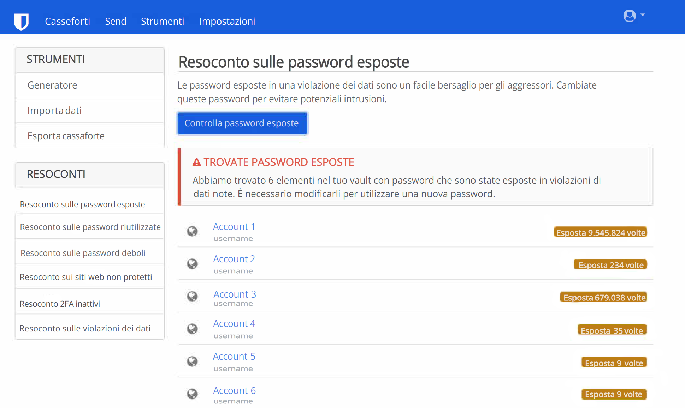

Con il tempo, può essere facile accumulare una serie di profili online, molti dei quali potrebbero non essere più utilizzati. L'eliminazione di questi account inutilizzati è un passo importante per recuperare la propria privacy, poiché gli account inattivi sono vulnerabili alle violazioni dei dati. Una violazione dei dati (anche detta data breach) avviene quando la sicurezza di un servizio è compromessa e le informazioni protette vengono visualizzate, trasmesse o rubate da soggetti non autorizzati. Le violazioni dei dati sono purtroppo [troppo comuni](https://haveibeenpwned.com/PwnedWebsites) al giorno d'oggi e quindi praticare una buona igiene digitale è il modo migliore per ridurre al minimo l'impatto che hanno sulla propria vita. L'obiettivo di questa guida è quindi quello di aiutarvi a superare il fastidioso processo di cancellazione dell'account, spesso reso difficile da un [design ingannevole](https://www.deceptive.design/), per migliorare la propria presenza online.

## Trovare i vecchi account

### Gestore di password

Se hai un gestore di password che hai usato per tutta la tua vita digitale, questa parte sarà molto semplice. Spesso includono funzionalità integrate per rilevare se le vostre credenziali sono state esposte in una violazione dei dati, come ad esempio [Data Breach Report](https://bitwarden.com/blog/have-you-been-pwned/) di Bitwarden.

<figure markdown>
  
</figure>

Anche se non hai mai utilizzato un gestore di password, è probabile che tu abbia usato quello del tuo browser o del tuo telefono senza nemmeno accorgetene. Per esempio: [Gestore Password Firefox ](https://support.mozilla.org/kb/password-manager-remember-delete-edit-logins),[Gestore Password Google](https://passwords.google.com/intro) e [ Gestore Password Edge ](https://support.microsoft.com/en-us/microsoft-edge/save-or-forget-passwords-in-microsoft-edge-b4beecb0-f2a8-1ca0-f26f-9ec247a3f336).

Le piattaforme desktop spesso dispongono di un gestore di password che può aiutarvi a recuperare le password dimenticate:

- [Gestione credenziali](https://support.microsoft.com/en-us/windows/accessing-credential-manager-1b5c916a-6a16-889f-8581-fc16e8165ac0) Windows
- [Password ](https://support.apple.com/en-us/HT211145) macOS
- [ Password ](https://support.apple.com/en-us/HT211146) iOS
- Linux, GNOME Keyring, accessibile tramite [Seahorse](https://help.gnome.org/users/seahorse/stable/passwords-view.html.en) o [Gestione portafogli di KDE](https://userbase.kde.org/KDE_Wallet_Manager)

### Email

Se non avete mai usato un gestore di password o pensate di avere account che non sono stati aggiunti al vostro gestore di password, potete provare a cercare l'account (o gli account) email utilizzato per registrarvi. Sul vostro client email, cercate parole chiave come "verifica" o "benvenuto." Quasi ogni volta che create un account online, il servizio vi manderà un link di verifica o un messaggio introduttivo alla vostra email. Questo può essere un ottimo modo per trovare vecchi account dimenticati.

## Eliminazione vecchi account

### Accedi

Per eliminare i vostri vecchi account, dovrete prima assicurarvi di poter accedere. Ancora una volta, se l'account era già nel tuo gestore di password, questo passaggio è molto più semplice. In caso contrario, si può provare a indovinare la password. Altrimenti, ci sono metodi per riottenere l'accesso al tuo account, tipicamente disponibili tramite un link "password dimenticata" nella pagina d'accesso. È anche possibile che gli account abbandonati siano stati già stati eliminati: a volte i servizi eliminano tutti i vecchi account.

Quando si tenta di recuperare l'account, se il sito restituisce un messaggio di errore in cui dice che l'e-mail non è associata a un account, o se non si riceve mai un link di recupero dopo svariati tentativi, allora non c'è nessun account con quell'indirizzo e-mail e si deve provare con un altro. Se non riesci a capire quale email hai utilizzato, o non hai più accesso a quella email, puoi provare a contattare l'assistenza clienti del servizio in questione. Purtroppo, non vi è alcuna garanzia di poter riottenere l'accesso all'account.

### GDPR (solo per i residenti nello SEE)

I residenti dello SEE hanno ulteriori diritti in materia di cancellazione dei dati personali come specificato nell' [ Articolo 17 ](https://www.gdpr.org/regulation/article-17.html) del GDPR. Se applicabile, leggere l'informativa sulla privacy per qualsiasi servizio per trovare informazioni su come esercitare il diritto alla cancellazione. Leggere l'informativa sulla privacy può rivelarsi importante, poiché alcuni servizi prevedono l'opzione "Elimina account" che si limita a disabilitare l'account, mentre per la vera e propria eliminazione è necessario intraprendere ulteriori azioni. A volte la cancellazione vera e propria può comportare la compilazione di sondaggi, l'invio di un'e-mail al responsabile della protezione dei dati del servizio o addirittura la dimostrazione della propria residenza nel SEE. Se intendi procedere in questo modo, **NON** sovrascrivere le informazioni dell'account: La tua identità come residente del SEE potrebbe venirti richiesta. Nota che la posizione geografica del servizio non ha alcuna importanza; il GDPR si applica a chiunque serva utenti Europei. Se il servizio non rispetta il vostro diritto alla cancellazione, puoi contattare il tuo [Garante per la protezione dei dati personali](https://ec.europa.eu/info/law/law-topic/data-protection/reform/rights-citizens/redress/what-should-i-do-if-i-think-my-personal-data-protection-rights-havent-been-respected_en) e potreste avere diritto anche ad un risarcimento in denaro.

### Sovrascrivere Informazioni dell'Account

In alcune situazioni in cui si prevede di abbandonare un account, può avere senso sovrascrivere le informazioni dell'account con dati falsi. Una volta che sei sicuro di poter accedere, modifica tutte le informazioni di quell'account con informazioni false. Il motivo è che molti siti conservano le informazioni precedentemente in possesso dell'utente anche dopo la cancellazione dell'account. La speranza è che sovrascrivano le informazioni precedenti con i dati più recenti da te inseriti. Tuttavia, non è garantito che non vi siano backup con le informazioni precedenti.

Per l'e-mail dell'account, o create un nuovo account e-mail utilizzando il vostro provider oppure create un alias utilizzando un [servizio di alias e-mail ](../email.md#email-aliasing-services). Una volta fatto ciò, potete eliminare l'indirizzo email alternativo. Consigliamo di NON utilizzare i provider di email temporanee, poiché spesso è possibile riattivarle.

### Elimina

È possibile consultare [JustDeleteMe](https://justdeleteme.xyz) per le istruzioni sull'eliminazione dell'account per un servizio specifico. Alcuni siti offrono fortunatamente l'opzione "Elimina account", mentre altri si spingono fino a costringervi a parlare con un agente di supporto. Il processo di cancellazione può variare da un sito all'altro, e in alcuni casi la cancellazione dell'account sarà impossibile.

Per i servizi che non permettono l'eliminazione dell'account, la cosa migliore da fare è quella di falsificare tutte le informazioni (come detto in precedenza) e di rafforzare la sicurezza dell'account. Per fare ciò, abilita [MFA](multi-factor-authentication.md) e qualsiasi altra funzionalità che il sito offre. Inoltre, cambia la password con una generata casualmente che sia della lunghezza massima consentita (un [gestore di password](../passwords.md)può esserti utile per questo).

Se siete soddisfatti che tutte le informazioni che vi interessano siano state rimosse, potete tranquillamente dimenticarvi di questo account. In caso contrario, potrebbe essere una buona idea quella di conservare le credenziali insieme alle altre password e di tanto in tanto effettuare un nuovo accesso per reimpostare la password.

Anche quando riesci a eliminare un account, non vi è alcuna garanzia che tutte le tue informazioni vengano rimosse. Infatti, alcune società sono tenute per legge a conservare determinate informazioni, in particolare quando si tratta di operazioni finanziarie. È per lo più fuori dal tuo controllo ciò che accade ai tuoi dati quando si tratta di siti Web e servizi cloud.

## Evita nuovi account

Come dice il vecchio detto, "un grammo di prevenzione vale un chilo di cura." Ogni volta che ti senti tentato di registrare un nuovo account, chiediti: "Ne ho davvero bisogno? Posso realizzare ciò che mi serve senza un account?" Spesso è molto più difficile eliminare un account piuttosto che crearne uno. E anche dopo aver eliminato o modificato le info del tuo account, potrebbe esserci una versione nella cache di qualche sito di terze parti, come [Internet Archive](https://archive.org/). Evitate la tentazione quando potete: il te stesso del futuro ti ringrazierà!
